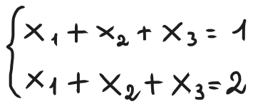

# Extra: Domande di teoria prese dai fogli 11-20
### Foglio 11, esercizio 2
Dimostrare che l'insieme dei polinomi $p \in P_4$ tali che $p(x) = p(-x)$ è un sottospazio vettoriale di $P_4$ e esibirne un insieme di generatori.
#### Svolgimento
Per verificare che sia un sottospazio vettoriale di $P_4$, dobbiamo assicurarci che siano rispettate entrambe le proprietà di chiusura, ovvero quella della somma e quella del prodotto scalare.

Sia $V =$ { $p \in P_4 | p(x) = p(-x)$ }. Notiamo che i polinomi di questo insieme hanno tutti la forma $a_0 + a_2 x^2 + a_4 x^4$, altrimenti non si avrebbe che $p(x) = p(-x)$. Procediamo verificando le due proprietà di chiusura:
1. Siano $p(x), q(x) \in V$. Allora si ha che: 
   
   $(p + q)(x) = p(x) + q(x) = p(-x) + q(-x) = (p + q)(-x)$
   
   Quindi $p + q \in V$, ovvero la chiusura della somma è verificata.
2. Siano $p(x) \in V$ e $λ \in R$. Allora si ha che:
   
   $(λp)(x) = λp(x) = λp(-x) = (λp)(-x)$
   
   Quindi $λp \in V$, ovvero la chiusura del prodotto scalare è verificata.
3. Il polinomio nullo $p(x) = 0$ soddisfa la condizione $p(x) = p(-x)$, quindi $0 \in V$.

Dunque $V$ è un sottospazio vettoriale. Come detto prima, ogni polinomio $p(x) \in V$ ha la forma $a_0 + a_2 x^2 + a_4 x^4$, di conseguenza un insieme di generatori può essere { $1, x_2, x_4$ }.

### Foglio 11, esercizio 3 


#### Svolgimento


Abbiamo isolato $α_1, α_2$ scrivendoli come espressioni in termini di $x_1, x_2$. Questo dimostra che ogni vettore $x_1, x_2$ si può scrivere in modo unico come combinazione lineare di quei due vettori, quindi è dimostrato che compongono una base per $R^2$.

### Foglio 14, esercizio 3
Mostrare che il seguente sistema ammette solo soluzione banale.


#### Svolgimento
Per dimostrare che il sistema ha solo soluzione banale, dobbiamo utilizzare il teorema di Roché-Capelli per dimostrare che ha solo una soluzione e quella soluzione sarà banale (ovvero $x_1 = x_2 = x_3 = 0$ ). Costruiamo quindi la matrice $[A, b]$ e procediamo con l'eliminazione di Gauss:


Abbiamo dimostrato che $x_1 = x_2 = x_3 = 0$ è soluzione del sistema, inoltre, per il teorema di Rouchè-Capelli, questa soluzione è unica, in quanto $rank(A) = rank([A, b]) = 3 = n$.

### Foglio 14, esercizio 7
Dimostrare o confutare che per ogni $A \in R^{m \times n}$ e $b \in R^m$, l'insieme delle soluzioni del sistema lineare $Ax = b$ è uno spazio vettoriale.

#### Svolgimento
Prendiamo il sistema lineare $x_1 + x_2 = 1$, che ha come soluzione $[x, 1 - x]$. Questo significa che $(0, 1)$ e $(1, 0)$ sono soluzioni del sistema. Se questo insieme fosse uno spazio vettoriale, allora varrebbe la proprietà di chiusura della somma, però $(0, 1) + (1, 0) = (1, 1)$ che non è una soluzione del sistema lineare. Quindi non è uno spazio vettoriale.

### Foglio 14, esercizio 8
Fornire un esempio di matrici $A, B \in R^{4 \times 4}$ tali che $rank(A) = rank(B) = 2$ e $rank(AB) = 0$.

#### Svolgimento
Prendiamo due matrici che abbiano due colonne nulle e due colonne non nulle, così avranno entrambe rango $2$. Affinché il loro prodotto abbia rango $0$, dobbiamo sceglierle in modo che diano la matrice nulla come risultato. Per fare questo, ci basterà prendere come $A$ una matrice nulla con $1$ sui primi due elementi della diagonale, mentre come $B$ una matrice nulla con $1$ sugli ultimi due elementi della diagonale. Questo permette di annullare il prodotto in quanto ogni $1$ su una matrice verrà accoppiato con uno $0$ sull'altra matrice, annullandolo.


### Foglio 14, esercizio 9, punto 1
Dimostrare che se $A \in R^{m \times n}$ e $T \in R^{n \times n}$ ed è invertibile, allora $Im(AT) = Im(A)$.

#### Svolgimento
Sia $y \in Im(A)$. Questo significa che esiste $x \in R^n$ tale che $y = Ax$. Siccome $T$ è invertibile, possiamo scrivere $x = Tz$ con $z = T^{-1}x$. Allora:

$y = A(Tz) = (AT)z \implies y \in Im(AT)$

Viceversa, poniamo $z = Tx \implies Az = y \in Im(A)$. Questo dimostra che $Im(AT) = Im(A)$.

*Riporto solo questo punto perché questo è già un esercizio avanzato che non metterà, per di più tutti gli altri punti seguono una logica simile*.

### Foglio 15, esercizio 4
Rispondere VERO o FALSO alle seguenti affermazioni:
1. Un sistema lineare avente più incognite che equazioni ammette sempre almeno una soluzione.
2. Un sistema lineare avente più equazioni che incognite non ammette mai soluzione.
3. Se un sistema lineare avente più incognite che equazioni ammette almeno una soluzione, allora ne ammette infinite.

L'affermazione ```1``` è FALSA. Lo dimostriamo con un esempio di sistema lineare avente più incognite che equazioni ma che non ammette soluzioni.



L'affermazione ```2``` è FALSA. Lo dimostriamo con un esempio di sistema lineare avente più equazioni che soluzioni ma che ammette soluzioni.


L'affermazione ```3``` è VERA. Sia $Ax = b$ un sistema lineare con $A \in R^{m \times n}$ e $b \in R^m$, con $m < n$ (ovvero ci sono più incognite che equazioni) e assumiamo che il sistema abbia almeno una soluzione. Siccome il sistema ammette soluzione, allora si ha che $rank(A) = rank([A, b]) \leq min$ { $n, m$ } per il teorema di Rouché-Capelli. Inoltre, sappiamo che $m < n$ per ipotesi, di conseguenza $rank(A) = rank([A, b]) < n$. Quindi, per il teorema di Rouché-Capelli, il sistema ammette infinite soluzioni, nello specifico ammette $\infty^{n - rank(A)}$ soluzioni.

### Foglio 15, esercizio 6
1. Può un sistema lineare $Ax = b$ con matrice dei coefficienti $3 \times 4$ ammettere unica soluzione per un'opportuna scelta di $b$?
2. Può un sistema lineare $Ax = b$ con matrice dei coefficienti $4 \times 3$ ammettere soluzione per ogni scelta di $b$?
3. Sia $A \in R^{5 \times 12}$ e supponiamo che esista un vettore $b$ tale che $Ax = b$ ammetta $\infty^{8}$ soluzioni. Qual è il rango di $A$?
4. Ricordiamo che una matrice $A \in R^{m \times n}$ si dice *skinny* se $m > n$. Giustificare o confutare la seguente affermazione: "Se un sistema lineare $Ax = b$ ammette unica soluzione per una particolare scelta del vettore $b$, allora $A$ è quadrata o skinny".
5. Ricordiamo che una matrice $A \in R^{m \times n}$ si dice *fat* se $m < n$. Giustificare o confutare la seguente affermazione: "Se un sistema lineare $Ax = b$ ammette infinite soluzioni per una particolare scelta del vettore $b$, allora $A$ è fat".

La risposta alla domanda ```1``` è NO. Se la matrice dei coefficienti è $3 \times 4$, questo significa che ci sono più incognite che equazioni. Di conseguenza, come abbiamo dimostrato nell'esercizio precedente con il teorema di Rouché-Capelli, non può avere unica soluzione ma deve averne per forza infinite.

La risposta alla domanda ```2``` è NO. Per avere una soluzione per ogni $b \in R^4$, la matrice dovrebbe avere rango pieno ed essere in grado di generare tutto $R^4$, ma questo non è possibile. Siccome la matrice dei coefficienti è $4 \times 3$, il rango potrà essere al più $3$, quindi non potrà mai coprire tutto $R^4$.

La risposta alla domanda ```3``` è $rank(A) = 4$. Questo perché, per il teorema di Rouché-Capelli, abbiamo che $\infty^{n - rank(A)}$, quindi, siccome il sistema lineare ha $\infty^{8}$ soluzioni, allora $8 = n - rank(A) \implies 8 = 12 - rank(A)$, di conseguenza $rank(A) = 4$.

L'affermazione nella domanda ```4``` è VERA. Questo perché, per il teorema di Rouché-Capelli, un sistema lineare $Ax = b$ ha un'unica soluzione se e solo se $rank(A) = rank([A, b]) = n$. Sappiamo inoltre che $rank(A) \leq min${ $n, m$ }, quindi deve essere per forza vero che $n \leq m$, ovvero $A$ è quadrata o skinny.

L'affermazione nella domanda ```5``` è FALSA. Anche un sistema lineare $Ax = b$, dove $A$ è una matrice quadrata, può ammettere infinite soluzioni. Ad esempio:


### Foglio 17, esercizio 3


#### Svolgimento

Notiamo che il prodotto $AX$ ha come risultato la matrice identità, il che significa che $A$ e $X$ sono inverse tra loro.

Data una matrice $R^{n \times n}$, possiamo quindi calcolarne l'inversa mediante fattorizzazione $LU$. Questo metodo ci suggerisce che possiamo prendere la base canonica di $R^n$ e risolvere il sistema lineare $AX_i = e_i$, dove $e_i$ è elemento $i$-esimo della base e $0 < i \leq n$. Un generico vettore $X_i$ ottenuto con questo procedimento sarà anche la colonna $i$-esima della matrice $X$, ovvero l'inversa di $A$.


Osserviamo che quella combinazione lineare è uguale al vettore soluzione che abbiamo ricavato. Si può giustificare in questo modo.

Sappiamo che $Ax_1 = e_1$, $Ax_2 = e_2$ e $Ax_3 = e_3$. Notiamo anche che $b \in R^3$, quindi possiamo scriverlo come combinazione lineare della base canonica di $R^3$, ovvero $b = e_1 + 2e_2 + 3e_3$. Adesso moltiplichiamo $A$ per la combinazione lineare richiesta e otteniamo:

$A(x_1 + 2x_2 + 3x_3) = Ax_1 + 2Ax_2 + 3Ax_3 = e_1 + 2e_2 + 3e_3 = b$

Quindi $x = x_1 + 2x_2 + 3x_3$ è soluzione del sistema $Ax = b$. Più generalmente, quando abbiamo una matrice invertibile $A \in R^{n \times n}$ e $x_1, x_2, ..., x_n$ tali che $Ax_i = e_i$, dove $e_i$ è l'elemento $i$-esimo della base canonica di $R^n$, allora possiamo prendere qualunque vettore $b \in R^n$, scriverlo come combinazione lineare $b = b_1e_1 + b_2e_2 + ... + b_ne_n$ e si avrà che la soluzione del sistema lineare $Ax = b$ sarà $x = b_1x_1 + b_2x_2 + ... + b_nx_n$.

### Foglio 18, esercizio 6
Sia $A \in R^{n \times n}$ una matrice reale, di cui si conosce la fattorizzazione $A = LU$. Proporre una procedura computazionalmente efficiente per risolvere il sistema lineare $A^2x = b$ e analizzarne il costo in termini di operazioni algebriche elementari.

#### Svolgimento
Dato che $A^2x = b$, possiamo scrivere $A^2x = AAx = b$. Ponendo poi $Ax = y$, possiamo impostare il sistema come $Ax = y$ e $Ay = b$. Dato inoltre che $A = LU$, possiamo riscrivere il sistema come $LUx = y$ e $LUy = b$.

Possiamo procedere con la risoluzione del sistema $LUy = b$ seguendo i due step:
1. Risolvere $Lz = b$
2. Risolvere $Uy = z$
Fatto questo, si può procedere con la risoluzione del sistema $LUx = y$ seguendo i due step:
3. Risolvere $Lw = y$
4. Risolvere $Ux = w$
E il vettore $x$ sarà il vettore soluzione del sistema lineare $A^2x = b$. 

A livello computazionale, ogni sistema $Ax = b$, dove $A$ è una matrice di cui si conosce la fattorizzazione $LU$, può essere risolto con un costo di circa $n^2$ operazioni elementari (una procedura di sostituzione in avanti e una all'indietro). Questo significa che, con il procedimento proposto sopra, possiamo risolvere il sistema lineare $A^2x = b$ in $2n^2$ operazioni elementari.

### Esonero 22 dicembre 2017, esercizio 1.5 (per il foglio 19)
Calcolare il numero di condizionamento di $A$ in norma $||\cdot||_1$.

*Nota bene: questa richiesta viene assegnata come ultimo punto di un unico problema. I punti precedenti chiedono sempre di calcolare la fattorizzazione* $PA = LU$ *e la matrice* $A^{-1}$, *per cui fornirò almeno quest'ultima visto che serve per l'esercizio, ma in sede d'esame andrà probabilmente calcolata in un punto precedente. Vedere nello specifico lo svolgimento dell'esercizio 3 del foglio 17 poco sopra in questa pagina.*


#### Svolgimento
La norma $||\cdot||_1$ si calcola effettuando la somma dei numeri in valore assoluto (ad esempio la colonna $[-3, 0, 4]$ darà $|-3| + |0| + |4| = 7$) sulle colonne della matrice e prendendo il massimo. La formula per calcolare il fattore di condizionamento di $A$ è $K(A) = ||A||_1 \cdot ||A^{-1}||_1$, quindi procediamo calcolando la norma per le due matrici in questo modo:


Di conseguenza, $||A||_1 = 8$ e $||A^{-1}||_1 = 29$, di conseguenza $K(A) = 8 \cdot 29 = 232$.
### Foglio 20, esercizio 5
Sia $A \in R^{n \times n}$ una matrice reale, di cui si conosce la fattorizzazione $PA = LU$. Proporre una procedura efficiente per risolvere il sistema lineare $A^TAx = b$. Studiare il costo in termini di numero di operazioni algebriche elementari.

#### Svolgimento
Prendiamo il sistema $A^TAx = b$. Possiamo porre $Ax = y \implies A^Ty = b$, quindi possiamo risolvere il sistema in due fasi:
1. Risolvere $A^Ty = b$
2. Risolvere $Ax = y$

Dato che $PA = LU$, possiamo scrivere $A = P^{-1}LU$. Poiché $P$ è una matrice di scambio, allora $P^{-1} = P^T$, quindi possiamo scrivere $A = P^TLU$. Da questo deriva che $A^T = (P^TLU)^T = U^T L^T P$.

A questo punto, procediamo con il primo step, ovvero la risoluzione di $A^Ty = b$. Sappiamo che $A^T = U^T L^T P$, quindi dobbiamo risolvere $U^T L^T Py = b$ in questi step:
1. Risolvere $L^Tz = P^Tb$
2. Risolvere $U^Ty = z$
Successivamente, possiamo risolvere il sistema lineare $Ax = y$, utilizzando la fattorizzazione $PA = LU$, in questi step:
3. Risolvere $Lw = Py$
4. Risolvere $Ux = w$

A livello computazionale, ogni sistema $Ax = b$, dove $A$ è una matrice di cui si conosce la fattorizzazione $PA = LU$, può essere risolto con un costo di circa $n^2$ operazioni elementari (una procedura di sostituzione in avanti e una all'indietro). Questo significa che, con il procedimento proposto sopra, possiamo risolvere il sistema lineare $A^TAx = b$ in $2n^2$ operazioni elementari (oltre a quelle necessarie per calcolare matrici trasposte e moltiplicarle tra loro).
### [Torna all'indice](../README.md)