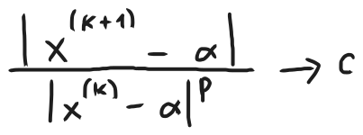
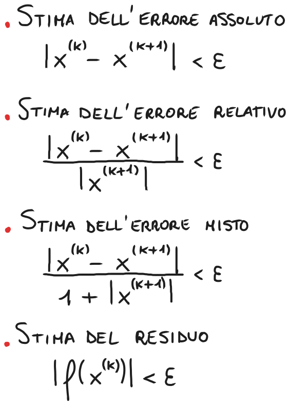
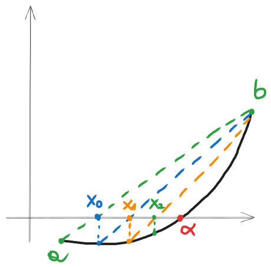
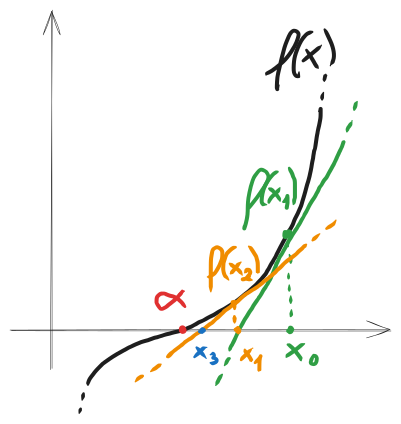
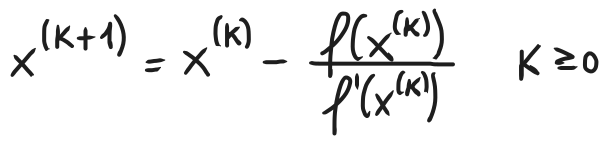
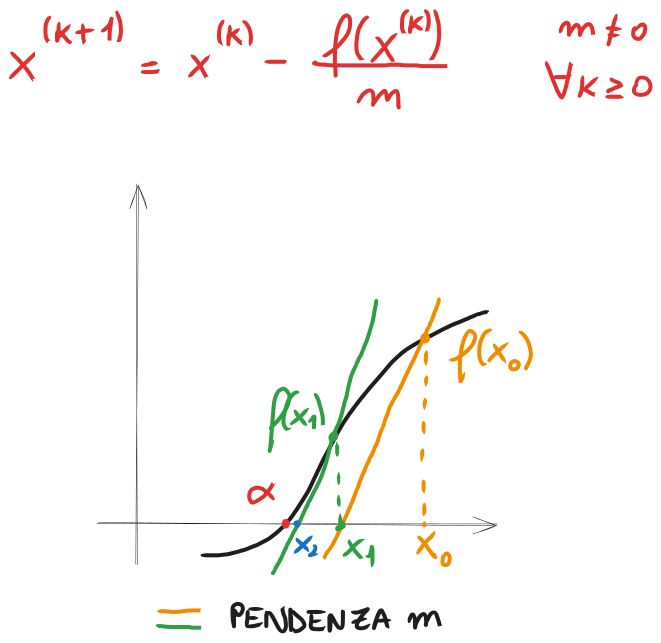
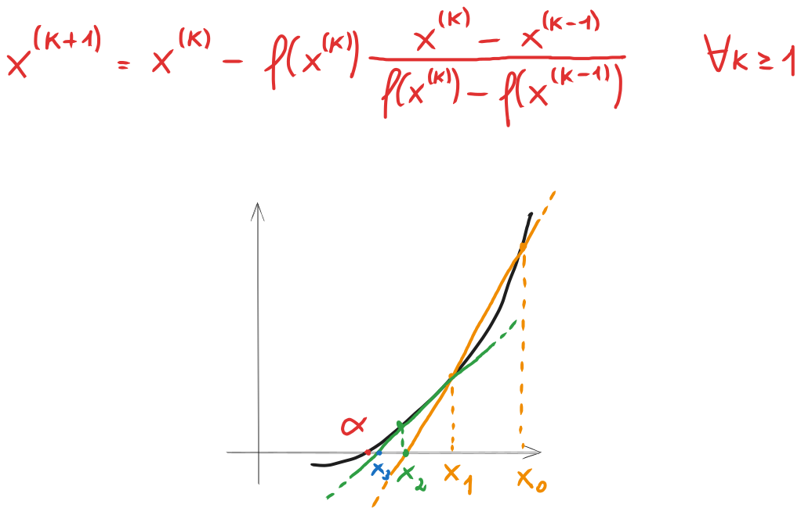
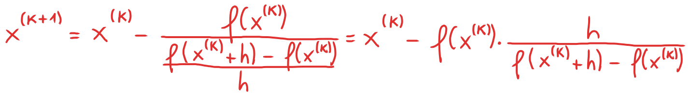

# Recap dei metodi iterativi per il calcolo degli zeri di funzione

### Elenco dei metodi e rispettivo ordine di convergenza

|        `Metodo`        | `Ordine di convergenza` |
| :--------------------: | :---------------------: |
| *Successive bisezioni* |           $1$           |
|     *Regula Falsi*     |           $1$           |
|        *Newton*        |           $2$           |
|        *Corde*         |           $1$           |
|       *Secanti*        |      $\approx 1.6$      |
|     *Quasi-Newton*     |           $2$           |

### Successive Bisezioni
#### Descrizione del metodo
Il metodo delle successive bisezioni è uno dei metodi più conosciuti per l'approssimazione degli zeri di funzione. Innanzitutto, ipotizziamo di avere una certa $f: [a,b] \rightarrow R$ continua e tale che $f(a)f(b) < 0$. Questo garantisce la presenza di uno zero nell'intervallo $[a,b]$ grazie al teorema degli zeri.

L'idea di questo metodo è dimezzare ripetutamente l'intervallo $[a, b]$ utilizzando il punto medio tra i due estremi. Il nuovo intervallo sarà dato dal punto medio e dall'estremo in cui $f$ assume segno opposto.

#### Pseudocodice
**Input:** $f, a, b, ε$. Si assume $a < b$, $f$ continua, $sing(f(a)) \neq sign(f(b))$.

1. $x = \frac{1}{2} (a + b)$;
2. Se $b - x < ε$, poni $α = x$ ed esci;
3. Se $sign(f(a)) \neq sign(f(x))$, allora poni $b = x$, altrimenti poni $a = x$;
4. Torna al punto 1.

#### Convergenza
La convergenza del metodo delle successive bisezioni è garantita se $f: [a,b] \rightarrow R$ continua e tale che $f(a)f(b) < 0$, ovvero sono verificate le stesse condizioni del teorema degli zeri.

Generalmente, se consideriamo $\{x^{(k)}\}_{k \in N}$ come la successione generata dal metodo delle successive bisezioni, il rapporto

tende ad oscillare e quindi non ammette limite per $k \rightarrow \infty$, non permettendo di determinare formalmente l'ordine di convergenza di questo metodo. Nonostante ciò, si può utilizzare un ragionamento informale per dire che, generalmente, il metodo delle successive bisezioni ha convergenza lineare.

#### Criteri di arresto
Dato un certo valore $ε>0$ che chiameremo *tolleranza sull'errore*, possiamo fermare le iterazioni del metodo quando la stima dell'errore è minore di $ε$. Possiamo calcolare la stima dell'errore in diversi modi, chiamati criteri di arresto (generalmente ne vuole solo due a scelta per l'esercizio):

### Regula Falsi
#### Descrizione del metodo
Il metodo della *Regula Falsi* è un metodo iterativo per l'approssimazione di uno zero di funzione ed è una variazione del metodo delle successive bisezioni. Assumiamo di avere una funzione abbiamo una certa $f: [a, b] \rightarrow R$ continua e tale che $f(a)f(b) < 0$. Per il teorema degli zeri, è garantito che nell'intervallo $[a, b]$ sia presente almeno uno zero. 

L'idea alla base è disegnare la corda che passa per i punti $(a, f(a))$ e $(b, f(b))$ e si trova il punto in cui questa corda interseca l'asse delle ascisse. Quel punto di intersezione rappresenta l'approssimazione dello zero di funzione. Si può anche utilizzare per definire un nuovo intervallo, prendendo il punto di intersezione e l'estremo con segno opposto, per poi ripetere il processo.

#### Pseudocodice
**Input:** $f, a, b, ε$. Si assume $a < b$, $f$ continua, $sing(f(a)) \neq sign(f(b))$.

1. $x = \frac{af(b) - bf(a)}{f(b) - f(a)}$;
2. Se $b - x < ε$, poni $α = x$ ed esci;
3. Se $sign(f(a)) \neq sign(f(x))$, allora poni $b = x$, altrimenti poni $a = x$;
4. Torna al punto 1.

**Output:** $α$

#### Convergenza
La convergenza del metodo delle successive bisezioni è garantita se $f: [a,b] \rightarrow R$ continua e tale che $f(a)f(b) < 0$, le stesse condizioni del teorema degli zeri.

Come nel metodo delle successive bisezioni, non è possibile dimostrare formalmente la convergenza di questo metodo. Nonostante ciò, generalmente si dice che il metodo del Regula Falsi ha convergenza lineare.

### Metodo di Newton
#### Descrizione del metodo
Il metodo delle successive bisezioni è uno dei metodi più conosciuti per l'approssimazione degli zeri di funzione. L'idea alla base del metodo procede in questo modo.

Sia $f: [a, b] \rightarrow R$ continua e derivabile in $[a, b]$ e sia $α \in [a, b]$ tale $f(α) = 0$. Data una stima $x^{(0)}$ di $α$, si utilizza la retta tangente a $f(x)$ in $x^{(0)}$ per approssimare $f(x)$. Si calcola quindi l'intersezione tra la retta tangente e l'asse delle ascisse per ottenere una nuova stima $x^{(1)}$ che sia migliore della precedente. Si continua nello stesso modo per ottenere le stime successive $x^{(2)}$, $x^{(3)}$, ..., che si avvicineranno man mano al valore di $α$.

Sulla base di questo ragionamento, la formula dell'iterata generale del metodo di Newton è

#### Pseudocodice
**Input:** $f$, $f'$, $x^{(0)}$, $ε$, $nitmax$.

1. $nit = 1$
2. $dfx = f'(x^{(0)})$
3. Se $|dfx|$ è troppo piccolo, esci con errore
4. $dx = \frac {-f(x^{(0)})}{dfx}$
5. $x^{(1)} = x^{(0)} + dx$
6. Se $|dx| < ε$, poni $α = x^{(1)}$ ed esci
7. Se $nit = nitmax$, esci con errore
8. $nit = nit + 1$
9. $x^{(0)} = x^{(1)}$
10. Torna al punto 2

**Output:** $α$, $nit$.

#### Convergenza
Sia $f$ una funzione avente almeno due derivate continue in un intorno di $α$, ovvero uno zero semplice di $f$. Allora, per $x^{(0)}$ sufficientemente vicino a $α$, la successione generata dal metodo di Newton converge a $α$ con ordine di convergenza non inferiore a 2.

Se $f'(α) = 0$ la convergenza del metodo non è garantita e, se converge, il metodo convergerà linearmente. Se $f'(α) \neq 0$ e $f''(α) = 0$, invece, il metodo convergerà e avrà ordine di convergenza pari almeno a $3$.

Affinché la convergenza sia garantita, quindi, è necessario che $f$ sia continua e derivabile almeno due volte in un intorno di $α$. Inoltre, $f'(α) \neq 0$ e in generale le due derivate devono essere sufficientemente regolari in quell'intorno.

#### Criteri di arresto
Dato un certo valore $ε>0$ che chiameremo *tolleranza sull'errore*, possiamo fermare le iterazioni del metodo quando la stima dell'errore è minore di $ε$. Possiamo calcolare la stima dell'errore in diversi modi, chiamati criteri di arresto (generalmente ne vuole solo due a scelta per l'esercizio):

### Varianti del metodo di Newton senza derivata
Il metodo di Newton ha ottime proprietà di convergenza ma ha alcuni svantaggi. Ad esempio, ad ogni passo è richiesto il calcolo della derivata prima di $f$. Questa potrebbe non essere nota (ad esempio nel caso in cui la mappatura $x \rightarrow f(x)$ sia nota ma provenga da una "black box", ovvero la funzione in sé è sconosciuta), oppure è nota ma è molto onerosa da calcolare. Quando il calcolo della derivata prima di $f$ causa problemi, ci si rivolge a varianti del metodo di Newton dette *derivative-free*, ovvero esenti dall'uso della derivata.

#### Metodo delle corde
In questo metodo si mantiene l'idea generale del metodo di Newton, la differenza è che anziché utilizzare la retta tangente alla funzione calcolata nel punto considerato, si utilizza una retta che ha una certa pendenza fissa per ogni iterazione. Questa pendenza corrisponderà a un certo valore $m \neq 0$ prefissato.

La convergenza di questo metodo è garantita, secondo la teoria dei metodi iterativi ad un passo, quando si ha che $|g'(α)| < 1$, dove $g(x)$ è la funzione iteratrice del metodo. Generalmente, il metodo delle corde ha convergenza lineare, però, scegliendo $m \approx f'(α)$ si può ottenere una convergenza anche quadratica o superiore.

#### Metodo delle secanti
In questo metodo si mantiene l'idea generale del metodo di Newton, la differenza è che, anziché utilizzare la retta tangente, si utilizza la retta passante per i due punti generati dalle iterazioni precedenti del metodo. Geometricamente, quindi, la retta tangente è sostituita dalla retta secante passante per i punti del grafico $(x^{(k - 1)}, f(x^{(k - 1)}))$ e $(x^{(k)}, f(x^{(k)}))$ e si trova l'intersezione tra questa secante e l'asse delle ascisse per trovare il punto $x^{(k + 1)}$. È quindi un metodo "a due passi", ovvero sono necessarie due iterazioni precedenti della funzione per calcolare la successiva. 

Questo è un metodo a due passi, quindi non possiamo fare le stesse considerazioni che abbiamo fatto mediante la teoria dei metodi a un passo. Però si può dimostrare che, se $α$ è zero semplice di $f$, $f$ è sufficientemente regolare e $x^{(0)}$ e $x^{(1)}$ sono sufficientemente vicini a $α$, allora il metodo produce una successione che converge a $α$ con ordine di convergenza non inferiore a $φ = \frac {sqrt(5) + 1}{2} \approx 1.6$. È dunque un metodo superlineare.

#### Metodo quasi-Newton
In questo metodo si mantiene l'idea generale del metodo di Newton, la differenza è che si utilizza *un'approssimazione* del valore della derivata prima anziché utilizzarne il valore preciso.

L'espressione $\frac{f(x^{(k)} + h) - f(x^{(k)})}{h}$ è la formula del rapporto incrementale e, prendendo il limite per $h \rightarrow 0$, si ottiene la definizione teorica di derivata di $f$ calcolata in $x^{(k)}$, ovvero $f'(x^{(k)})$, permettendo così di calcolarne direttamente il valore. Non sempre è possibile calcolare direttamente questo limite, per cui generalmente si preferisce assegnare un valore piuttosto piccolo ad $h$ (ad esempio $0.1$, $0.01$, valori piccoli ma comunque diversi da $0$) e questo permette di ottenere un'approssimazione abbastanza accurata di $f'(x^{(k)})$.

Per quanto riguarda l'ordine di convergenza, sebbene in teoria il metodo converga linearmente, scegliendo $h$ in modo ottimale il metodo ha un comportamento pressoché indistinguibile dal metodo di Newton (quindi convergenza quadratica).

### [Torna all'indice](../README.md)