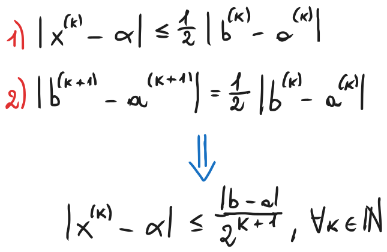

# Metodo delle successive bisezioni, errore e residuo

In questa parte di programma ci concentreremo sulla risoluzione di un problema specifico. Data una certa funzione $f: [a, b] \rightarrow R$, continua nel suo dominio, bisogna calcolare un certo valore $α ∈ [a, b]$ tale che $f(α) = 0$. Graficamente, questo equivale a cercare un punto di intersezione del grafico di $f$ con l'asse delle $x$.

 
 
Questo è un problema di fondamentale importanza in molte applicazioni pratiche, ad esempio in economia, ingegneria, fisica, biologia e così via. Nonostante ciò, raramente è possibile calcolare esattamente le soluzioni di un'equazione non lineare di questo tipo. In genere, ci si deve accontentare di un'approssimazione della soluzione, ottenuta mediante metodi numerici che vedremo prossimamente. Altre volte un'espressione esatta esiste, invece, ma è troppo complessa da calcolare per cui si preferisce approssimarla numericamente. Un esempio tipico di equazione la cui soluzione non è esprimibile in forma chiusa è un'equazione trascendente mista, ad esempio $x - cos(x) = 0$.
### Teorema degli zeri
Sia $f: [a, b] \rightarrow R$ continua e tale che $f(a)f(b) < 0$ (ovvero $f(a)$ e $f(b)$ hanno segni opposti). Allora esiste un certo $α ∈ (a, b)$ tale che $f(α) = 0$. 

Se $f(α) = 0$, diremo che $α$ è uno *zero* di (o per) $f$.

Il teorema degli zeri assicura che una funzione continua ammetta sempre *almeno* uno zero all'interno di un intervallo ai cui estremi essa assume valori di segno opposto.

Si noti bene che il teorema degli zeri indica una condizione *sufficiente* ma non *necessaria* per la presenza di uno zero, ovvero potrebbe esserci una funzione che non rispetta le ipotesi del teorema degli zeri ma che ha comunque uno zero. Inoltre, queste ipotesi non garantiscono l'unicità dello zero, potrebbero essercene molteplici in quell'intervallo.

Per garantire anche l'unicità dello zero, oltre a verificare le ipotesi del teorema degli zeri, la funzione deve anche essere strettamente monotona (quindi deve essere o strettamente crescente o strettamente decrescente) nell'intervallo $[a, b]$. 

I metodi numerici che studieremo per l'approssimazione degli zeri saranno di natura *iterativa*. Produrranno una successione di approssimazioni che, presumibilmente, converge al valore preciso della soluzione. Ogni valore della successione si calcola mediante il suo predecessore e, man mano che si itera, si otterrà un'approssimazione sempre migliore della soluzione.
## Metodo delle successive bisezioni
Questo è il primo metodo che esamineremo. È uno degli algoritmi più semplici e robusti per la ricerca di zeri di funzioni.

Le ipotesi di partenza di questo metodo sono le stesse del teorema degli zeri, ovvero abbiamo una certa $f: [a, b] \rightarrow R$ continua e tale che $f(a)f(b) < 0$. L'idea chiave alla base del metodo è suddividere ripetutamente l'intervallo $[a, b]$ utilizzando il punto medio tra i due estremi. Il nuovo intervallo sarà dato dal punto medio e dall'estremo in cui $f$ assume segno opposto. 

Facciamo un esempio. Assumiamo che il punto medio di $[a, b]$ sia un certo $x_0$ e che $f(a) < 0$ e $f(b) > 0$. Se $f(x_0)$ è negativo, allora il nuovo intervallo sarà $[x_0, b]$, mentre se $f(x_0)$ è positivo, allora il nuovo intervallo sarà $[a, x_0]$. 

Si continua questo processo iterativamente, dimezzando ogni volta la lunghezza dell'intervallo, finché non si ottiene un intervallo talmente piccolo da avere un punto medio che fornisca una buona approssimazione della soluzione dell'equazione.

### Descrizione del metodo mediante algoritmo
Dati $f$, $a$, $b$ che verifichino le ipotesi del teorema degli zeri, si pone:

$a^{(0)} = a, b^{(0)} = b, x^{(0)} = \frac{a^{(0)} + b^{(0)}}{2}$ 

Per k = 0, 1, ...
1. Se $f(x^{(k)}) = 0$, poni $α = x^{(k)}$ ed esci dal ciclo.
2. Altrimenti:
   - Se $f(a^{(k)}) f(x^{(k)}) < 0$, allora: $a^{(k+1)} = a^{(k)}, b^{(k+1)} = x^{(k)}$
   - Altrimenti: $a^{(k+1)} = x^{(k)}, b^{(k+1)} = b^{(k)}$
3. Calcola la nuova approssimazione:
   - $x^{(0)} = \frac{a^{(k+1)} + b^{(k+1)}}{2}$
Fine ciclo

Si inizia con l'inizializzazione delle variabili e il calcolo del primo punto medio. Lo step 1 è un caso base che ferma il ciclo quando l'approssimazione corrisponde con la soluzione cercata. Lo step 2 è quello che si occupa di dimezzare l'intervallo nel modo descritto nell'idea dell'algoritmo. Sceglierà quindi il punto medio come nuovo estremo e prenderà poi uno dei due estremi precedenti in base all'esito del controllo. Lo step 3 si occupa infine di calcolare il punto medio tra i nuovi estremi e successivamente si reitera il processo.

L'algoritmo si ferma in un numero finito di passi soltanto se si ha $f(x^{(k)}) = 0$ per un certo $k$. Altrimenti, si generano tre successioni $\{a^{(k)}\}$, $\{b^{(k)}\}$, $\{x^{(k)}\}$, con $k ∈ N$, che verificano le seguenti proprietà:
- $a^{(k)} \leq x^{(k)} \leq b^{(k)}$, per ogni $k$
- $a^{(k)} \leq α \leq b^{(k)}$, per ogni $k$
- $a^{(k)} \rightarrow α$ in modo monotono crescente
- $b^{(k)} \rightarrow α$ in modo monotono decrescente
- $x^{(k)} \rightarrow α$
- $f(α) = 0$

La probabilità che si realizzi il punto 1 dell'algoritmo, e quindi che l'algoritmo abbia un numero finito di passi, è trascurabile e, nella pratica, rende superfluo il controllo.

Per questo motivo, bisogna trovare un altro modo per decidere quando fermare l'algoritmo. Ci vogliamo fermare quando la nostra approssimazione è molto vicina alla soluzione. A questo scopo, definiamo i concetti di errore e residuo.
## Errore e residuo
Siano $α, \dot α ∈ R$, con $\dot α$ che rappresenta un'approssimazione di $α$. Definiamo le quantità *Errore Assoluto* e *Errore relativo* dell'approssimazione le quantità:

La qualità dell'approssimazione è tanto migliore quanto è più piccolo l'errore. Generalmente è preferibile utilizzare l'errore relativo, in quanto tiene conto anche dell'ordine di grandezza dei numeri coinvolti, al contrario dell'errore assoluto.

Chiaramente, non abbiamo a disposizione il valore di $α$, di conseguenza non possiamo calcolare direttamente queste quantità. Possiamo, però, calcolare il numero di passi minimi necessari per raggiungere un determinato valore di tolleranza sull'errore assoluto. Consideriamo le tre successioni generate dal metodo delle successive bisezioni. Mediante una rappresentazione grafica degli intervalli, possiamo notare che:

Supponiamo di voler determinare il più piccolo valore di $k$ tale che l'errore assoluto sia minore di un certo ε, che definiremo come tolleranza sull'errore assoluto. Vedendo la formula di sopra, basterà scegliere il più piccolo intero $k$ tale che

Relativamente al problema di calcolare lo zero di una funzione $f$, definiamo come *residuo dell'approssimazione* $\dot α$ la quantità $f(\dot α)$. Indica quanto il valore della funzione calcolata a $\dot α$ sia lontano da 0. Il residuo non è sempre un buon indicatore dell'errore assoluto, ma può sovrastimarlo o sottostimarlo in base alla pendenza della curva della funzione considerata. 

In questo esempio possiamo notare che, nonostante l'errore assoluto sia lo stesso in entrambi i grafici, il residuo è considerevolmente maggiore nel secondo grafico siccome la curva del grafico ha una pendenza maggiore. Il residuo dipende quindi anche dalla pendenza della curva e, di conseguenza, deve avere un qualche collegamento con la derivata della funzione.

Se l'approssimazione è sufficientemente vicina ad $α$, si ha che

Il valore assoluto del residuo sovrastima l'errore assoluto quando la derivata di $f$ in $α$ è grande, mentre lo sottostima quando è piccola. È quindi sconsigliato usare il residuo come criterio di arresto, a meno che non si abbiano informazioni a priori sulla grandezza della derivata di $f$ in un intorno della soluzione.

### [Lezione successiva](Lezione2.md)
### [Torna all'indice](../README.md)

