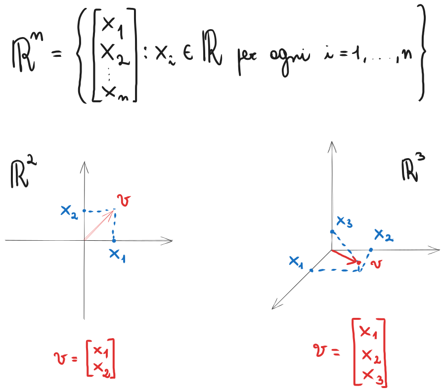
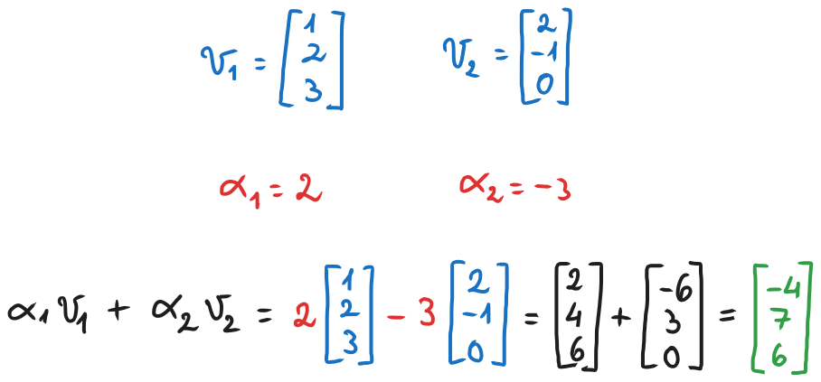
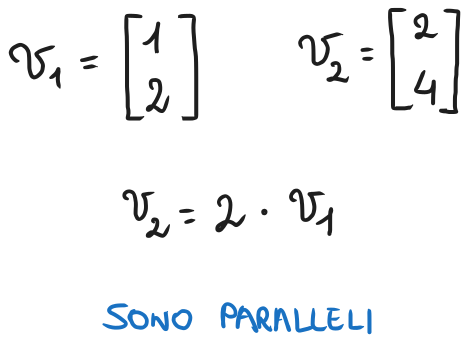
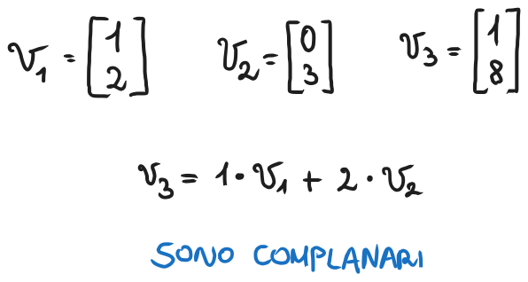
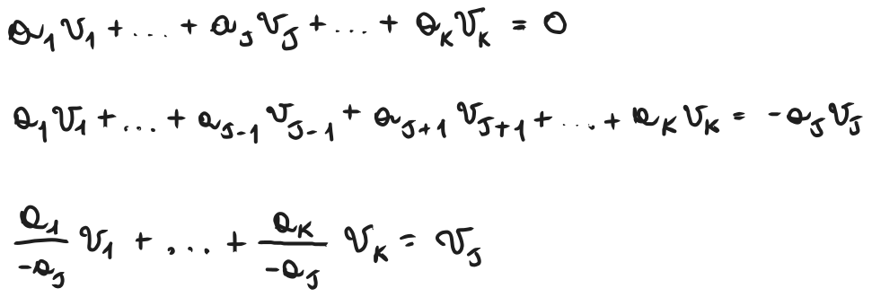
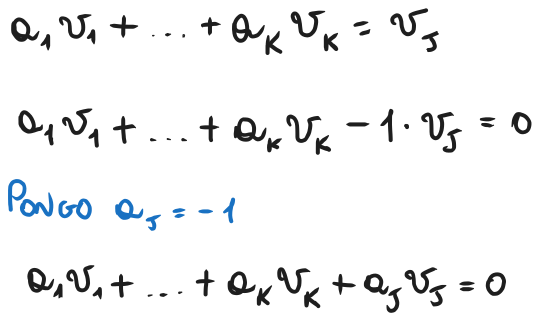
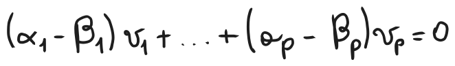
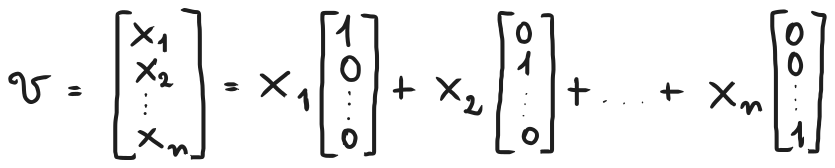
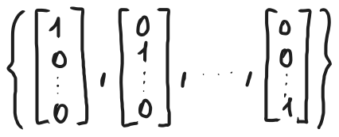

# Introduzione agli spazi vettoriali
### [Lezione precedente](Lezione8_9.md)

### Definizioni preliminari
Nota bene: con *leggi di composizione* si intendono un insieme di regole che permettono di combinare elementi di un insieme secondo certe operazioni. Sono essenzialmente delle funzioni che prendono due o più elementi di un insieme e lo combinano in un unico elemento. Si dicono *interne* se prendono elementi di un insieme per combinarli in un altro elemento dell'insieme di partenza, mentre si dicono *esterne* se includono insiemi differenti.

Ad esempio, l'addizione su $N$ ($+: N \times N \rightarrow N$) è una legge di composizione interna perché prende due numeri naturali e restituisce un altro numero naturale.

Il prodotto tra uno scalare e un vettore ($⋅: R \times R^n \rightarrow R^n$), invece, è una legge di composizione esterna perché prende elementi da insiemi differenti (l'insieme dei numeri reali e l'insieme dei vettori di numeri reali) per restituire un vettore.
#### Corpo
Un insieme $K$ dotato di leggi di composizione interne denotate con $+$ e $*$ (ovvero su questo insieme è possibile definire addizione e moltiplicazione) è detto *corpo* se valgono le seguenti proprietà:
1. $x + y = y + x$, per ogni $x, y \in K$ (l'addizione gode della proprietà commutativa)
2. Esiste $0 \in K$ tale che $x + 0 = x$ per ogni $x \in K$ (esiste elemento neutro per l'addizione)
3. Per ogni $x \in K$ esiste $-x \in K$ tale che $x + (-x) = 0$ (per ogni elemento dell'insieme, l'addizione ammette un elemento opposto che lo annulla)
4. Esiste $1 \in K$ tale che $1 * x = x * 1 = x$ per ogni $x \in K$ (esiste elemento neutro per la moltiplicazione)
5. Per ogni $x \in K, x \neq 0$, esiste $x^{-1}$ tale che $x * x^{-1} = x^{-1} * x = 1$ (per ogni elemento dell'insieme, la moltiplicazione ammette un elemento inverso che lo porta a $1$)

Affinché si possa definire un campo non è necessario che la moltiplicazione goda della proprietà commutativa, ma se dovesse avere anche quella proprietà allora si dice che $K$ è un *corpo commutativo* o *campo*. Ad esempio, gli insiemi $Z$, $Q$ e $R$ rispettano tutte queste proprietà e la moltiplicazione gode della proprietà commutativa, quindi sono campi. A seguito, a meno di indicazioni diverse, ci riferiremo al corpo $K = R$ (insieme dei numeri reali).

#### Spazio vettoriale
Un insieme $V$ dotato di leggi di composizione interna $+$ ed esterna $⋅: K \times V \rightarrow V$ è detto *spazio vettoriale sul corpo* $K$ se soddisfa le seguenti proprietà:
1. $v + w = w + v$ e $α \cdot v = v \cdot α$ per ogni $α \in K$ e $v \in V$ (l'addizione tra vettori e la moltiplicazione tra uno scalare e un vettore godono della proprietà commutativa)
2. Esiste $0 \in V$ tale che $v + 0 = v$ per ogni $v \in V$ (esiste elemento neutro per l'addizione tra vettori)
3. Per ogni $v \in V$ esiste $-v \in V$ tale che $v + (-v) = 0$ (per ogni vettore, l'addizione ammette un vettore opposto che lo annulla)
4. Per ogni $α, β \in K$ e per ogni $v \in V$: $(α \cdot β) \cdot v = α \cdot (β \cdot v)$ (il prodotto tra scalari e vettori gode della proprietà associativa)
5. Per ogni $α, β \in K$ e per ogni $v \in V$: $(α + β) \cdot v = α \cdot v + β \cdot v$ (il prodotto tra scalari e vettori gode della proprietà associativa rispetto all'addizione tra scalari)
6. Per ogni $α \in K$ e per ogni $v, w \in V$: $α \cdot (v + w) = α \cdot v + α \cdot w$ (il prodotto tra scalari e vettori gode della proprietà associativa rispetto all'addizione tra vettori)
7. Per ogni $v \in V$: $1 \cdot v = v$ (esiste elemento neutro per la moltiplicazione tra vettori)

Gli elementi di uno spazio vettoriale $V$ sono detti *vettori*. Possiamo immaginare un vettore come una sequenza di numeri appartenenti all'insieme $K$. I singoli numeri appartenenti a $K$ sono detti *scalari*. Successivamente, useremo la notazione $αv$ per indicare il prodotto tra scalare e vettore $α \cdot v$.

L'insieme $R^n$ delle $n$-uple ordinate di numeri reali



è uno spazio vettoriale di $R$ ed è l'esempio più comune e utilizzato di spazio vettoriale.

#### Sottospazio vettoriale
Siano $V$ spazio vettoriale su $K$ e $W \subset V$. Diremo che $W$ è un *sottospazio vettoriale* di $V$ se
1. $v + w \in W$ per ogni $v, w \in W$
2. $αv \in W$ per ogni $a \in K$ e $v \in W$.

Affinché $W$ sia un sottospazio vettoriale di $V$, quindi, deve essere vero che presi due vettori qualunque di $W$ la loro somma è comunque un vettore di $W$, mentre, presi uno scalare qualunque di $K$ e un vettore qualunque di $W$, il loro prodotto è comunque un vettore di $W$. Queste proprietà sono generalmente dette "di chiusura". Si dice quindi che un sottoinsieme $W$ è un sottospazio vettoriale di $V$ se è *chiuso* rispetto alle leggi di composizione ereditate da $V$.

Preso un vettore $V$, osserviamo che il vettore nullo (che indicheremo con $\{0\}$) e $V$ stesso sono sempre sottospazi di $V$. Il vettore nullo è detto *sottospazio banale* di $V$.

#### Combinazione lineare
Siano $v_1, v_2, ... v_k \in V$ e $a_1, a_2, ..., a_k \in K$. Allora il vettore $a_1v_1 + ... + a_kv_k$ è detto *combinazione lineare* dei vettori $v_1, v_2, ... v_k$ e gli scalari $a_1, a_2, ..., a_k$ sono detti *coefficienti della combinazione lineare*.



#### Vettori paralleli e complanari
Due vettori $v_1, v_2 \in V$ non nulli sono detti *paralleli* se uno è combinazione lineare dell'altro, ovvero se $v_2 = αv_1$ per qualche $α \in K$.



Se prendessimo questi due vettori sul grafico cartesiano, noteremmo infatti che hanno lo stesso coefficiente angolare e di conseguenza sono paralleli.

Tre vettori $v_1, v_2, v_3 \in V$ non nulli sono detti *complanari* se uno è combinazione lineare degli altri due, ovvero se $v_3 = α_1v_1 + α_2v_2$ per qualche $α_1, α_2 \in K$.



#### Sottospazi generati
Siano $v_1, v_2, ... v_k \in V$. Allora l'insieme 

$span\{v_1, v_2, ... v_k\} = \{v \in V : v = a_1v_1 + ... + a_kv_k, a_1, a_2, ..., a_k \in K\}$

è un sottospazio vettoriale di $V$ detto *sottospazio generato dai vettori* $v_1, v_2, ... v_k$, che ne sono detti i generatori. In sostanza, si tratta dell'insieme di tutti i vettori di $V$ che sono generati da una combinazione lineare di altri vettori di $V$.

#### Vettori linearmente indipendenti
Siano $v_1, v_2, ... v_k \in V$. Diremo che $v_1, v_2, ... v_k$ sono *linearmente indipendenti* se $a_1v_1 + ... + a_kv_k = 0 \implies α_1 = α_2 = ... = 0$. Se $v_1, v_2, ... v_k$ non sono linearmente indipendenti, allora i vettori si dicono *linearmente dipendenti*.

Quindi, la definizione esprime il fatto che i vettori $v_1, v_2, ... v_k$ sono linearmente indipendenti tra loro se non esiste alcuna combinazione lineare nulla oltre a quella in cui tutti i coefficienti sono nulli. Questo tra l'altro implica che vettori linearmente indipendenti devono necessariamente essere non nulli.

All'atto pratico, dei vettori linearmente indipendenti non hanno alcuna correlazione tra di loro che si possa tracciare a una combinazione lineare. Tra l'altro, presi $3$ vettori, se questi sono linearmente dipendenti tra loro si può dimostrare che sono anche complanari tra loro.

Più generalmente, si può dire che dei vettori $v_1, v_2, ... v_k \in K$ sono linearmente dipendenti se e solo se uno di questi può essere espresso come combinazione lineare degli altri. Si può dimostrare in questo modo.

$\implies)$ Siano $v_1, v_2, ... v_k \in K$ dei vettori linearmente dipendenti tra loro. Siccome $v_1, v_2, ... v_k$ sono linearmente dipendenti tra loro, allora esiste una combinazione lineare $a_1v_1 + ... + a_kv_k = 0$ per la quale ci sia almeno un coefficiente $a_j$ con $1 \leq j \leq k$ tale che $a_j \neq 0$. Prendiamo quindi questa combinazione lineare e procediamo in questo modo:



Siccome $a_j \neq 0$, tutti i nuovi coefficienti sono ben definiti e appartenenti a $K$. Di conseguenza, abbiamo che $v_j$ può essere espresso come combinazione lineare degli altri vettori.

$\Longleftarrow)$ Siano $v_1, v_2, ... v_k, v_j \in K$, dei vettori tali che $a_1v_1 + ... + a_kv_k = v_j$, ovvero $v_j$ è una combinazione lineare di $v_1, v_2, ... v_k$. Procediamo in questo modo:



Abbiamo quindi trovato una combinazione lineare nulla e tale che $a_j = -1 \neq 0$, di conseguenza $v_1, v_2, ... v_k, v_j$ sono linearmente dipendenti tra loro. Questo conclude la dimostrazione.

### Base
Sia $W$ un sottospazio vettoriale di $V$. L'insieme di vettori $\{v_1, ..., v_p\} \subset W$ costituisce una *base* per $W$ se
1. $v_1, ..., v_p$ sono linearmente indipendenti
2. $span\{v_1, ..., v_p\} = W$

In questo caso, $p \in N$ è detta dimensione del sottospazio $W$ e scriveremo $dim(W) = p$. In questa definizione si assume che il sottospazio $W$ abbia dimensione finita. Non è sempre così, però. Ad esempio, prendiamo $P_{\infty}$ l'insieme dei polinomi di una variabile reale definito come $P_{\infty} = \{p(x) = a_nx^n + ... + a_1x + a_0, a_i \in R, n \in N\}$. Nessun insieme finito di polinomi potrà mai generare tutto $P_{\infty}$, dunque una qualsiasi base di $P_{\infty}$ dovrà essere costituita da un numero infinito di elementi.

In ogni caso, in questo corso le basi finite sono il nostro principale caso di interesse,

#### Teorema
L'insieme ${v_1, ..., v_p} \subset W$ è una base per il sottospazio $W$ se e solo se per ogni $v \in W$ esiste un'unica scelta di scalari $α_1, ..., α_p$ tale che $v = α_1v_1 + ... + α_pv_p$. Da questo teorema deriva il nome *base*, in quanto fornisce appunto una "base" da utilizzare per generare univocamente tutti i vettori dello spazio $W$.

#### Dimostrazione
L'esistenza dei coefficienti $α_1, ..., α_p$ deriva dal fatto che ${v_1, ..., v_p}$ sono generatori per $W$, come definito nel punto ```2```. Per quanto riguarda l'unicità, si procede come segue. Si supponga che $v = α_1v_1 + ... + α_pv_p$ e che $v = β_1v_1 + ... + β_pv_p$, ovvero che ci siano almeno due combinazioni lineari distinte per $v$. Sappiamo quindi che $v = α_1v_1 + ... + α_pv_p = β_1v_1 + ... + β_pv_p$ e da qui procediamo riorganizzando i termini dell'equazione in questo modo:



Siccome sappiamo che ${v_1, ..., v_p}$ sono linearmente indipendenti tra loro, quest'uguaglianza potrà essere verificata soltanto se tutti i coefficienti sono nulli. Da questo segue che, per ogni $i = 1, ..., p$, si ha che $α_i - β_i = 0 \implies α_i = β_i$. Questo significa che le due combinazioni lineari sono uguali e di conseguenza sono in realtà un'unica combinazione lineare.

Un esempio di base è la cosiddetta *base canonica*. È evidente che, per ogni vettore di $v \in R^n$ possiamo scrivere in modo univoco



Di conseguenza, l'insieme di vettori



Costituisce una base per $R^n$ detta *base canonica* di $R^n$.

#### Teorema
Sia $W$ uno spazio vettoriale con $dim(W) = p \in N$. Allora:
1. $p$ è il numero massimale di elementi di un insieme costituito da vettori linearmente indipendenti in $W$
2. $p$ è il numero minimale di elementi di un insieme di generatori di $W$

Da questo teorema segue, ad esempio, che due vettori $v_1, v_2 \in R^3$ non potranno mai generare tutto lo spazio $R^3$, mentre tre vettori $v_1, v_2, v_3 \in R^2$ non potranno mai essere linearmente indipendenti.

### [Lezione successiva](Lezione12.md)
### [Torna all'indice](../README.md)