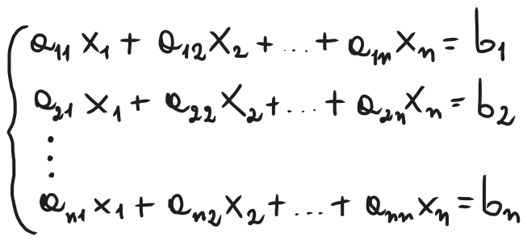
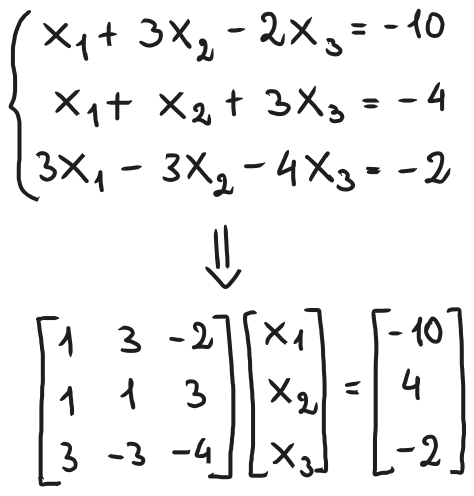
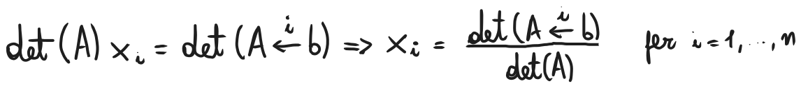

# Sistemi lineari
### [Lezione precedente](Lezione11.md)

Nota bene: Mi sembrava superfluo fare gli appunti sulle operazioni tra le matrici, le abbiamo già fatte in altre materie e il PDF di Pugliese sull'argomento è più che sufficiente per studiare e capire l'argomento. Di conseguenza ho riportato solo la parte nuova sui sistemi lineari.

### Gruppo generale lineare
Il *gruppo generale lineare* su $R$, indicato con $GL(n, R)$, è l'insieme di tutte le matrici quadrate $n \times n$ a coefficienti reali che sono invertibili, ovvero che hanno determinante non nullo. Possiamo quindi definirlo come

$GL(n, R) = \{A \in R^{n \times n} | det(A) \neq 0\}$

Su $GL(n, R)$ abbiamo definito l'operazione di prodotto di matrici, rispetto alla quale valgono le seguenti proprietà:
- Il prodotto è associativo
- Il prodotto di due matrici è invertibile
- Esiste un elemento neutro, ovvero la matrice identità $I_n$
- Ogni matrice in $GL(n, R)$ ammette un'inversa

Di conseguenza, $GL(n, R)$ è un *gruppo* rispetto al prodotto tra matrici. Non è un *gruppo commutativo*, però, perché ricordiamo che, in generale, il prodotto tra matrici non è commutativo.

### Sistemi lineari
Un sistema lineare di $n$ equazioni in $n$ incognite ha la seguente forma:

Ponendo $A = (a_{ij})$, $x = [x_1, x_2, ..., x_n]^T$ e $b = [b_1, b_2, ..., b_n]^T$ il sistema può essere scritto come $Ax = b$, nota anche come *forma matriciale*. In questa forma, $A$ è detta *matrice dei coefficienti*, $x$ *vettore delle incognite* e $b$ *vettore dei termini noti*.

Ad esempio, possiamo prendere il seguente sistema lineare e riscriverlo nella forma $Ax = b$ come segue:

Se $A$ ha determinante non nullo, allora possiamo moltiplicare l'equazione precedente per $A^{-1}$, ottenendo quindi che $Ax = b \implies x = A^{-1}b$.

#### Teorema
Se la matrice dei coefficienti di un sistema lineare di $n$ equazioni in $n$ incognite è non-singolare (ovvero il suo determinante non è nullo), allora il sistema ammette unica soluzione per ogni scelta dei termini noti.
#### Regola di Cramer
Denotiamo con $A \leftarrow^{i} b$ la matrice ottenuta da $A$ rimpiazzandone la $i$-esima colonna con il vettore $b$. Se $Ax = b$, allora si ha che $A(I \leftarrow^{i} x) = A \leftarrow^{i} b$ da cui, sfruttando la regola sul determinante del prodotto, si ha che

La regola di Laplace per il calcolo del determinante, matrice inversa, regola di Cramer e concetti simili hanno principalmente un'utilità più teorica che pratica. Se $A \in R^{n\times n}$, il calcolo di $det(A)$ tramite la regola di Laplace richiede $O(n!)$ operazioni algebriche elementari. Anche il più veloce supercomputer attualmente disponibile impiegherebbe anni per calcolare il determinante di una matrice quadrata con poche decine di righe e colonne, mentre molti problemi di calcolo scientifico coinvolgono matrici nell'ordine dei milioni o miliardi di righe e colonne.

La regola di Cramer non è quindi uno strumento praticabile per risolvere sistemi lineari, infatti vedremo successivamente metodi più efficienti.
### [Lezione successiva](Lezione13.md)
### [Torna all'indice](../README.md)