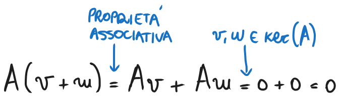
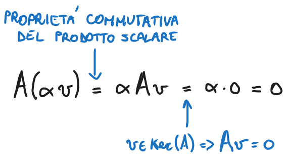
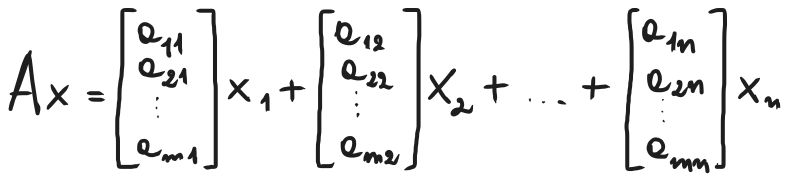
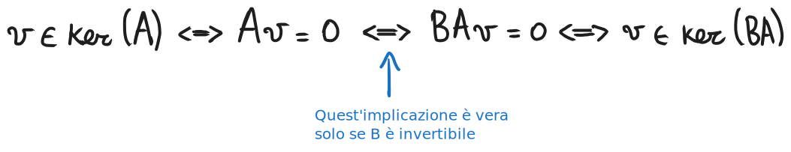

# Sottospazi fondamentali dell'algebra lineare
### [Lezione precedente](Lezione12.md)

Il metodo di Cramer per la risoluzione di un sistema lineare è quindi poco adatto per sistemi lineari più grandi. Introduciamo quindi alcune nuove nozioni di algebra lineare, nello specifico daremo le definizioni di alcuni specifici sottospazi vettoriali fondamentali per lo studio dell'esistenza delle soluzioni di un sistema lineare e la loro unicità.

### Matrice completa
Siano $A \in R^{m \times n}$, $x \in R^n$ e $b \in R^m$. Definiamo $[A, b] \in R^{m \times (n + 1)}$ come la *matrice completa* associata al sistema lineare $Ax = b$.

In parole povere, dato un sistema lineare, la matrice completa associata ad esso è la matrice che si ottiene prendendo la matrice dei coefficienti e aggiungendo come colonna finale il vettore dei termini noti.

### Nucleo
Sia $A \in R^{m \times n}$. L'insieme $ker(A) = \{v \in R^n : Av = 0\}$ è detto *nucleo* di $A$.

Questo insieme rappresenta quindi tutti i vettori $R^n$ che, moltiplicandoli per la matrice $A$, la azzerano. Possiamo fare alcune osservazioni su questo insieme, nello specifico:
1. $ker(A) \subset R^n$
2. $0 \in ker(A)$ per ogni matrice $A \in R^{m \times n}$ (siccome il vettore nullo è elemento annullante della moltiplicazione, sarà per forza contenuto nell'insieme $ker(A)$ per ogni matrice)

Se $ker(A) = {0}$, ovvero l'unico vettore che annulla la matrice $A$ è il vettore nullo e, di conseguenza, il nucleo di $A$ è ridotto al solo vettore nullo, diremo che $A$ *ha nucleo banale*, altrimenti diremo che $A$ *ha nucleo non banale*.

#### Teorema
Sia $A \in R^{m \times n}$. Si ha che $ker(A)$ è un sottospazio vettoriale di $R^n$.
#### Dimostrazione
Per dimostrare il teorema, dobbiamo verificare che le due proprietà di chiusura che caratterizzano un sottospazio vettoriale siano vere.
1. Siano $v, w \in ker(A)$. Dobbiamo verificare che la loro somma $v + w$ appartenga sempre a $ker(A)$. Affinché $v + w \in ker(A)$, deve essere vero che $A(v + w) = 0$ per definizione di $ker(A)$. Verifichiamo:
   
   
   Quindi la proprietà 1 è verificata.
2. Siano $v \in ker(A)$ e $α \in R$. Dobbiamo verificare che il loro prodotto $αv$ appartenga sempre a $ker(A)$. Affinché $αv$ appartenga a $ker(A)$, deve essere vero che $A(αv) = 0$ per definizione di $ker(A)$. Verifichiamo:
   
   
   Quindi la proprietà 2 è verificata. Entrambe le proprietà sono verificate, quindi $ker(A)$ è sottospazio vettoriale di $R^n$. questo conclude la dimostrazione.

### Immagine
Sia $A \in R^{m \times n}$. L'insieme $Im(A) = \{y \in R^m : y = Ax, x \in R^n\}$ è detto *immagine* di $A$. 

$Im(A)$ è l'insieme di tutti i vettori che si ottengono moltiplicando $A$ per un altro vettore appartenente a $R^m$. Facciamo alcune osservazioni:
- $Im(A)$ è l'immagine dell'applicazione della funzione $x \in R^n \rightarrow Ax \in R^m$
- $Im(A) \subset R^m$
- $0 \in Im(A)$ per ogni matrice $A \in R^{m \times n}$ (siccome $A \cdot 0 = 0$)

#### Teorema
Sia $A \in R^{m \times n}$. Si ha che $Im(A)$ è un sottospazio vettoriale di $R^m$. Non vedremo la dimostrazione di questo teorema.

Si consideri ora un sistema lineare $Ax = b$. Sulla base delle definizioni di $ker(A)$ e $Im(A)$, possiamo fare delle osservazioni.
1. Per definizione, il sistema ammette soluzione se e soltanto se $b \in Im(A)$.
2. Siamo $b \in Im(A)$ e $v \in ker(A)$ $v \neq 0$ (e quindi $A$ ha nucleo non banale). Sia $x \in R^n$ soluzione del sistema lineare $Ax = b$. Allora $A(x + v) = Ax + Av = b + 0 = b$, di conseguenza anche $x + v$ è soluzione per lo stesso sistema lineare. Da questo ne deriva che la soluzione di un sistema lineare $Ax = b$ è unica soltanto se $A$ ha nucleo non banale.

Queste due affermazioni possono essere riassunte in questo enunciato: *Un sistema lineare* $Ax = b$ *ammette soluzione SE E SOLO SE* $b$ *è nell'immagine di* $A$*. Se il sistema ammette soluzione, questa è unica SE E SOLO SE il nucleo di* $A$ *è banale.*

3. Il nucleo di una matrice $A$ è un sottospazio vettoriale sul corpo $R$ e, quindi, o è ridotto al vettore nullo oppure ha infiniti elementi. Questo significa che, se un sistema lineare ammette più di una soluzione, allora ne ammette necessariamente infinite. *Un sistema lineare può avere solo 0, 1 o infinite soluzioni.*
4. Se $A \in R^{m \times n}$ e $x \in R^n$, possiamo scrivere
   
   
   Per cui possiamo interpretare $Im(A)$ come l'insieme di tutte le possibili combinazioni lineari delle sue colonne, ovvero come il sottospazio vettoriale ($span$) generato dalle sue colonne.

### Rango e rango pieno
Sia $A \in R^{m \times n}$. Il numero $rank(A) = dim(Im(A))$ è detto *rango* di $A$. Si deve trattare necessariamente di un numero intero naturale e rappresenta il numero di elementi dell'immagine di $A$.

Alcune osservazioni:
1. Siccome $Im(A)$ è un sottospazio di $R^m$, allora si ha che $rank(A) \leq m$
2. Siccome $Im(A)$ è anche il sottospazio generato dalle $n$ colonne di $A$, si ha che $rank(A) \leq n$

Da queste due osservazioni ne deriva il fatto che, per ogni matrice $A \in R^{m \times n}$, si ha che $rank(A) \leq min\{m, n\}$.

Se $rank(A) = min\{m, n\}$, allora diremo che $A$ ha *rango pieno*. Se $rank(A) = min\{m, n\} = m$ allora diremo che $A$ ha *rango pieno per righe*. Se $rank(A) = min\{m, n\} = n$, allora diremo che $A$ ha *rango pieno per colonne*.

### Nucleo, rango e operazioni elementari su di essi
In questa sezione vedremo le operazioni che conservano il nucleo e il rango di una matrice. L'obiettivo è cercare di individuare qualche operazione che permetta di semplificare la forma di una matrice così da semplificare anche il calcolo di nucleo e rango.
#### Teorema
Siano $A \in R^{m \times n}$ e $B \in R^{m \times m}$. Se $B$ è invertibile, allora si ha che $ker(A) = ker(BA)$.

Si può enunciare questo teorema anche dicendo che *la pre-moltiplicazione per una matrice invertibile conserva il nucleo*.
#### Dimostrazione

Mentre tutte le altre implicazioni sono vere per la definizione di $ker(A)$.
### [Lezione successiva](Lezione14.md)
### [Torna all'indice](../README.md)