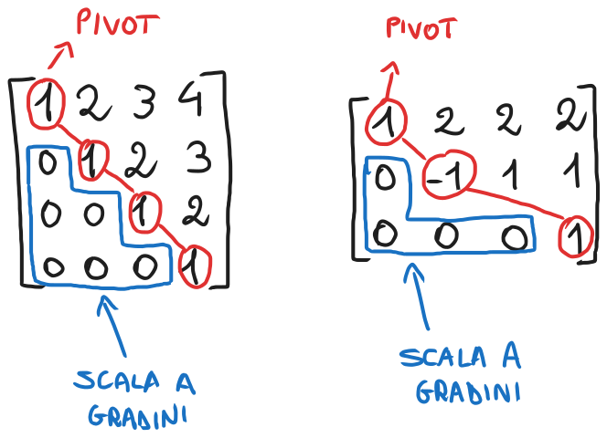

# Operazioni elementari, forma a gradini, calcolo di rango, base, nucleo e immagine di una matrice
### [Lezione precedente](Lezione13.md)

### Teorema
Siano $A \in R^{m \times n}$ e $B \in R^{m \times m}$. Se $B$ è invertibile, si ha che $rank(A) = rank(BA)$.

Mediante la definizione di rango si può verificare che, se $\{v_1, ..., v_p\}$ è una base per $Im(A)$ e $B$ è una matrice invertibile, allora $\{Bv_1, ..., Bv_p\}$ è una base per $Im(BA)$.

### Operazioni elementari
Chiameremo *operazioni elementari* le seguenti operazioni sulle righe di una matriche:
- Sommare ad una riga un multiplo di un'altra riga
- Scambiare due righe fra di loro

Le operazioni elementari sulle righe di una matrice ne conservano nucleo e rango.

### Matrici in forma a gradini
Sia $U \in R^{m \times n}$. Informalmente, diremo che $U$ è *in forma a gradini* o *a gradini* se:
- Il primo elemento non nullo di ciascuna riga si trova a destra del primo elemento non nullo della riga precedente
- Se una riga di $U$ è nulla, lo sono anche tutte le righe successive.

Formalmente, diremo che $U = \{U_{ij}\}$ è a gradini se:
- Per ogni riga non nulla $i \geq 2$ di $U$, si ha $min\{j : U_{ij} \neq 0\} > min\{j : U_{i-1, j} \neq 0\}$
- Se esiste $i = 1, ..., n$ tale che $U_{ij} = 0$ per ogni $j$, allora $U_{kj} = 0$ per ogni $k \geq i$ e per ogni $j$

Essenzialmente, una matrice si dice *a gradini* proprio perché compone una specie di "scala a gradini" di zeri.

### Pivot e colonne pivotali
Se $U \in R^{m \times n}$ è a gradini, il primo elemento non nullo di ciascuna sua riga (da sinistra) è detto *pivot* oppure *elemento pivotale*. Formalmente, $U_{ij}$ è un pivot di $U$ se $U_{ij} \neq 0$ e $j = min\{k : U_{ik} \neq 0\}$.

Sia $U \in R^{m \times n}$ a gradini. Una colonna di $U$ si dice *pivotale* se contiene un pivot, altrimenti essa si dice *non pitovale*.

Ad esempio, nell'esempio di sopra, nella prima matrice tutte le colonne sono pivotali, mentre nella seconda matrice le colonne 1, 2 e 4 sono pivotali, mentre la colonna 3 no.

Alcune osservazioni:
1. Le colonne pivotali di una matrice a gradini sono linearmente indipendenti e, quindi, ne costituiscono una base per l'immagine
2. Le righe non nulle di una matrice a gradini sono linearmente indipendenti

### Forma a gradini di una matrice
Se $U \in R^{m \times n}$ a gradini è si può ottenere mediante delle operazioni elementari a partire da una matrice $A \in R^{m \times n}$, allora si dice che $U$ è *una forma a gradini* di $A$.

L'idea sarà quindi partire da una matrice $A$ e utilizzare le operazioni elementari per ricondurla a una matrice $U$ a gradini.
#### Teorema
Se $U \in R^{m \times n}$ è una forma a gradini di $A$, allora $rank(A)$ è uguale al numero di pivot di $U$.

Questo teorema segue dal fatto che:
1. Le operazioni elementari conservano il rango di una matrice, quindi $rank(A) = rank(U)$
2. Le colonne pivotali di una matrice a gradini sono linearmente indipendenti e ne costituiscono una base per l'immagine, dunque $rank(U) =$ *numero di colonne pivotali di* $U =$ *numero di pivot di* $U$.

Si può quindi dimostrare che le operazioni elementari conservano anche l'indipendenza lineare delle righe. Unendo questo fatto alle osservazioni precedenti, si ottiene il seguente teorema.
#### Teorema
Per ogni matrice $A$, si ha che $rank(A) =$ *numero di righe linearmente indipendenti di* $A =$ *numero di colonne linearmente indipendenti di* $A$. 

### Parametrizzazione
Ricordiamo che, se $v_1, ..., v_p$ è base per un sottospazio vettoriale $W$ di $V$, allora ogni elemento $v \in W$ può essere espresso in un unico modo come combinazione lineare dei $V_i$, ovvero $v = α_1v_1 + ... + α_pv_p$. In tal caso, l'espressione

$W = \{v \in V : v = α_1v_1 + ... + α_pv_p | α_1, ..., α_p \in R\}$

si dice *parametrizzazione del sottospazio* $W$, e gli $α_i$ ne sono detti *parametri*.

Se è possibile descrivere un sottospazio come nella relazione di sopra, e i vettori $v_1, ..., v_p$ sono linearmente indipendenti, allora è possibile dimostrare che $\{v_1, ..., v_p\}$ è una base per $W$ e l'espressione $v = α_1v_1 + ... + α_pv_p$ è una parametrizzazione di $W$. È quindi possibile ottenere una base per uno spazio vettoriale a partire da una sua parametrizzazione costituita da vettori linearmente indipendenti. Questo fatto si può usare per costruire basi per il nucleo di una matrice.

### Calcolare una base per nucleo e immagine di una matrice
Sia $A \in R^{m \times n}$. Descriviamo sinteticamente una strategia per calcolare una base per $ker(A)$ e $Im(A)$.
1. Trasformare $A$ in una sua forma a gradini $U$ mediante operazioni elementari
2. Considerato il sistema lineare $Ux = 0$, spostare a destra del segno di uguaglianza le incognite associate alle colonne non pivotali di $U$ (le chiameremo *incognite non pivotali*) mediante *sostituzione all'indietro*, cioè risolvendo le equazioni dall'ultima "a salire" fino alla prima
3. Descrivere l'insieme delle soluzioni di $Ux = 0$ come parametrizzazione di $ker(U)$ ed estrarne una base per $ker(A) = ker(U)$
4. Ottenere una base per $Im(A)$ considerandone le colonne corrispondenti alle colonne pivotali di $U$.
### [Lezione successiva](Lezione15.md)
### [Torna all'indice](../README.md)