# Teorema di Rouché-Capelli, eliminazione di Gauss
### [Lezione precedente](Lezione14.md)

Al termine della lezione precedente abbiamo delineato una strategia per ottenere basi per il nucleo e per l'immagine di una matrice. Da questa strategia è emerso che:
- Considerata una matrice $A$ e una sua forma a gradini $U$, ogni colonna pivotale di $U$ corrisponde ad un vettore di una base di $Im(A)$
- Ad ogni colonna non pivotale di $U$ è associato un vettore di una base per $ker(A)$
Da questo ne deriva il seguente teorema.

#### Teorema
Sia $A \in R^{m \times n}$. Allora $rank(A) + dim(ker(A)) = n$.

Abbiamo detto che $rank(A)$ è uguale al numero di colonne pivotali di $U$, mentre $dim(ker(A))$ è uguale al numero di colonne non pivotali di $U$. Questo significa che sommando i due si ottiene il numero totale di colonne della matrice.

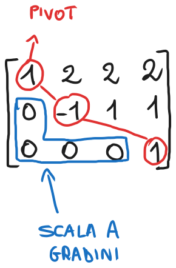

Prendendo questa matrice esempio della lezione precedente, possiamo verificare l'identità $3 + 1 = 4$. Questo perché, come detto nella lezione precedente, abbiamo 3 colonne pivotali (1, 2 e 4) e una colonna non pivotale (3). Insieme, formano 4 colonne. Assurdo, lo so.

### Strategia per risolvere un sistema lineare
La strategia per ottenere basi per nucleo e immagine di una matrice può essere adattata alla risoluzione di un qualsiasi sistema lineare $Ax = b$.
1. Portare la matrice completa del sistema $[A, b]$ in forma a gradini $[U, c]$
2. Risolvere, se possibile, $Ux = c$ rispetto alle incognite pivotali mediante sostituzione all'indietro

Gli scenari ai quali si può andare incontro sono generalmente tre. Li descriviamo in forma schematica di seguito, utilizzando il simbolo $\times$ per marcare gli elementi non nulli di una matrice.

#### Caso A
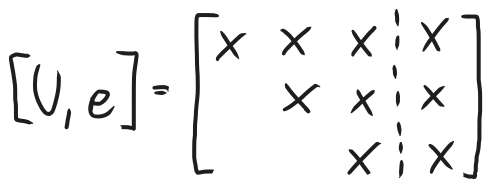

In questo caso, tutte e sole le colonne di $U$ sono pivotali e, dunque, il sistema ammette soluzione ed è unica.

In merito al rango delle matrici, possiamo osservare che $rank(U) = rank([U, c]) = n$.
#### Caso B
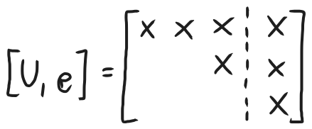

L'ultima colonna di $[U, c]$ (ovvero la colonna associata a $c$) contiene un pivot. Questo dà luogo ad un'equazione impossibile da risolvere, quindi il sistema non ammette soluzioni.

In merito al rango delle matrici, possiamo osservare che $rank(U) < rank([U, c])$.
#### Caso C
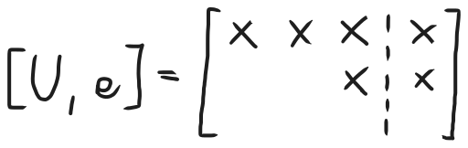

L'ultima colonna di $[U, c]$ non è pivotabile, ma $U$ ha colonne non pivotabili. Ne segue che il sistema ammette infinite soluzioni, parametrizzabili rispetto all'incognita non pivotabile.

In merito al rango delle matrici, possiamo osservare che $rank(U) = rank([U, c]) < n$.

Ricordiamo anche che $rank(U) = rank(A)$ e $rank([U, c]) = rank([A, b])$, siccome $U$ e $[U, c]$ provengono da operazioni elementari sulle righe di $A$ e $[A, b]$ rispettivamente, che mantengono inalterate il loro rango.

Tutte queste considerazioni possono essere formalizzate nel seguente teorema.

### Teorema di Rouché-Capelli
Siano $A \in R^{m \times n}$ e $b \in R^m$. Allora:
1. Il sistema $Ax = b$ ammette soluzione se e soltanto se $rank(A) = rank(A, b)$
2. Se $rank(A) = rank([A, b]) = n$, allora la soluzione di $Ax = b$ è unica, altrimenti il sistema ammette infinite soluzioni parametrizzabili mediante $n - rank(A)$ parametri arbitrari e indipendenti. Nell'ultimo caso, scriveremo che il sistema ammette $\infty^{n - rank(A)}$ soluzioni.

### Esercizio di esempio
Siano 

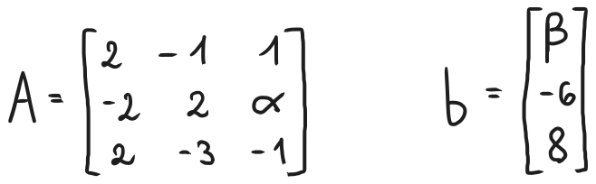

con $α, β \in R$. Determinare i valori di $α$ e $β$ per i quali il sistema $Ax = b$:
- Non ammette soluzioni *(a)*
- Ammette unica soluzione *(b)*
- Ammette infinite soluzioni. *(c)*

Per i valori di $α$ e $β$ ottenuti al punto *(c)*, determinare:
1. Tutte le soluzioni del sistema lineare
2. Una base per $ker(A)$
3. Una base per $Im(A)$
4. Il rango di $A$
#### Svolgimento
Prima di tutto, portiamo $[A, b]$ in forma a gradini. Lo facciamo di seguito indicando, per chiarezza, le operazioni elementari effettuate.

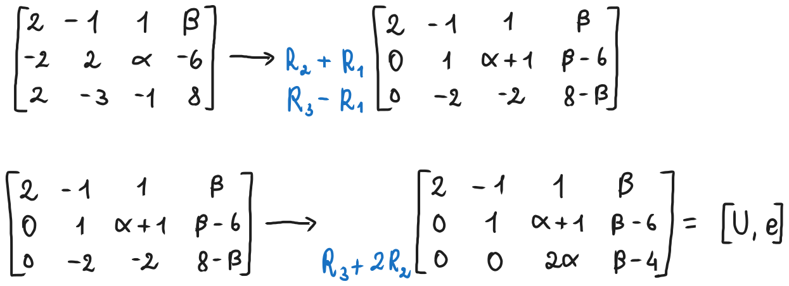

Adesso possiamo già rispondere ai quesiti *(a)*, *(b)* e *(c)*.
- *(a)*: Per non ammettere soluzioni, deve esserci un pivot lungo l'ultima colonna di $[U, c]$. Questo significa che tutta la terza riga è nulla fino all'ultimo elemento, ovvero $α = 0$ e $β \neq 4$
- *(b)*: Per ammettere una sola soluzione, tutte le colonne di $U$ devono essere pivotali. Questo significa che il terzo elemento dell'ultima riga non deve essere nullo, ovvero $α \neq 0$
- *(c)*: Per ammettere infinite soluzioni, deve esserci almeno una colonna non pivotale in $U$ e non c'è un pivot lungo l'ultima colonna di $[U, c]$. Questo significa che l'ultima riga deve essere totalmente nulla, ovvero $α = 0$ e $β = 4$.

Per $α = 0$ e $β = 4$, abbiamo

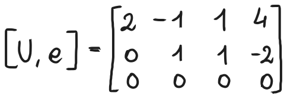

1. Scriviamo esplicitamente il sistema $Ux = 0$ trattando l'incognita non pivotale $x_3$ come parte del termine noto, per poi risolvere il sistema rispetto a $x_1$ e $x_2$ per sostituzione all'indietro.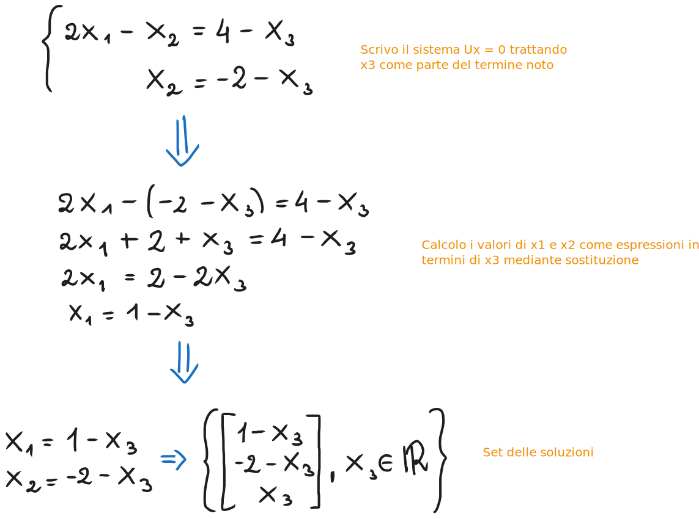
2. Riscriviamo l'insieme delle soluzioni isolando la parte costante da quella parametrica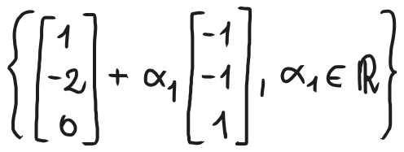
   Riconosciamo che la colonna parametrica è una parametrizzazione per il nucleo di $A$, quindi deduciamo che
   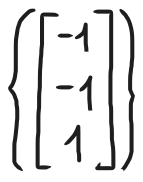
   è una base per $ker(A)$.
3. Una base per $Im(A)$ è costituita dalle colonne di $A$ corrispondenti alle colonne pivotali di $U$. $U$ ha due pivot in $U_{1,1}$ e $U_{2,2}$, quindi ha due colonne pivotali, ovvero le colonne 1 e 2. Di conseguenza, la base per $Im(A)$ si ottiene prendendo le colonne 1 e 2 di $A$:
   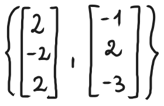
4. $rank(A)$ sarà uguale al numero di pivot di $U$ per i teoremi visti precedentemente, di conseguenza $rank(A) = 2$ in quanto $U$ ha due pivot.

### Considerazioni su esistenza e unicità delle soluzioni di sistemi lineari
Sia $Ax = b$ un sistema lineare con $A \in R^{m \times n}$. A seconda della relazione che sussiste tra $m$ e $n$, si hanno diverse aspettative circa esistenza e unicità delle soluzioni (ricordiamo che $m$ è il numero di righe e $n$ il numero di colonne).
- $m > n$ : In questo caso $A$ è detta *matrice skinny (magra)* ed il sistema è detto *sovradeterminato*. Essendo il numero di equazioni superiore al numero di incognite, in generale ci si aspetta che tale sistema non ammetta soluzioni.
- $m = n$ : In questo caso $A$ è detta *matrice quadrata* e così è detto anche il sistema. In generale, ci si aspetta che $A$ sia non singolare e, di conseguenza, che il sistema ammetta unica soluzione (ovviamente ci sono i diversi casi che abbiamo visto sopra, quindi attenersi principalmente a quelli).
- $m < n$ : In questo caso $A$ è detta *matrice fat (grassa)* ed il sistema è detto *sottodeterminato*.  Essendo il numero di equazioni inferiore al numero di incognite, in generale ci si aspetta che che tale sistema ammetta infinite soluzioni.

Sia chiaro che queste osservazioni sono solo delle aspettative. È facile produrre esempi di sistemi che rispecchino la relazione tra $m$ e $n$ ma abbiano un numero di soluzioni diverso, ad esempio sistemi sottodeterminati che non ammettono soluzioni o sistemi sovradeterminati che ne ammettono infinite, ma generalmente sono casi più speciali.

### Sistemi lineari quadrati, eliminazione di Gauss e fattorizzazione LU
Illustriamo adesso una strategia, detta *eliminazione di Gauss*, per risolvere un sistema lineare $Ax = b$. Ci limiteremo al caso dei sistemi quadrati. Vedremo poi un evoluzione di questo approccio, una specifica sequenza di operazioni elementari sulla matrice dei coefficienti del sistema, ovvero la cosiddetta *fattorizzazione LU* di $A$.

#### Eliminazione di Gauss
Consideriamo il seguente sistema lineare

1. **Passo di eliminazione**: Si elimina l'incognita $x_1$ dalle equazioni $Eq2$ e $Eq3$ aggiungendo a queste un multiplo di $Eq1$: 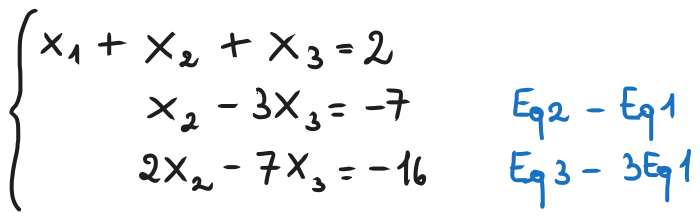
2. **Passo di eliminazione**: Si elimina l'incognita $x_2$ dall'equazione $Eq3$ aggiungendo a questa un multiplo di $Eq_2$: 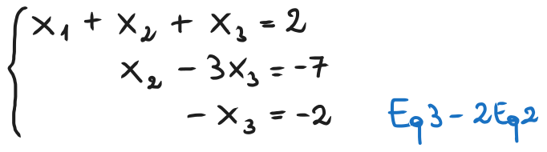
3. **Sostituzione all'indietro**: Si risolve il sistema lineare salendo dall'ultima equazione alla prima:
   
   $x_3 = 2 \implies x_2 = -7 + 3x_3 = -1 \implies x_1 = 2 - x_2 - x_3 = 1$
   
4. **Soluzione**: La soluzione del sistema lineare è
   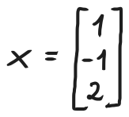

### Algoritmo generale dell'eliminazione di Gauss
Generalizziamo adesso la strategia al caso di un sistema di $n$ equazioni in $n$ incognite, descrivendola in forma algoritmica.
1. Per $k = 1, ..., n - 1$
	   eliminare, qualora possibile, l'incognita $x_k$ dalle equazioni $Eq(k+1), ..., Eqn$ sommando a queste un opportuno multiplo di $Eqk$
	Fine
2. Risolvere, nell'ordine, $Eqn$, $Eq(n-1)$, ..., $Eq1$ per sostituzione all'indietro.
### [Lezione successiva](Lezione16.md)
### [Torna all'indice](../README.md)