# Fattorizzazione LU
### [Lezione precedente](Lezione15.md)

Nella lezione precedente, abbiamo definito un algoritmo che delinea una strategia per la risoluzione dei sistemi lineari basato sul metodo di eliminazione di Gauss.

1. Per $k = 1, ..., n - 1$
	   eliminare, qualora possibile, l'incognita $x_k$ dalle equazioni $Eq(k+1), ..., Eqn$ sommando a queste un opportuno multiplo di $Eqk$
	Fine
2. Risolvere, nell'ordine, $Eqn$, $Eq(n-1)$, ..., $Eq1$ per sostituzione all'indietro.

Non è sempre possibile, però, portare a termine il punto ```1``` di questa strategia. Ad esempio, non è possibile farlo per il sistema

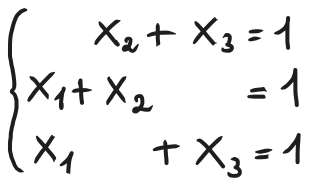

### Interpretazione algebrica dell'eliminazione di Gauss
È possibile interpretare i passi dell'eliminazione di Gauss come una pre-moltiplicazione per opportune matrici che effettuano operazioni elementari  sulle righe della matrice dei coefficienti del sistema $A$. Illustriamo questo fatto sull'esempio della lezione precedente.

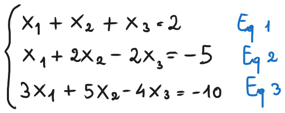

**Passo 1.** Nella cancellazione di Gauss, si elimina l'incognita $x_1$ dalle equazioni $Eq2$ e $Eq3$ aggiungendo a queste un multiplo di $Eq1$ ($Eq_2 - Eq_1$, $Eq3 - 3Eq_1$). Algebricamente, questo corrisponde a moltiplicare $A$ alla seguente matrice $M_1$.

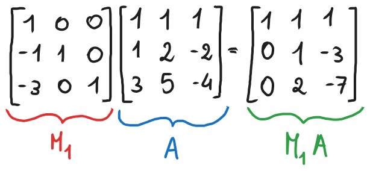

**Passo 2.** Nella cancellazione di Gauss, si elimina l'incognita $x_2$ dall'equazione $Eq3$ e $Eq3$ aggiungendo a queste un multiplo di $Eq2$ ($Eq_3 - 2Eq_2$). Algebricamente, questo corrisponde a moltiplicare $M_1A$ alla seguente matrice $M_2$.

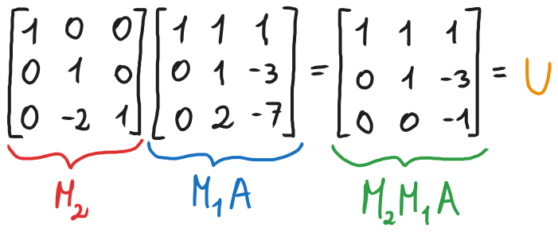

Algebricamente, possiamo quindi rappresentare il processo di trasformazione di $A$ in $U$ come $M_2M_1A = U$.

Notiamo inoltre che $det(M_1) = det(M_2) = 1$, dunque sia $M_1$ che $M_2$ sono invertibili e di conseguenza possiamo scrivere che $A = M_1^{-1}M_2^{-1}U$.

Vedremo successivamente che $M_1$ e $M_2$ hanno una struttura speciale che consente di calcolare facilmente $M_1^{-1}$ e $M_2^{-1}$, ottenendo

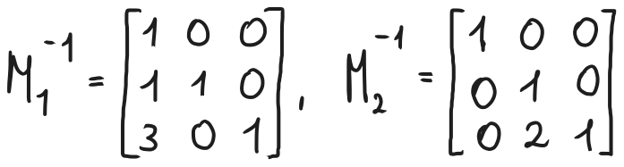

### Fattorizzazione LU
Proseguiamo adesso calcolando esplicitamente il prodotto tra $M_1^{-1}$ e $M_2^{-1}$ e lo nominiamo come $L$:

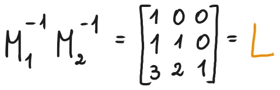

Notiamo che $L$ è una matrice triangolare inferiore dove tutti gli elementi della diagonale sono uguali a $1$. In conclusione, possiamo scrivere $A = LU$, con $U$ triangolare superiore (siccome $U$ è a scalini sarà anche una matrice diagonale superiore) e $L$ triangolare inferiore come visto sopra. Inoltre, $diag(L) = [1, 1, 1]$.

Ricapitolando, abbiamo quindi:

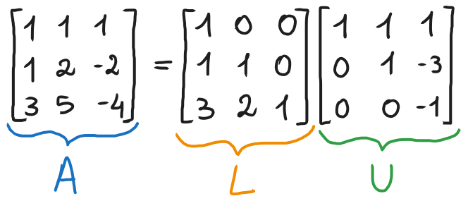

La forma $A = LU$ è quindi detta *fattorizzazione LU di* $A$.

Possiamo fare alcune osservazioni:
- Le inverse $M_1^{-1}$ e $M_2^{-1}$ coincidono, rispettivamente, con le matrici $M_1$ e $M_2$, con l'unica differenza che gli elementi sotto la diagonale hanno lo stesso valore ma segno opposto
- Sotto la diagonale, gli elementi del prodotto $M_1^{-1} M_2^{-1}$ hanno lo stesso valore dei corrispondenti non nulli dei singoli fattori. Lungo e sopra la diagonale, invece, il prodotto $M_1^{-1} M_2^{-1}$ coincide con i fattori $M_1^{-1}$ e $M_2^{-1}$.
Queste osservazioni non sono accidentali ma generali, e sono conseguenze della struttura speciale delle matrici $M_1^{-1}$ e $M_2^{-1}$.

Più avanti nella lezione vedremo come calcolare a tutti gli effetti le matrici $M_1, M_2, ..., M_{n-1}, U$ a partire da qualunque matrice $A \in R^{n \times n}$.

### Matrici triangolari speciali
Una matrice triangolare è detta *speciale* se tutti i suoi elementi diagonali sono uguali a $1$.

È possibile definire alcune importanti proprietà di chiusura sulle matrici triangolari rispetto a prodotto e inverso.
1. Il prodotto tra matrici triangolari inferiori (rispett. superiori) è a sua volta triangolare inferiore (rispett. inferiore).
2. L'inversa di una matrice triangolare inferiore (rispett. superiori) e invertibile è triangolare inferiore (rispett. inferiore).
3. Il prodotto tra matrici triangolari inferiori (rispett. superiori) speciali è triangolare inferiore (rispett. superiore) speciale.
4. L'inversa di una matrice triangolare inferiore (rispett. superiori) speciale e invertibile è triangolare inferiore (rispett. inferiore) speciale.

### Matrici elementari
Diremo che una matrice $M_k \in R^{n \times n}$ è *elementare* se è triangolare inferiore speciale e coincide con l'identità fatta eccezione per al massimo una colonna, Per convenienza, l'indice $k$ indicherà sempre l'unica colonna lungo la quale $M_k$ può differire dall'identità. Formalmente, diremo che $M_k$ è elementare se
1. $M_k$ è triangolare inferiore speciale
2. $(M_k)_{ij} = 0$ per ogni $i < j$ con $j \neq 0$

In parole povere, una matrice elementare è una matrice che ha $1$ come tutti elementi della diagonale, mentre tutti i restanti elementi sono $0$. È ammesso che una colonna includa elementi diversi da $0$ sotto la diagonale, in quel caso la colonna in questione darà l'indice alla matrice. Ad esempio:

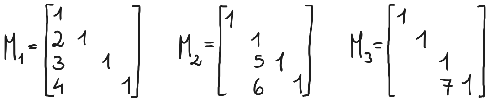

Ho omesso di rappresentare elementi nulli per rapidità. Vediamo adesso un teorema che mostra che l'inversa di una matrice elementare e il prodotto tra matrici elementari (purché siano effettuati nel giusto ordine) godono di proprietà speciali. Per di più, possono essere ottenuti sostanzialmente senza effettuare calcoli. Sono essenzialmente una formalizzazione delle osservazioni che abbiamo fatto nell'esempio della fattorizzazione $LU$.
#### Teorema
1. Sia $M_k$ elementare. Allora essa è invertibile e si ha che $(M_k^{-1})_{ij} = -(M_k)_{ij}$ per ogni $i > j$ (l'inversa di una matrice elementare è uguale alla matrice elementare stessa con gli elementi sotto la diagonale cambiati di segno)
2. Siano $M_{k1}, ..., M_{kp} \in R^{n \times n}$ elementari con $k_1 < ... < k_p$. Allora il prodotto è una matrice triangolare superiore e si ha $(M_{k1} ... M_{kp})_{ij} = (M_{k1} + ... + M_{kp})_{ij}$ per ogni $i > j$ (il prodotto di matrici elementari in ordine è uguale a una matrice composta da tutte le colonne eccezione delle matrici elementari di partenza)
#### Esempio
Riprendiamo le matrici elementari che abbiamo usato come esempio precedentemente:


Abbiamo detto che sono elementari e, di conseguenza, si ha:

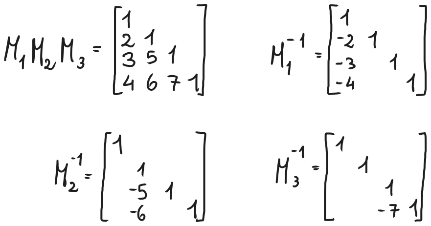

Questo vale solo se le matrici sono in ordine. Ad esempio, il prodotto $M_3 M_2 M_1$ non verifica le ipotesi del teorema, siccome le matrici sono disposte da $3$ a $1$ piuttosto che da $1$ a $3$ (ricordiamo che il prodotto tra matrici non gode della proprietà commutativa).

### Minori principali di testa
Sia $A \in R^{n \times n}$. Il determinante della sottomatrice principale di testa di $A$ di ordine $k$ è detto *minore principale di testa di ordine* $k$.

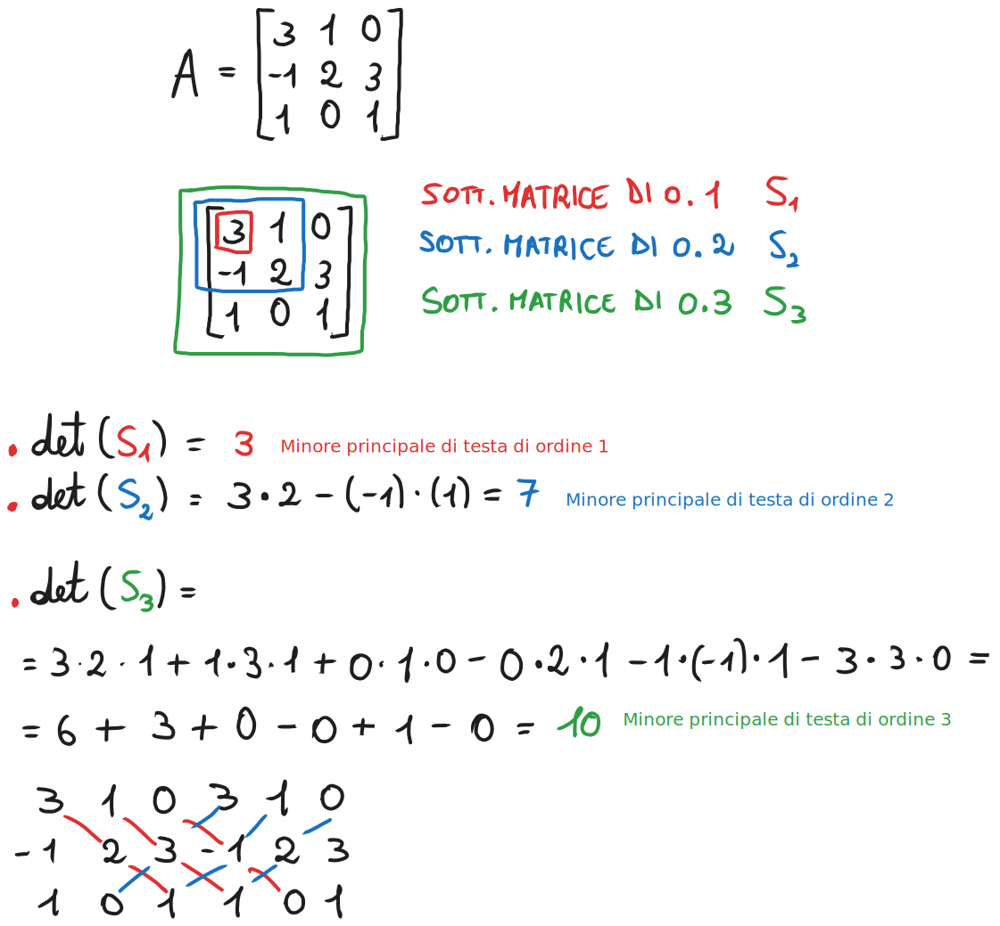

### Teorema dell'esistenza e dell'unicità della fattorizzazione LU
Sia $A \in R^{n \times n}$. Se i minori principali di testa d'ordine $1, 2, ..., n-1$ sono diversi da zero, allora esistono e sono uniche le matrici $L, U \in R^{n \times n}$ tali che:
1. $L$ è triangolare inferiore speciale
2. $U$ è triangolare superiore
3. $A = LU$ (detta *fattorizzazione* $LU$ *di* $A$)

Nota bene: non sono riuscito a capire la dimostrazione/algoritmo di questo teorema, ma ho capito come si fanno gli esercizi. Sulla lezione di Pugliese in questo momento farebbe vedere la dimostrazione, io invece riporterò un esercizio che ho fatto con la spiegazione dei vari passaggi così che possiate comunque capire il procedimento generico.

### Esempio

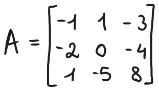

Determinare le matrici $M_1$,  $M_2$ e la matrice triangolare superiore $U$ tali che $M_2 M_1 A = U$, successivamente determinare la fattorizzazione $LU$ di $A$.
#### Svolgimento
Per iniziare l'esercizio bisogna partire da $A$ e cercare di portarlo nella sua forma a gradini, ovvero la matrice $U$ (che sarà anche la matrice $U$ nella fattorizzazione $LU$). Partiamo quindi dalla prima colonna, dobbiamo utilizzare $R_1$ (riga 1 della matrice) per azzerare il resto della prima colonna di $A$. Nel caso di $R_2$ (riga 2 della matrice), dobbiamo sottrarre $R_ 2$ due volte, così da avere $-2 + 2 = 0$. Nel caso di $R_3$ (riga 3 della matrice), dobbiamo aggiungere $R_1$ una volta, così da avere $1 + (-1) = 0$. Quindi:

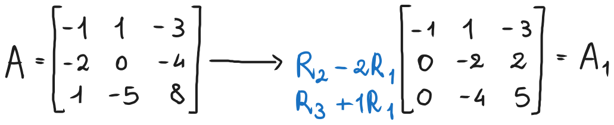

Come abbiamo visto all'inizio della lezione, le operazioni elementari possono essere viste come una pre-moltiplicazione per una matrice $M_1$ (ovvero $A_1$ = $M_1 A$). Quindi, il nostro obiettivo adesso è utilizzare le operazioni elementari che hanno trasformato $A$ in $A_1$ per costruire la matrice $M_1$. Ricordiamo che $M_1$ è una *matrice elementare*, ovvero una matrice che ha solo $1$ come elementi sulla diagonale mentre gli altri elementi sono tutti nulli, fatta eccezione per al massimo una colonna, in cui gli elementi sotto la diagonale possono essere non nulli. Partiamo quindi descrivendo la struttura generale della matrice $M_1$, mettendo quindi gli $1$ sulla diagonale di una matrice vuota.

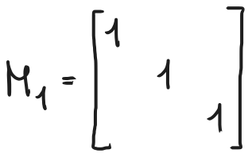

Adesso, prenderemo i coefficienti di $R_1$ nelle operazioni elementari fatte sopra per costruire la colonna non nulla di $M_1$. Fatto questo, basterà semplicemente riempire di $0$ il resto della matrice e avremo costruito la nostra matrice $M_1$.

La colonna si costruisce in questo modo. Innanzitutto, siccome stiamo operando sulla prima colonna di $A$, i coefficienti andranno inseriti nella prima colonna di $M_1$ (infatti è proprio per questo che si chiama $M_1$). Dovremo semplicemente riportare i coefficienti nella colonna, in questo modo:

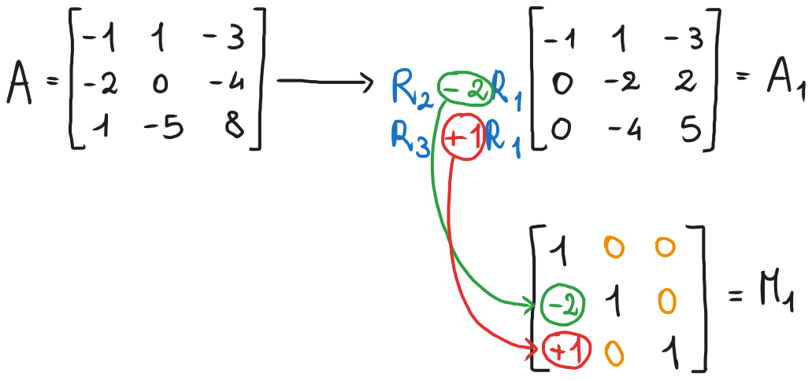

Fatto questo, abbiamo già costruito la matrice $M_1$. Adesso si continua da $A_1$, e seguiremo lo stesso processo. Passiamo alla seconda colonna e scendiamo di una riga per arrivare al successivo pivot della matrice. Da qui, cercheremo di utilizzare $R_2$ per azzerare il resto della seconda colonna di $A_1$, sempre per cercare di raggiungere la forma a gradini $U$. Dobbiamo quindi sottrarre due volte $R_2$ da $R_3$ per azzerare il resto della colonna, siccome $-4 - (2 \cdot (-2)) = -4 + 4 = 0$.

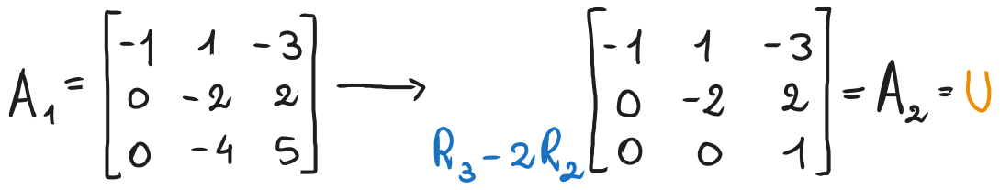

Notiamo che $A_2$ è a gradini, quindi abbiamo raggiunto la forma a gradini di $A$ e, di conseguenza, $A_2 = U$. Di nuovo, il nostro obiettivo adesso sarà utilizzare le operazioni elementari che hanno trasformato $A_1$ in $A_2$ per costruire la matrice $M_2$. Partiamo allo stesso modo di $M_1$, quindi costruendo una matrice che ha $1$ come elementi sulla diagonale. Siccome stiamo lavorando sulla seconda colonna di $A_1$, allora dovremo riempire la seconda colonna di $M_2$. Ora dobbiamo semplicemente riportare i coefficienti di $R_2$ nelle operazioni elementari (in questo caso solo una) in $M_2$ in questo modo, per poi riempire il resto di $M_2$ con degli $0$:

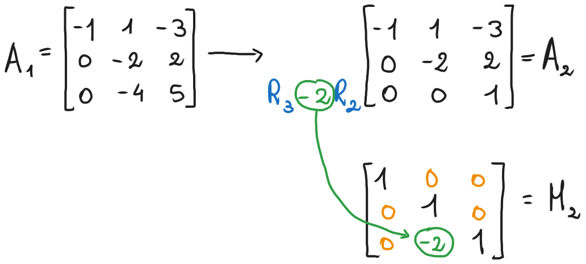

Abbiamo detto che $A_2$ è arrivata alla forma a gradini, quindi $A_2 = U$ e di conseguenza possiamo fermarci qui. Se la matrice fosse stata $4 \times 4$ o più, avremmo poi dovuto continuare con lo stesso processo per calcolare $M_3$ e così via, fino a $M_{n - 1}$, dove $n$ è il numero di righe e colonne della matrice, man mano scendendo sulla diagonale, azzerando il resto della colonna con delle operazioni elementari che utilizzano la riga corrente per poi utilizzare i coefficienti per costruire la matrice. Abbiamo già finito il primo punto dell'esercizio, ovvero abbiamo calcolato $M_1$ e $M_2$. Si ha che $U = A_2 = M_2 A_1 = M_2 M_1 A$, quindi è verificato.

Il prossimo step dell'esercizio è trovare la fattorizzazione $A = LU$. La matrice $U$ sarà la stessa matrice $U$ che corrisponde alla forma a gradini di $A$, quella che abbiamo trovato nello step precedente, ovvero $A_2$. Per trovare $L$, invece, si ha che $M_2 M_1 A = U \implies A = M_1^{-1} M_2^{-1} U$, quindi $L =  M_1^{-1} M_2^{-1}$. Ricordiamo che sia $M_1$ che $M_2$ sono matrici elementari (così come le loro inverse), quindi è semplice calcolare questo prodotto. Innanzitutto, l'inversa di una matrice elementare equivale alla matrice stessa, ma tutti gli elementi sotto la diagonale hanno segno opposto rispetto alla matrice di partenza. Calcoliamo quindi le matrici inverse $M_1^{-1}$ e  $M_2^{-1}$:

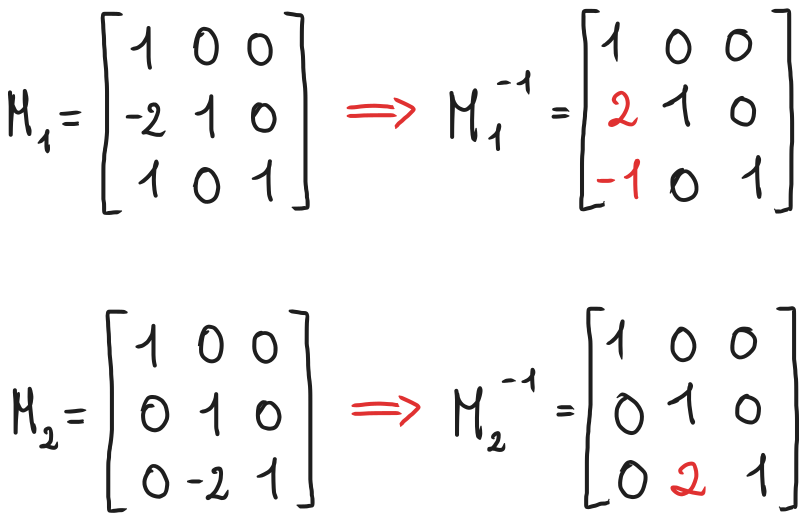

Adesso, basterà moltiplicarle per ottenere la matrice $M_1^{-1} M_2^{-1} = L$. La moltiplicazione tra due o più matrici elementari (in ordine, ma va bene perché abbiamo (e avremo in tutti gli esercizi) prima $M_1^{-1}$ e $M_2^{-1}$) è semplicemente una matrice che unisce le colonne non nulle delle singole matrici elementari. Di conseguenza, nel nostro caso avremo:

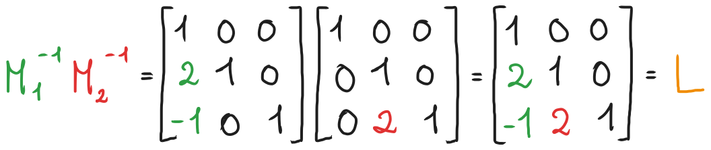

Abbiamo tutti gli elementi della fattorizzazione $A = LU$. Non ci resta quindi che scrivere:

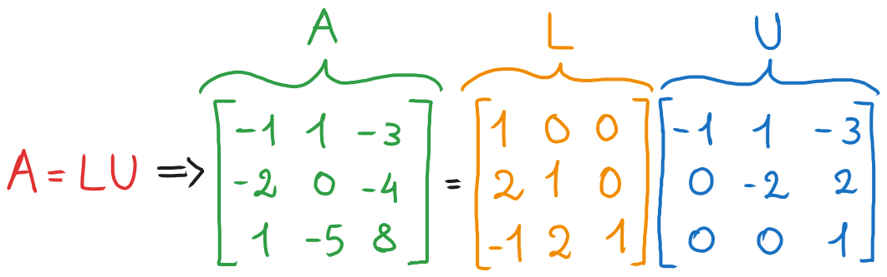

E questo conclude l'esercizio. Come accennato sopra, nel caso in cui le matrici fossero più grandi, ad esempio nel caso di una $4 \times 4$, avremo più matrici da invertire e poi moltiplicare tra loro per ottenere $L$. Il procedimento è lo stesso, basterà semplicemente invertire tutte le matrici $M_k$ ottenute. Anche il prodotto è semplice, basta semplicemente aggiungere le diverse colonne non nulle tra loro, quindi se ci fossero $3$ matrici, bisognerebbe costruire la matrice prodotto con le $3$ colonne non nulle delle rispettive matrici, lo stesso procedimento per $4, 5, ...$ matrici.

Questo è il procedimento generale per la fattorizzazione $LU$. Esiste anche l'approccio con pivoting che vedremo nelle lezioni successive, ma come ragionamento è praticamente identico a questo approccio e serve solo per ottimizzare questo algoritmo all'interno di un calcolatore. Questo approccio resta valido e verrà utilizzato per spiegare il pivoting. Tutti gli esercizi sulla fattorizzazione $LU$ possono essere risolti con questo procedimento, potrebbero occasionalmente esserci delle frazioni come coefficienti o matrici di dimensione diversa da $3 \times 3$ (vedremo alcune matrici $4 \times 4$), ma il procedimento per risolverli è sempre questo.

### Moltiplicatori
Gli elementi non nulli sotto la diagonale della matrice $L$ sono detti *moltiplicatori*.

Dal procedimento che abbiamo appena descritto notiamo che:
1. Gli elementi della diagonale $a_{kk}^{(n - 1)}$, con $k = 1, 2, ..., n - 1$ sono elementi pivotali di $U$
2. Come conseguenza delle proprietà delle matrici elementari e della costruzione delle matrici $M_1, M_2, ..., M_{n - 1}$, la matrice $L = M_1^{-1}M_2^{-1}...M_{n-1}^{-1}$ della fattorizzazione $LU$ è costituita, al di sotto della diagonale, dai moltiplicatori
   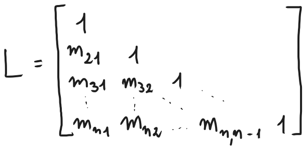
   
   Dove i moltiplicatori $m_{i, j}$ sono i coefficienti delle varie operazioni elementari invertiti di segno. Questa è una semplificazione che permette di calcolare direttamente $L$ negli esercizi in cui è richiesta solo la fattorizzazione $LU$ e non il calcolo delle matrici $M_1, M_2, ..., M_{n - 1}$.
### [Torna all'indice](../README.md)