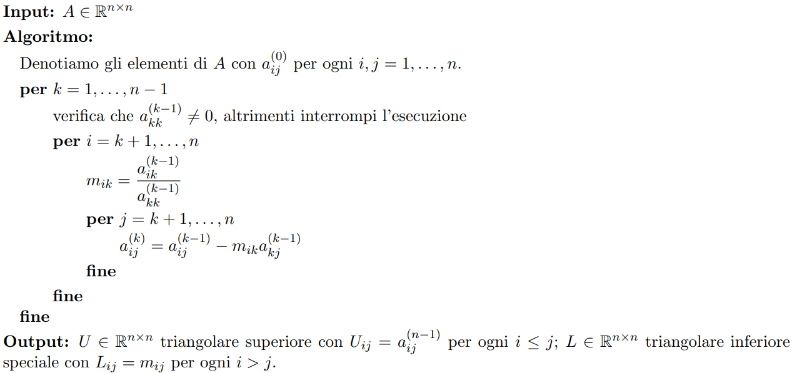
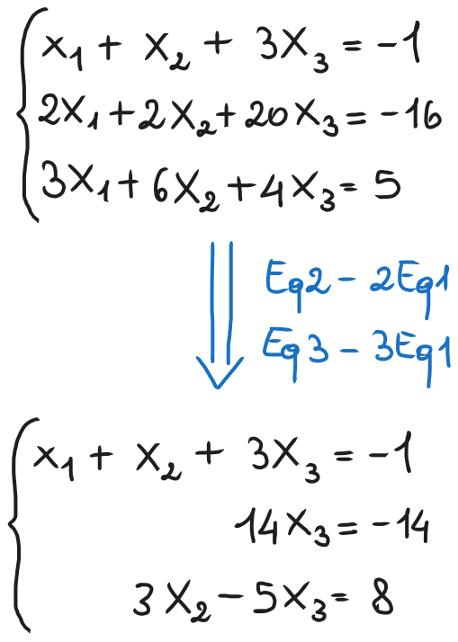
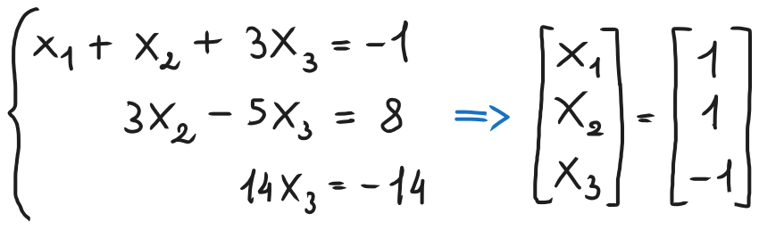

# Algoritmo della fattorizzazione LU, pivot nulli o quasi nulli
### [Lezione precedente](Lezione16.md)

Nella lezione precedente abbiamo mostrato l'interpretazione algebrica dell'eliminazione di Gauss, scoprendo che è equivalente a fattorizzare la matrice dei coefficienti $A$ nel prodotto $A = LU$. L'algoritmo utilizzato può essere tradotto nel seguente pseudocodice:



Il ragionamento di Pugliese per calcolare la complessità computazionale dell'algoritmo è superfluo visto che non serve all'esame, quindi, per riassumerne l'esito, secondo il suo ragionamento il costo computazionale della fattorizzazione $LU$ è di $\frac{2}{3}n^3$ operazioni algebriche elementari. Per un approccio più diretto, molto semplicemente dallo pseudocodice possiamo notare come l'algoritmo sia composto da $3$ cicli for annidati che asintoticamente vanno da $1$ a $n$. Di conseguenza, possiamo dire che l'algoritmo ha complessità $O(n^3)$, quindi complessità cubica.

### Applicazioni della fattorizzazione LU
Supponiamo di voler risolvere il sistema lineare $Ax = b$, con $A$ invertibile, e di aver calcolato la fattorizzazione $A = LU$ di $A$. Allora è possibile risolvere il sistema in due passaggi.
1. Risolvere $Ly = b$ mediante *sostituzione in avanti* per determinare $y$.
2. Risolvere $Ux = y$ mediante *sostituzione all'indietro* per determinare $x$.

Un'altra applicazione della fattorizzazione $LU$ è il calcolo agevolato del determinate di una matrice $A \in R^{n \times n}$. Nello specifico $det(A) = det(LU) = det(L)det(U) = \prod_{k = 1}^{n} U_{kk}$. Ovvero il determinante di $A$ sarà uguale al prodotto di tutti gli elementi sulla diagonale della matrice $U$, ovvero la forma a gradini di $A$.

### Pivot nulli o quasi nulli
Gli elementi che si trovano sulla diagonale creati a ogni passo dell'eliminazione di Gauss dovrebbero diventare pivot man mano che continuiamo con le cancellazioni. Quando, però, anziché esserci un pivot definito, troviamo un pivot nullo, allora l'algoritmo illustrato nello pseudocodice a pagina $1$ si interrompe. Quando ci troviamo in una situazione di questo tipo, la matrice potrebbe anche avere una fattorizzazione $LU$, ma quell'algoritmo non sarebbe in grado di determinarla. In altre situazioni, invece, la matrice potrebbe non ammettere a prescindere una fattorizzazione $LU$.

#### Esempio


Partiamo da questo sistema lineare e procediamo applicando il metodo di eliminazione di Gauss, effettuando le operazioni scritte nell'immagine. Notiamo, però, che non possiamo procedere perché il secondo pivot è nullo, infatti l'algoritmo mostrato sopra si sarebbe interrotto con un'anomalia. Ovviamente noi esseri umani ci rendiamo conto che basterebbe *scambiare* $Eq2$ con $Eq3$ senza il bisogno di effettuare altre operazioni per ottenere la forma a scalini di $A$, ovvero $U$, la matrice triangolare superiore. Questo possiamo farlo perché anche lo scambio di due righe è un'operazione elementare su matrici. Arrivati a quel punto, il sistema si potrebbe risolvere facilmente per sostituzione all'indietro.



Eseguendo l'algoritmo in *MATLAB*, però, l'algoritmo si arresterebbe o restituirebbe risultati anomali che non sono in linea con la soluzione che abbiamo calcolato. Per di più, se il pivot non fosse nullo ma fosse un numero molto piccolo (pivot quasi nulli), l'algoritmo proseguirebbe ma ci sarebbe una drastica perdita di precisione a causa del malcondizionamento della divisione quando il denominatore è vicino a $0$, facendo quindi ottenere dei risultati imprecisi.

I pivot nulli sono il motivo per cui nell'algoritmo c'è il controllo ```if A(k, k) == 0 interrompi l'esecuzione```, ma questo controllo non è sufficiente a causa dei pivot quasi nulli.

Abbiamo visto che lo scambio di equazioni può essere un utile strumento per rimediare al problema dei pivot nulli, per cui nella prossima lezione vedremo come possiamo interpretarlo come un'operazione elementare. Inoltre, introdurremo una modifica all'algoritmo della fattorizzazione $LU$ per renderlo più stabile, specialmente nei casi che abbiamo menzionato sopra.
### [Lezione successiva](Lezione18.md)
### [Torna all'indice](../README.md)