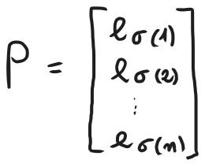
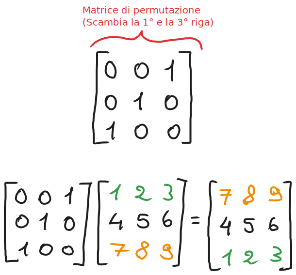
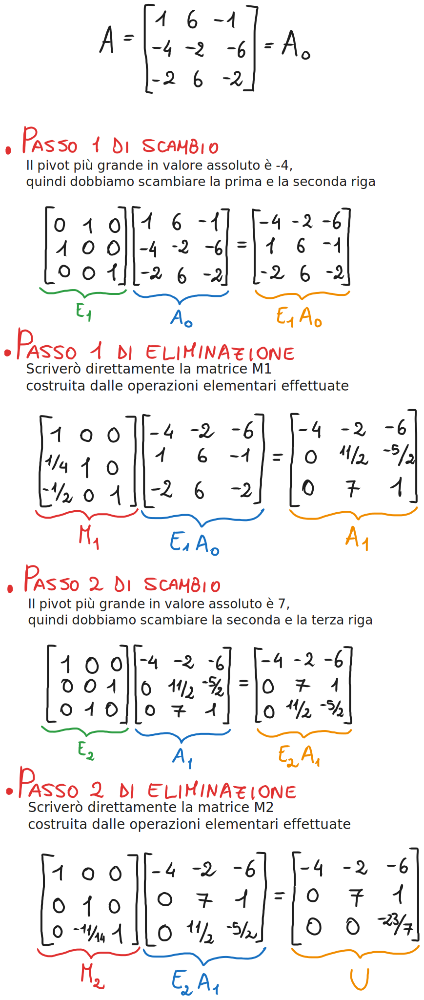
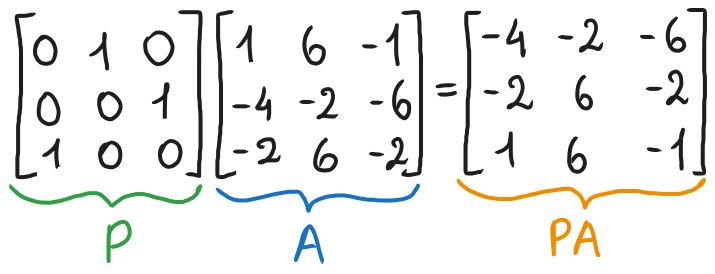
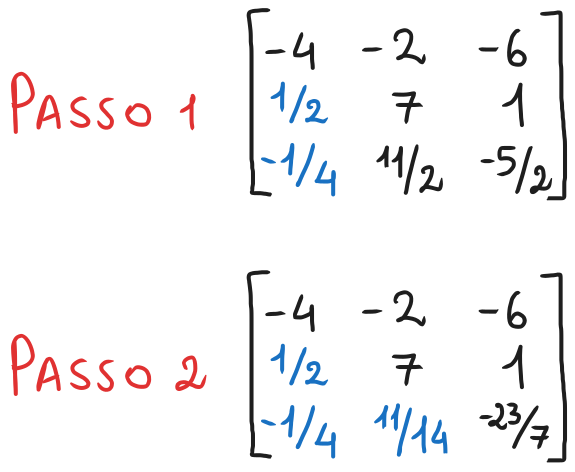
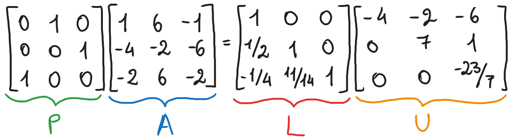
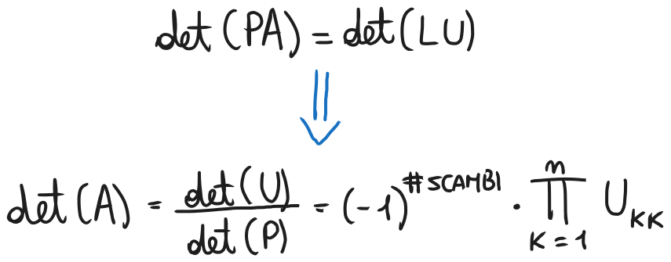
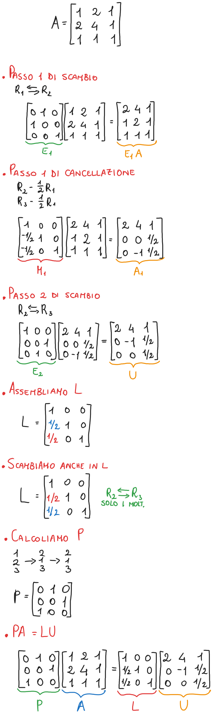

# Fattorizzazione LU con pivoting parziale
### [Lezione precedente](Lezione16.md)

Abbiamo visto come i pivot nulli o pivot molto vicini a $0$ possono causare problemi nel calcolo della fattorizzazione $LU$. Abbiamo visto come lo scambio tra righe può essere una valida strategia per ovviare al problema, per cui oggi lavoreremo su questo.

Innanzitutto, definiremo lo scambio tra righe mediante pre-moltiplicazione per una certa matrice $E_i$, definita come vedremo in seguito. L'idea è che vogliamo operare ogni volta sul pivot più *grande possibile* in valore assoluto, così da rendere il calcolo più stabile evitando quanto più possibile i pivot nulli o quasi. Per farlo, a ogni iterazione, anziché procedere direttamente con la cancellazione, effettueremo prima uno scambio tra righe, nello specifico scambieremo la riga corrente con la riga contenente il pivot più grande in quella colonna. Vediamo ora formalmente il procedimento, le definizioni necessarie e una formalizzazione di quest'idea.

### Matrici di permutazione
Una matrice $P \in R^{n \times n}$ si dice *matrice di permutazione* se si ottiene permutando le righe della matrice identità. Formalmente, $P$ è una matrice di permutazione se

dove $e_k$ è la $k$-esima riga della matrice identità e $σ$ è una permutazione dell'insieme { $1, 2, ..., n$ }. La matrice identità è inclusa in questa definizione, è il caso in cui $σ(k) = k$ per ogni $k = 1, 2, ..., n$.

Pre-moltiplicando una matrice qualunque per una matrice di permutazione l'effetto che si ottiene è che si scambiano le colonne della matrice di partenza. Possiamo immaginarlo in questo modo: gli scambi che abbiamo effettuato per arrivare dalla matrice identità alla matrice di permutazione verranno effettuati anche sulla matrice per cui verrà moltiplicata. Possiamo immaginarla anche come un selettore, ad esempio, se nella prima riga troviamo $1$ in terza posizione, quello ci sta indicando che dobbiamo inserire nella prima riga quella che nella matrice di partenza era la terza riga (ovvero la prima e la terza riga si scambiano).

Quando agisce per post-moltiplicazione (ovvero viene moltiplicata dopo la matrice di partenza), invece, ne scambierà non le righe ma le colonne. In questo caso, scambierebbe la prima e la terza colonna.
#### Proprietà delle matrici di permutazione
Se $P \in R^{n \times n}$ è una matrice di permutazione, allora:
1. $P$ è invertibile
2. $P^{-1} = P^T$
3. $det(P) = \pm1$

### Matrici di scambio
Una matrice si dice *matrice di scambio* se è una matrice di permutazione ottenuta scambiando al più due righe della matrice di identità tra di loro.

Si può dimostrare facilmente che ogni matrice di permutazione $n \times n$ è il prodotto di al più $n - 1$ matrici di scambio.

### Introduzione al pivoting parziale
La necessità di tenere sotto controllo la grandezza dei moltiplicatori motiva la seguente integrazione all'algoritmo per il calcolo della fattorizzazione $LU$:

*Al* $k$*-esimo passo di eliminazione, determiniamo l'indice* $r_k$*, con* $k \leq r_k \leq n$*, per cui* $|a^{(k-1)}_{r_k, k}|$ *assume valore massimo, e scambiando la riga* $k$ *con la riga* $r_k$ *prima di procedere con l'eliminazione.*

Ogni passo di eliminazione è preceduto quindi da uno scambio di righe che ha come scopo quello di portare in posizione pivotale l'elemento di valore assoluto massimo tra quelli candidati, ossia gli elementi della colonna pivotale che si trovano dalla diagonale in giù.

Questa strategia è detta *pivoting parziale* (o *pivoting per righe*) e garantisce che i moltiplicatori restino, in valore assoluto, non maggiori di $1$, prevenendo così gravi fenomeni di instabilità numerica (i pivot nulli o quasi creano moltiplicatori molto elevati, quindi questo garantisce che non si creino problemi).

#### Esempio

Possiamo quindi rappresentare il procedimento come una sequenza di pre-moltiplicazioni per le opportune matrici. Nello specifico, abbiamo $M_2E_2M_1E_1A = U$.

### Generalizzazione
Nel caso generale in cui si applichi il pivoting parziale a una matrice $A \in R^{n \times n}$, questa può essere ridotta in forma triangolare superiore pre-moltiplicandola alternativamente per matrici di scambio $E_k$ e matrici elementari $M_k$, ovvero $M_{n-1}E_{n-1}...M_2E_2M_1E_1A = U$.

Al contrario dell'eliminazione di Gauss senza pivoting parziale, la strategia del pivoting parziale non conduce ad una relazione algebrica immediatamente interpretabile come fattorizzazione della matrice originale $A$. È possibile, però, ottenere una fattorizzazione $LU$ della matrice $E_{n-1}...E_2E_1A$.

Consideriamo la matrice $A$ dell'esempio ma con le righe permutate tramite la permutazione $P = E_2E1$.

Applicando poi i due passi di eliminazione a $PA$, otteniamo

Dalla quale otteniamo la seguente fattorizzazione $LU$ per $PA$:

Osserviamo che il fattore $U$ dell'ultima fattorizzazione coincide con quello ottenuto precedentemente. Anche $L$ è rimasta pressoché invariata, l'unica eccezione sono i *moltiplicatori della prima colonna*, che risultano permutati secondo la matrice di scambio $E_2$. Quest'osservazione non è un caso ma un fatto generale.

Se, durante l'eliminazione di Gauss con pivoting parziale su una matrice $n \times n$, ogni scambio tra righe della matrice viene accompagnato dallo *scambio*, *lungo le stesse righe*, *dei moltiplicatori già calcolati fino a quel punto*, allora si ottiene una fattorizzazione $LU$ di una matrice $E_{n-1}...E_2E_1A$, dove ciascuna $E_k$ è la matrice di scambio utilizzata al passo $k$. Ponendo $P = E_{n-1}...E_2E_1$, si ha $PA = LU$.

Si può dimostrare che, se $A$ è invertibile, ogni passo di scambio trova sempre un candidato non nullo da portare in posizione pivotale.

In parole povere, ripensiamo al procedimento che abbiamo fatto durante l'esempio. L'idea è che, durante il calcolo di $U$, memorizziamo gli scambi di righe che abbiamo effettuato mediante le matrici $E_1, E_2, ..., E_{n-1}$ e, una volta calcolata $L$, si effettuano gli stessi scambi tra le righe. L'unica accortezza da considerare è che gli scambi non verranno effettuati tra le righe intere ma solo tra i moltiplicatori. Gli elementi della diagonale o sopra la diagonale non vengono toccati.

### Teorema di esistenza della fattorizzazione LU con pivoting parziale
Sia $A \in R^{n \times n}$ invertibile. Allora esistono $P, L, U \in R^{n \times n}$ tali che:
1. $P$ è una matrice di permutazione
2. $L$ è triangolare inferiore speciale con $|L_{ij}| \leq 1$ per ogni $i > j$
3. $U$ è triangolare superiore
4. $PA = LU$ (questa è detta *fattorizzazione* $LU$ *pivoting parziale di* $A$)

### Sistemi lineari con fattorizzazione LU con pivoting parziale
Supponiamo di voler risolvere il sistema lineare $Ax = b$, con $A$ invertibile, e di aver calcolato la fattorizzazione $LU$ con pivoting parziale di $A$, $PA = LU$. Allora è possibile risolvere il sistema in due passaggi:
1. Risolvere $Ly = Pb$ mediante *sostituzione in avanti* per determinare $y$
2. Risolvere $Ux = y$ mediante *sostituzione all'indietro* per determinare $x$

### Calcolo del determinante mediante la fattorizzazione LU
Per calcolare il determinante $A$ sfruttandone la fattorizzazione $PA = LU$, si procede come segue:

Dove per "#scambi" si intende il numeri di scambi di riga effettuati durante la fattorizzazione $PA = LU$. Si conta essenzialmente il numero di matrici $E_k$.

Il determinante si calcola ancora come nella fattorizzazione $LU$ senza pivoting, ovvero facendo il prodotto degli elementi sulla diagonale di $U$, la differenza è che ora bisognerà anche tenere conto del segno determinato dal numero di scambi. Se il numero di scambi è pari, allora il calcolo resta invariato, altrimenti bisognerà invertire di segno il prodotto della diagonale.

### Esercizio 1

### [Torna all'indice](../README.md)