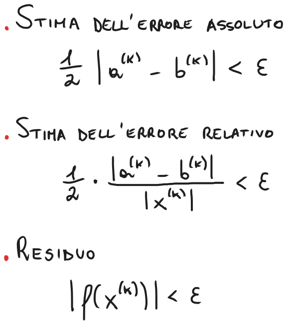
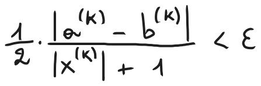
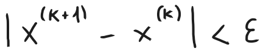
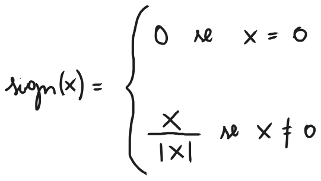

# Criteri di arresto, vantaggi, svantaggi e implementazione del metodo delle successive bisezioni
### [Lezione precedente](Lezione1.md)

Abbiamo visto come sia quasi statisticamente impossibile che l'algoritmo riesca a calcolare il valore preciso dello zero della funzione, di conseguenza il controllo *esci dal ciclo quando* $f(x^{(k)}) = 0$ è superfluo. Avendo definito i concetti di errore e residuo, possiamo utilizzarli per definire dei nuovi controlli da effettuare per decidere quando terminare l'esecuzione dell'algoritmo.

## Criteri di arresto
Possiamo quindi utilizzare i concetti di errori e residuo per determinare quando l'algoritmo può fermarsi. L'idea è fornire in input un certo valore ε che definiremo *tolleranza* e terminare l'algoritmo solo quando il calcolo della stima dell'errore sia inferiore a questo valore. Questo ci assicura che la nostra approssimazione abbia un certo livello di qualità, in linea con il valore ε.

Come abbiamo accennato nella lezione precedente, in queste condizioni non abbiamo modo di calcolare direttamente i valori di errore relativo e assoluto, siccome non disponiamo del valore preciso α dello zero della funzione. È possibile, però, fare delle *stime* relative a questi valori che possono comunque essere utilizzate come criteri di arresto.

L'errore assoluto ($E_a$) corrisponde alla differenza tra il valore preciso di α e la sua relativa approssimazione $\dot α$ (detto anche $x^{(k)}$) che abbiamo calcolato. Quando l'intervallo diventa sufficientemente piccolo, $E_a$ inizia ad avvicinarsi alla differenza tra i valori degli estremi dell'intervallo. Questa differenza è una leggera sovrastima di $E_a$, in quanto considera gli estremi dell'intervallo anziché i valori $α$ e $\dot α$ che sono interni all'intervallo stesso. Per migliorare la stima di $E_a$, possiamo dividere questa differenza per 2, siccome nel metodo delle successive bisezioni avviciniamo sempre di più il punto medio dell'intervallo allo zero della funzione. Quando l'intervallo è sufficientemente piccolo, vedremo che questa stima è effettivamente inferiore ma molto vicina al valore di $E_a$ (quindi funge da limite superiore di $E_a$). Lo stesso discorso vale per l'errore relativo ($E_r$), di conseguenza utilizzeremo la stessa stima di $E_a$ che abbiamo definito sopra. Anche in questo caso non disponiamo del valore preciso di $α$, ma, con un intervallo sufficientemente piccolo, possiamo assumere che $\dot α$ sia già molto vicino a $α$, di conseguenza possiamo usare quel valore il calcolo di $E_r$. In merito al residuo, invece, non ci sono particolari osservazioni da fare e può essere usato direttamente, senza la necessità di stimarlo.

Possiamo definire quindi 3 criteri di arresto sulla base delle metriche descritte sopra.

Quando $α \approx 0$, però, è importante notare che il criterio di arresto basato sulla stima dell'errore relativo diventa inadeguato. Questo perché, nel calcolo della stima dell'errore relativo, stiamo dividendo per un numero che si avvicina sempre di più a 0, quindi c'è la probabilità che l'errore relativo aumenti sproporzionatamente.

Quando, invece, $|α|$ è un numero molto grande, per ragioni legate all'errore commesso nell'arrotondamento a un numero di macchina (argomento che vedremo successivamente), il criterio di arresto basato sulla stima dell'errore assoluto diventa inadeguato.

In assenza di stime a priori su α, per ovviare a questi problemi, si può utilizzare una specie criterio di arresto *misto* tra errore assoluto ed errore relativo.

Questo controllo è più affidabile e robusto perché funge da controllo quando $|α|$ è molto grande o molto piccolo, aggirando anche eventuali problemi di calcolo se $α \approx 0$.

Esiste anche un ulteriore criterio per calcolare la stima sull'errore assoluto. L'idea è che, anziché calcolare la differenza tra il valore da calcolare e l'approssimazione trovata, si calcola la differenza tra le due approssimazioni uscite dalle ultime due iterazioni dell'algoritmo. Così facendo, si può determinare un punto di arresto nel momento in cui ci si rende conto che, man mano che le iterazioni vanno avanti, l'approssimazione risultante sta variando sempre di meno. Questo è il criterio che utilizzeremo per arrestare l'algoritmo una volta che lo implementeremo sia in pseudocodice (vedere sotto) che in MATLAB e sarà utile anche per il metodo della *Regula Falsi*, una variante del metodo delle successive bisezioni che vedremo successivamente.

## Vantaggi e Svantaggi
Il metodo delle successive bisezioni offre i seguenti vantaggi:
- È semplice.
- È versatile e le condizioni necessarie sono semplici, non serve che $a$ e $b$ (estremi dell'intervallo) siano vicini ad $α$, è sufficiente che $f(a)f(b) < 0$ (si dice che questo metodo gode di proprietà di convergenza di tipo globale).
- Ad ogni passo fornisce stime sia per eccesso che per difetto della soluzione, in quanto $a^{(k)} \leq α \leq b^{(k)}$, per ogni $k$. I metodi che dispongono di questa proprietà vengono detti di tipo *bracketing*.

In compenso, però, presenta i seguenti svantaggi:
- È lento.
- Ha una convergenza non-monotona e scarta frequentemente buone approssimazioni della soluzione.
- Non può essere applicato per calcolare uno zero contenuto in un intorno nel quale la funzione $f$ non cambia mai segno (ad esempio $f(x) = x^2$).

## Pseudocodice
**Input:** $f, a, b, ε$. Si assume $a < b$, $f$ continua, $sing(f(a)) \neq sign(f(b))$.

1. $x = \frac{1}{2} (a + b)$;
2. Se $b - x < ε$, poni $α = x$ ed esci;
3. Se $sign(f(a)) \neq sign(f(x))$, allora poni $b = x$, altrimenti poni $a = x$;
4. Torna al punto 1.

**Output:** $α$

In questa implementazione utilizziamo l'ultimo criterio di arresto che abbiamo citato sopra, utilizzando $b$ e $x$ come $x^{(k+1)}$ e $x^{(k)}$, rispettivamente.

Notiamo come l'algoritmo si basi esclusivamente sul segno di $f$ calcolata agli estremi degli intervalli e al valore $x$, ma non necessita del valore effettivo di $f$ né può sfruttarlo in alcun modo. La funzione $sign(x)$ è detta *segno di x* e, appunto, possiamo immaginarla come una funzione che restituisca il segno di x. Formalmente, è definita in questo modo:

### [Torna all'indice](../README.md)