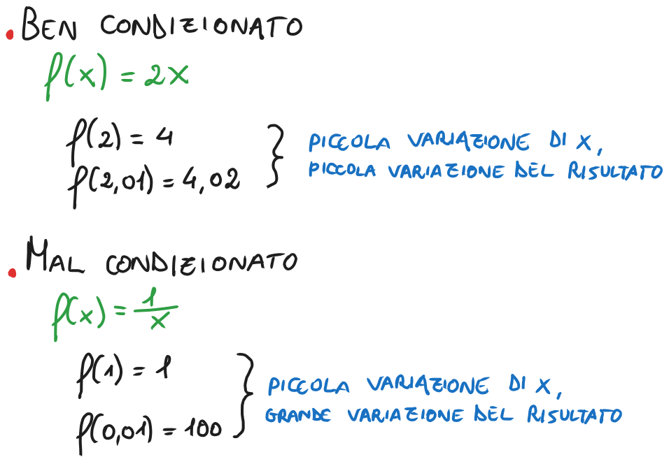
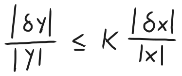
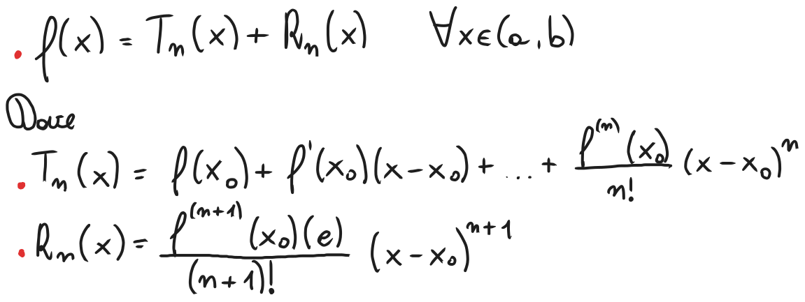
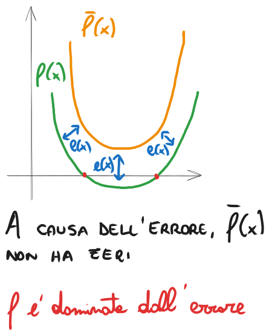
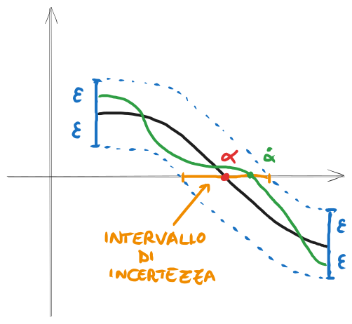
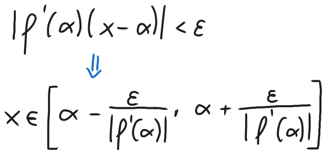

# Condizionamento di un problema e condizionamento del calcolo degli zeri di una funzione, teorema di Taylor, ordine di convergenza, introduzione al metodo di Newton

### [Lezione precedente](Lezione2.md)

### Condizionamento
Quando risolviamo un problema, dobbiamo tenere presente che i dati e i calcoli che effettuiamo saranno inevitabilmente soggetti ad errori. Questi errori possono essere dovuti a semplificazioni di un modello fisico, errori di misurazione, errori di discretizzazione (ad esempio approssimare una derivata mediante rapporto incrementale), errori di aritmetica di macchina e così via. Quale sarà quindi l'effetto di questi errori sull'accuratezza della soluzione da noi calcolata?

Sia *P* un problema. Supponiamo che al dato $x$ corrisponda la soluzione $y$, e che al dato $x + δx$ corrisponda la soluzione $y + δy$. Diremo che il problema *P* è **ben condizionato** se a piccole perturbazioni di $δx$ corrispondono altrettanto piccole perturbazioni $δy$ della soluzione. In caso contrario, diremo che il problema è *mal condizionato*. Essenzialmente, diremo che un problema è ben condizionato se i risultati sono stabili rispetto a piccoli cambiamenti dei dati, quindi non variano di molto o comunque variano in termini costanti, mentre diremo che un problema è mal condizionato se i risultati sono molto sensibili a piccoli cambiamenti dei dati e variano molto.

È possibile quantificare la sensibilità della soluzione a perturbazioni dei dati mediante il cosiddetto *numero di condizionamento*. Immaginiamo di voler cercare il più piccolo valore $K > 0$ per cui è possibile scrivere

dove si suppone che $|δx|$ sia un valore piccolo. Questa disuguaglianza esprime che, per piccole perturbazioni attorno al valore $x$, l'errore relativo sulla soluzione non può superare $K$ volte l'errore relativo sul dato. Il numero $K$ è detto **numero o fattore di condizionamento** del problema. Se abbiamo che $K \approx 1$, allora il problema è ben condizionato. Se, invece, $K >> 1$ ($K$ è molto più grande di 1), allora il problema è mal condizionato. In generale, $K$ dipende dal valore del dato, quindi si può dire che sia il risultato di un certo calcolo $K(x)$, una funzione che determina il fattore di condizionamento in base al dato di input. Quindi $K$ non è un valore costante per l'intero problema, ma dipende sì dal problema stesso, ma anche dal dato preso in considerazione. 

Ad esempio, assumiamo che il nostro problema sia un rapporto. Il fattore di condizionamento tenderà ad aumentare per valori di $x$ che rendono il denominatore molto vicini allo zero, mentre tenderà a diminuire per valori di $x$ che rendono il denominatore molto "grande" e quindi distante dallo zero. Come abbiamo visto nell'esempio $f(x) = \frac{1}{x}$, nonostante ci sia poca differenza tra i dati di partenza $1$ e $0,01$, i relativi risultati, ovvero $1$ e $100$, variano molto tra di loro. Prendiamo ora due numeri un po' più distanti dallo zero, ad esempio $3$ e $4$. In questo caso i risultati saranno, rispettivamente, $0,\overline3$ e $0,25$, che sono numeri molto più vicini tra loro rispetto a $1$ e $100$, nonostante i dati di partenza $3$ e $4$ abbiano praticamente la stessa distanza dei dati $1$ e $0,01$. Questo dimostra come il fattore di condizionamento dipenda molto anche dai dati considerati.

Ciò che conta di $K$ è il suo ordine di grandezza, ovvero se ricade nelle unità, oppure nelle decine, nelle centinaia, nelle migliaia e così via. Praticamente non cambia molto tra $K = 1$ e $K = 2$, è sempre di unità costanti che si parla, ma cambia molto tra $K = 1$ e $K = 10^3$, ad esempio, siccome sono ordini di grandezza molto differenti. Immaginiamo di avere un problema *P* e supponiamo che, in corrispondenza del dato $x$, si abbia $K(x) = 10^3$. Questo significa che, a un errore relativo $10^{-4}$, può corrispondere un errore relativo pari a $10^{-1}$ sulla soluzione e questo corrisponderebbe ad una perdita di precisione di 3 cifre, come vedremo in seguito.

### Polinomio di Taylor
Siano $f: [a, b] \rightarrow R$ derivabile $n + 1$ volte, con $n \geq 1$, e sia $x_0 ∈ (a, b)$. Allora, per ogni $x ∈ (a, b)$, esiste $c$ compreso tra $x$ e $x_0$ tale che

Il polinomio $T_n(x)$ è detto *polinomio di Taylor di grado n centrato in* $x_0$ *e valutato in* $x$, mentre $R_n(x)$ è detto *resto di Lagrange*. Il polinomio di Taylor è una tecnica utilizzata per approssimare funzioni non polinomiali e derivabili con una funzione polinomiale ricavata dalle derivate della funzione di partenza. Ora, facciamo alcune osservazioni.
1. La quantità $|R(x)| = |f(x) - T_n(x)|$ costituisce l'errore assoluto che si commette nell'approssimare $f(x)$ con $T_n(x)$.
2. Fissato il grado $n$, questo errore è tanto più piccolo quanto più $x$ è vicino a $x_0$. Questo perché moltiplichiamo per $(x - x_0)^{n+1}$ nel calcolo di $R_n(x)$, quindi più piccola è questa differenza e più piccolo sarà il risultato. 
3. Fissato $x$, se la derivata $n$-esima di $f$ in $x_0$ non cresce "troppo velocemente" al crescere di $n$, allora l'errore è tanto più piccolo quanto più grande è $n$. Questo perché abbiamo $(n+1)!$ al denominatore nel calcolo di $R_n(x)$, quindi, se la derivata che si trova al numeratore "non cresce troppo velocemente" (nello specifico, cresce con una velocità inferiore rispetto al fattoriale), allora la quantità $(n+1)!$ diventerà sempre più grande e farà diminuire il risultato.
4. Per $n = 1$, abbiamo che $y = T_1(x) = f(x_0) + f'(x_0)(x - x_0)$ è l'equazione della retta tangente al grafico di $f$ nel suo punto di ascissa $x_0$.
5. Generalmente il valore di $c$ dipende da $x$ ed è sconosciuto.

### Condizionamento degli zeri di una funzione
Ritorniamo adesso al problema del calcolo degli zeri di una funzione, ovvero data $f: [a, b] \rightarrow R$, determinare $α ∈ [a, b]$ tale che $f(α) = 0$. Vogliamo studiare l'effetto che le perturbazioni su $f$ hanno sul valore di $α$. Immaginiamo quindi che $α$ sia uno zero per $f$ e che $\overlineα$ sia uno zero per $\overline f(x)$, dove $\overline f(x) = f(x) + e(x)$, ovvero che sia una certa perturbazione di $f$ il cui errore assoluto è dato da $|e(x)|$. 

Facciamo ora due ipotesi di lavoro, ovvero:
1. $|e(x)| < ε$, cioè l'errore assoluto non può superare un certo valore $ε$ prefissato
2. $f$ e $\overline f(x)$ sono continue, $f(a)f(b)$ < 0.

Senza perdita di generalità, supponiamo che $f(a) > 0$ (il caso $f(b) > 0$ è analogo). Sulla base di quest'ipotesi, possiamo osservare che:
1. Se $f(a) > ε$, allora $\overline f(a) > 0$
2. Se $f(b) < -ε$, allora $\overline f(b) < 0$

Da questo possiamo dedurre che, se $|f|$ è sufficientemente grande sia in $a$ che in $b$, allora $f$ e $\overline f$ hanno lo stesso segno agli estremi di $[a, b]$, e di conseguenza anche $\overline f$ avrà uno zero in quell'intervallo. Se, però, una delle due condizioni non è rispettata, allora i segni di $f$ e $\overline f$ potrebbero non coincidere e di conseguenza $\overline f$ potrebbe non avere zeri in $[a, b]$. In conclusione, se $|f(x)| < ε$, non possiamo concludere informazioni certe sul segno di $\overline f$ e viceversa. In questi casi diremo che $f$ è *dominata dall'errore*.

Il più grande intervallo $I$ contenente $α$ e tale che $|f(x)| \leq ε$, per ogni $x ∈ I$, è detto **intervallo di incertezza** per lo zero $α$. Fissato $ε > 0$, il problema di calcolare lo zero $α$ è tanto più mal condizionato quanto più lungo è l'intervallo $I$.

L'obiettivo realistico di un metodo numerico è fornire un'approssimazione di $α$ che sia all'interno dell'intervallo di incertezza. 

Proviamo ora a definire la lunghezza di $I$. Per definizione, $I$ è costituito da punti vicini ad $α$ per i quali si ha che $|f(x)| < ε$. Se $x$ è sufficientemente vicino ad $α$, possiamo approssimare $f(x)$ con il suo polinomio di Taylor di grado 1 centrato in $α$, quindi $f(x) \approx f(α) + f'(α)(x - α)$. Siccome sappiamo che $α$ è zero di $f$, quindi $f(α) = 0$, allora $f(x) \approx f'(α)(x - α)$. Supponendo che $f'(α) \neq 0$ e risolvendo per $x$, abbiamo che

che costituisce la stima di $I$ che cercavamo. La lunghezza di $I$ è quindi inversamente proporzionale al valore $|f'(α)|$. Più precisamente, il reciproco di $|f'(α)|$ costituisce il numero di condizionamento rispetto all'errore assoluto del problema del calcolo dello zero $α$, poiché ad un errore assoluto $ε$ su $f$ può corrispondere un errore assoluto fino a $\frac{ε}{|f'(α)|}$ su $α$. Abbiamo quindi che $K(a) = \frac{1}{|f'(α)|}$.

In conclusione, da questo possiamo dedurre che se $|f'(α)| \geq 1$, diremo che lo zero $α$ è ben condizionato, in quanto il problema di calcolarlo è ben condizionato. Se, invece, $|f'(α)| << 1$, diremo che lo zero $α$ è mal condizionato, in quanto il problema di calcolarlo è mal condizionato.

Siccome dipende dalla derivata con queste modalità, possiamo dire che il calcolo di uno zero è tanto più mal condizionato quanto più piccola è la pendenza della tangente al grafico della funzione nello zero. Se il valore assoluto del coefficiente angolare della tangente in $α$ è superiore a 1, allora lo zero è ben condizionato. Inoltre, se una funzione ha più di uno zero nell'intervallo considerato, ciascuno di essi avrà il suo numero di condizionamento e, quindi, potrà essere ben o mal condizionato in base alla situazione.

Questo discorso vale soltanto con l'ipotesi che $f'(α) \neq 0$. Se, invece, dovessimo trovarci in un caso in cui $f'(α) = 0$, ci renderemmo conto, calcolando l'errore assoluto, che a prescindere il problema è mal condizionato. Quest'ipotesi risulterà essenziale successivamente e merita che ci sia una distinzione tra zeri che presentano derivata nulla e zeri che presentano derivata non nulla.

Siano $f$ derivabile e $α$ uno zero per $f$. Si dice che $α$ è uno **zero semplice** di $f$ se $f'(α) \neq 0$. Geometricamente, uno zero per $f$ è semplice se la tangente al grafico di $f$ in $α$ non è parallela all'asse delle ascisse.

### Ordine di convergenza
### [Torna all'indice](../README.md)
