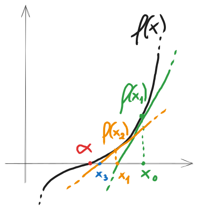

# Condizionamento di un problema e condizionamento del calcolo degli zeri di una funzione, teorema di Taylor, ordine di convergenza, introduzione al metodo di Newton

### [Lezione precedente](Lezione2.md)

### Condizionamento
Quando risolviamo un problema, dobbiamo tenere presente che i dati e i calcoli che effettuiamo saranno inevitabilmente soggetti ad errori. Questi errori possono essere dovuti a semplificazioni di un modello fisico, errori di misurazione, errori di discretizzazione (ad esempio approssimare una derivata mediante rapporto incrementale), errori di aritmetica di macchina e così via. Quale sarà quindi l'effetto di questi errori sull'accuratezza della soluzione da noi calcolata?

Sia *P* un problema. Supponiamo che al dato $x$ corrisponda la soluzione $y$, e che al dato $x + δx$ corrisponda la soluzione $y + δy$. Diremo che il problema *P* è **ben condizionato** se a piccole perturbazioni di $δx$ corrispondono altrettanto piccole perturbazioni $δy$ della soluzione. In caso contrario, diremo che il problema è *mal condizionato*. Essenzialmente, diremo che un problema è ben condizionato se i risultati sono stabili rispetto a piccoli cambiamenti dei dati, quindi non variano di molto o comunque variano in termini costanti, mentre diremo che un problema è mal condizionato se i risultati sono molto sensibili a piccoli cambiamenti dei dati e variano molto.

È possibile quantificare la sensibilità della soluzione a perturbazioni dei dati mediante il cosiddetto *numero di condizionamento*. Immaginiamo di voler cercare il più piccolo valore $K > 0$ per cui è possibile scrivere

dove si suppone che $|δx|$ sia un valore piccolo. Questa disuguaglianza esprime che, per piccole perturbazioni attorno al valore $x$, l'errore relativo sulla soluzione non può superare $K$ volte l'errore relativo sul dato. Il numero $K$ è detto **numero o fattore di condizionamento** del problema. Se abbiamo che $K \approx 1$, allora il problema è ben condizionato. Se, invece, $K >> 1$ ($K$ è molto più grande di 1), allora il problema è mal condizionato. In generale, $K$ dipende dal valore del dato, quindi si può dire che sia il risultato di un certo calcolo $K(x)$, una funzione che determina il fattore di condizionamento in base al dato di input. Quindi $K$ non è un valore costante per l'intero problema, ma dipende sì dal problema stesso, ma anche dal dato preso in considerazione. 

Ad esempio, assumiamo che il nostro problema sia un rapporto. Il fattore di condizionamento tenderà ad aumentare per valori di $x$ che rendono il denominatore molto vicini allo zero, mentre tenderà a diminuire per valori di $x$ che rendono il denominatore molto "grande" e quindi distante dallo zero. Come abbiamo visto nell'esempio $f(x) = \frac{1}{x}$, nonostante ci sia poca differenza tra i dati di partenza $1$ e $0,01$, i relativi risultati, ovvero $1$ e $100$, variano molto tra di loro. Prendiamo ora due numeri un po' più distanti dallo zero, ad esempio $3$ e $4$. In questo caso i risultati saranno, rispettivamente, $0,\overline3$ e $0,25$, che sono numeri molto più vicini tra loro rispetto a $1$ e $100$, nonostante i dati di partenza $3$ e $4$ abbiano praticamente la stessa distanza dei dati $1$ e $0,01$. Questo dimostra come il fattore di condizionamento dipenda molto anche dai dati considerati.

Ciò che conta di $K$ è il suo ordine di grandezza, ovvero se ricade nelle unità, oppure nelle decine, nelle centinaia, nelle migliaia e così via. Praticamente non cambia molto tra $K = 1$ e $K = 2$, è sempre di unità costanti che si parla, ma cambia molto tra $K = 1$ e $K = 10^3$, ad esempio, siccome sono ordini di grandezza molto differenti. Immaginiamo di avere un problema *P* e supponiamo che, in corrispondenza del dato $x$, si abbia $K(x) = 10^3$. Questo significa che, a un errore relativo $10^{-4}$, può corrispondere un errore relativo pari a $10^{-1}$ sulla soluzione e questo corrisponderebbe ad una perdita di precisione di 3 cifre, come vedremo in seguito.

### Polinomio di Taylor
Siano $f: [a, b] \rightarrow R$ derivabile $n + 1$ volte, con $n \geq 1$, e sia $x_0 ∈ (a, b)$. Allora, per ogni $x ∈ (a, b)$, esiste $c$ compreso tra $x$ e $x_0$ tale che

Il polinomio $T_n(x)$ è detto *polinomio di Taylor di grado n centrato in* $x_0$ *e valutato in* $x$, mentre $R_n(x)$ è detto *resto di Lagrange*. Il polinomio di Taylor è una tecnica utilizzata per approssimare funzioni non polinomiali e derivabili con una funzione polinomiale ricavata dalle derivate della funzione di partenza. Ora, facciamo alcune osservazioni.
1. La quantità $|R(x)| = |f(x) - T_n(x)|$ costituisce l'errore assoluto che si commette nell'approssimare $f(x)$ con $T_n(x)$.
2. Fissato il grado $n$, questo errore è tanto più piccolo quanto più $x$ è vicino a $x_0$. Questo perché moltiplichiamo per $(x - x_0)^{n+1}$ nel calcolo di $R_n(x)$, quindi più piccola è questa differenza e più piccolo sarà il risultato. 
3. Fissato $x$, se la derivata $n$-esima di $f$ in $x_0$ non cresce "troppo velocemente" al crescere di $n$, allora l'errore è tanto più piccolo quanto più grande è $n$. Questo perché abbiamo $(n+1)!$ al denominatore nel calcolo di $R_n(x)$, quindi, se la derivata che si trova al numeratore "non cresce troppo velocemente" (nello specifico, cresce con una velocità inferiore rispetto al fattoriale), allora la quantità $(n+1)!$ diventerà sempre più grande e farà diminuire il risultato.
4. Per $n = 1$, abbiamo che $y = T_1(x) = f(x_0) + f'(x_0)(x - x_0)$ è l'equazione della retta tangente al grafico di $f$ nel suo punto di ascissa $x_0$.
5. Generalmente il valore di $c$ dipende da $x$ ed è sconosciuto.

### Condizionamento degli zeri di una funzione
Ritorniamo adesso al problema del calcolo degli zeri di una funzione, ovvero data $f: [a, b] \rightarrow R$, determinare $α ∈ [a, b]$ tale che $f(α) = 0$. Vogliamo studiare l'effetto che le perturbazioni su $f$ hanno sul valore di $α$. Immaginiamo quindi che $α$ sia uno zero per $f$ e che $\overlineα$ sia uno zero per $\overline f(x)$, dove $\overline f(x) = f(x) + e(x)$, ovvero che sia una certa perturbazione di $f$ il cui errore assoluto è dato da $|e(x)|$. 

Facciamo ora due ipotesi di lavoro, ovvero:
1. $|e(x)| < ε$, cioè l'errore assoluto non può superare un certo valore $ε$ prefissato
2. $f$ e $\overline f(x)$ sono continue, $f(a)f(b)$ < 0.

Senza perdita di generalità, supponiamo che $f(a) > 0$ (il caso $f(b) > 0$ è analogo). Sulla base di quest'ipotesi, possiamo osservare che:
1. Se $f(a) > ε$, allora $\overline f(a) > 0$
2. Se $f(b) < -ε$, allora $\overline f(b) < 0$

Da questo possiamo dedurre che, se $|f|$ è sufficientemente grande sia in $a$ che in $b$, allora $f$ e $\overline f$ hanno lo stesso segno agli estremi di $[a, b]$, e di conseguenza anche $\overline f$ avrà uno zero in quell'intervallo. Se, però, una delle due condizioni non è rispettata, allora i segni di $f$ e $\overline f$ potrebbero non coincidere e di conseguenza $\overline f$ potrebbe non avere zeri in $[a, b]$. In conclusione, se $|f(x)| < ε$, non possiamo concludere informazioni certe sul segno di $\overline f$ e viceversa. In questi casi diremo che $f$ è *dominata dall'errore*.

Il più grande intervallo $I$ contenente $α$ e tale che $|f(x)| \leq ε$, per ogni $x ∈ I$, è detto **intervallo di incertezza** per lo zero $α$. Fissato $ε > 0$, il problema di calcolare lo zero $α$ è tanto più mal condizionato quanto più lungo è l'intervallo $I$.

L'obiettivo realistico di un metodo numerico è fornire un'approssimazione di $α$ che sia all'interno dell'intervallo di incertezza. 

Proviamo ora a definire la lunghezza di $I$. Per definizione, $I$ è costituito da punti vicini ad $α$ per i quali si ha che $|f(x)| < ε$. Se $x$ è sufficientemente vicino ad $α$, possiamo approssimare $f(x)$ con il suo polinomio di Taylor di grado 1 centrato in $α$, quindi $f(x) \approx f(α) + f'(α)(x - α)$. Siccome sappiamo che $α$ è zero di $f$, quindi $f(α) = 0$, allora $f(x) \approx f'(α)(x - α)$. Supponendo che $f'(α) \neq 0$ e risolvendo per $x$, abbiamo che

che costituisce la stima di $I$ che cercavamo. La lunghezza di $I$ è quindi inversamente proporzionale al valore $|f'(α)|$. Più precisamente, il reciproco di $|f'(α)|$ costituisce il numero di condizionamento rispetto all'errore assoluto del problema del calcolo dello zero $α$, poiché ad un errore assoluto $ε$ su $f$ può corrispondere un errore assoluto fino a $\frac{ε}{|f'(α)|}$ su $α$. Abbiamo quindi che $K(a) = \frac{1}{|f'(α)|}$.

In conclusione, da questo possiamo dedurre che se $|f'(α)| \geq 1$, diremo che lo zero $α$ è ben condizionato, in quanto il problema di calcolarlo è ben condizionato. Se, invece, $|f'(α)| << 1$, diremo che lo zero $α$ è mal condizionato, in quanto il problema di calcolarlo è mal condizionato.

Siccome dipende dalla derivata con queste modalità, possiamo dire che il calcolo di uno zero è tanto più mal condizionato quanto più piccola è la pendenza della tangente al grafico della funzione nello zero. Se il valore assoluto del coefficiente angolare della tangente in $α$ è superiore a 1, allora lo zero è ben condizionato. Inoltre, se una funzione ha più di uno zero nell'intervallo considerato, ciascuno di essi avrà il suo numero di condizionamento e, quindi, potrà essere ben o mal condizionato in base alla situazione.

Questo discorso vale soltanto con l'ipotesi che $f'(α) \neq 0$. Se, invece, dovessimo trovarci in un caso in cui $f'(α) = 0$, ci renderemmo conto, calcolando l'errore assoluto, che a prescindere il problema è mal condizionato. Quest'ipotesi risulterà essenziale successivamente e merita che ci sia una distinzione tra zeri che presentano derivata nulla e zeri che presentano derivata non nulla.

Siano $f$ derivabile e $α$ uno zero per $f$. Si dice che $α$ è uno **zero semplice** di $f$ se $f'(α) \neq 0$. Geometricamente, uno zero per $f$ è semplice se la tangente al grafico di $f$ in $α$ non è parallela all'asse delle ascisse.

### Ordine di convergenza
Passiamo ora a un altro problema legato al calcolo degli zeri di funzione, ovvero quantificare la velocità alla quale la successione generata da un metodo iterativo converge alla soluzione.

Sia $\{x^{(k)}\}_{k ∈ N}$ una successione di numeri reali convergente a un certo $α$. Nel nostro caso, considereremo la successione generata dal metodo e $α$ sarà lo zero di funzione. Diremo che $x^{(k)} \rightarrow α$ con ordine di convergenza $p \geq 1$ se esiste una costante $0 < c < \infty$ tale che

In questo caso, $c$ è detto fattore asintotico di convergenza. Il fattore $p$, ovvero l'ordine di convergenza, indicherà quanto velocemente la nostra successione si sta avvicinando al valore della radice e, di conseguenza, quanto velocemente il metodo che genera quella serie è in grado di avvicinarsi al valore dello zero della funzione.

La formula è essenzialmente il rapporto di due errori assoluti, ovvero gli errori assoluti calcolati con due iterazioni successive del metodo. L'idea è cercare di quantificare il fattore $p$ che separa l'iterazione corrente dall'iterazione successiva. Quanto più grande è questo fattore $p$, tanto più velocemente il metodo si avvicina allo zero della funzione. L'ordine di convergenza $p$ è quindi quello che ci interessa maggiormente, per gli esercizi che faremo $c$ è poco rilevante e serve principalmente per distinguere la convergenza *lineare* dalla convergenza *sublineare* (che generalmente tratteremo poco).

È importante notare che $p$ deve essere necessariamente un valore maggiore o al più uguale a 1, altrimenti significherebbe che il metodo che stiamo analizzando in realtà non si sta avvicinando alla soluzione, ma si sta allontanando. Infatti, con $p < 1$, la formula che abbiamo visto sopra non convergerebbe nemmeno a un valore finito.

Dati determinati valori di $p$ e $c$, utilizzeremo la seguente nomenclatura per le tipologie di convergenza.

| `p`   | `c`         | `Convergenza`  |
| ----- | ----------- | -------------- |
| $1$   | $1$         | *Sublineare*   |
| $1$   | $0 < c < 1$ | *Lineare*      |
| $> 1$ | Qualsiasi   | *Superlineare* |
| $2$   | Qualsiasi   | *Quadratica*   |
| $3$   | Qualsiasi   | *Cubica*       |
- **Sublineare**: L'errore si riduce rispetto all'iterazione precedente, però non in modo proporzionale e generalmente tende a rallentare piuttosto che velocizzarsi. È il tipo di convergenza più lento ed è poco efficiente, si preferiscono metodi numerici che ricadono nelle successive categorie.
- **Lineare**: L'errore si riduce di un fattore costante a ogni iterazione. Il numero di cifre corrette aumenta linearmente per ogni iterazione.
- **Quadratica**: L'errore si riduce proporzionalmente al quadrato dell'errore precedente. Il numero di cifre corrette raddoppia (circa) a ogni iterazione.
- **Cubica**: L'errore si riduce proporzionalmente al cubo dell'errore precedente. Il numero di cifre corrette triplica (circa) a ogni iterazione.

Dalla formula precedente, siccome $x^{(k)} \rightarrow α$ con ordine di convergenza $p$, possiamo dire che asintoticamente (ovvero, per $k$ sufficientemente grande) si ha che $|x^{(k + 1)} - α| \approx c|x^{(k)} - α|^p$. Visto che, asintoticamente, abbiamo che $|x^{(k)} - α| < 1$,  possiamo dedurre che $|x^{(k)} - α|^p$ sarà tanto più piccolo quanto più grande è $p$.

Facciamo ora un esempio. Supponiamo che $\{x^{(k)}\}_{k ∈ N}$ una successione di numeri reali convergente a un certo $α$. Supponiamo che $|x^ {(0)} - α| = 10^{-1}$ e $c = 10^{-1}$. Confrontiamo ora tre metodi, rispettivamente con convergenza lineare, quadratica e cubica, e le diverse progressioni che l'errore assoluto $|x^ {(k)} - α|$ ha nei diversi casi.

| `k`  | `p = 1`    | `p = 2`    | `p = 3`    |
| ---- | ---------- | ---------- | ---------- |
| $0$  | $10^{-1}$  | $10^{-1}$  | $10^{-1}$  |
| $1$  | $10^{-2}$  | $10^{-3}$  | $10^{-4}$  |
| $2$  | $10^{-3}$  | $10^{-7}$  | $10^{-13}$ |
| $3$  | $10^{-4}$  | $10^{-15}$ |            |
| ...  | ...        |            |            |
| $12$ | $10^{-13}$ |            |            |

Se avessimo impostato una tolleranza pari a $10^{-13}$ sull'errore assoluto, i tre metodi avrebbero raggiunto l'accuratezza richiesta in, rispettivamente, $12$, $3$ e $2$ passi. A parità di accuratezza della stima iniziale $x^{(0)}$ e di tolleranza, la convergenza è tanto più rapida quanto più grande è l'ordine di grandezza.

L'ordine di convergenza è una proprietà che abbiamo attribuito ad una successione convergente. Nei casi di nostro interesse, le successioni che andremo ad analizzare saranno generate da metodi iterativi per il calcolo degli zeri di funzione. Noteremo, però, che l'ordine di convergenza per queste successioni non è sempre lo stesso, può cambiare in casi estremi, richiedere dei prerequisiti e in alcuni metodi potrebbe non essere stabile a prescindere. Per questo, quando attribuiremo un ordine di convergenza a un metodo iterativo, intenderemo che quello è l'ordine di convergenza che "generalmente", nella maggior parte dei casi, esibiscono le successioni generate da quel metodo.

### Ordine di convergenza del metodo delle successive bisezioni
Si può dimostrare che, generalmente, se consideriamo $\{x^{(k)}\}_{k ∈ N}$ come la successione generata dal metodo delle successive bisezioni, il rapporto

tende ad oscillare, assume valori arbitrariamente grandi e piccoli e di conseguenza non può ammettere limite per $k \rightarrow \infty$. Nonostante la successione non verifichi la condizione di ordine di convergenza per alcun valore di $p \geq 1$, si usa dire che il metodo delle successive bisezioni ha convergenza lineare. Questo si può giustificare con il seguente ragionamento.

Facciamo un richiamo ad alcuni concetti delle lezioni precedenti. Siccome il metodo delle successive bisezioni tende a dimezzare la dimensione dell'intervallo a ogni iterazione, è dunque vera l'uguaglianza vista nella [lezione 1](Lezione1.md):

Nella [lezione precedente](Lezione2.md), invece, abbiamo visto come possiamo effettuare una stima dell'errore assoluto utilizzando la differenza dei valori agli estremi dell'intervallo, quando questo è sufficientemente piccolo. Di conseguenza, abbiamo che:

Unendo queste due uguaglianze, possiamo seguire il seguente ragionamento. Utilizziamo la stima dell'errore assoluto della seconda uguaglianza per sostituire le differenze degli estremi nella prima uguaglianza con l'errore assoluto. Di conseguenza, otteniamo che:

Osservando l'ultimo passo della formula, siamo ritornati alla formula della definizione di ordine di convergenza, ovvero il rapporto degli errori assoluti che tendono asintoticamente a un certo valore $c$. Possiamo notare come, in questo caso specifico, siamo arrivati a ottenere $p = 1$ e $c = \frac{1}{2} < 1$, quindi, per il metodo delle successive bisezioni, si ricade nel caso della convergenza lineare. Non è una dimostrazione rigida, in quanto ci siamo basati su alcune approssimazioni, però è un ragionamento che possiamo seguire per giustificare come, *generalmente*, il metodo delle successive bisezioni abbia convergenza lineare.

### Metodo di Newton
Questo è un altro metodo iterativo per il calcolo degli zeri di funzione che, insieme al metodo delle bisezioni successive, è una delle scelte preferite per la risoluzione di un'equazione non lineare.

L'idea del metodo è la seguente. Data una stima $x^{(0)}$ della soluzione del problema $f(x) = 0$, si cerca di "linearizzare il problema" vicino a $x^{(0)}$ e risolverlo per ottenere una nuova stima $x^{(1)}$ che sia migliore della precedente. Si continua nello stesso modo per ottenere le stime successive $x^{(2)}$, $x^{(3)}$, ...

Cosa si intende con "linearizzare il problema"? In matematica, linearizzare una funzione significa approssimarla utilizzando in qualche modo la propria derivata. In questo caso, l'idea alla base del teorema di Newton è utilizzare la retta tangente alla funzione nel punto $x^{(k)}$, verificare l'intersezione tra questa retta e l'asse delle ascisse e utilizzare l'intersezione come punto $x^{(k+1)}$. Partendo con una stima vicina allo zero cercato, questo metodo arriverà velocemente a un'approssimazione molto precisa della soluzione. L'idea di questo metodo può essere spiegata più accuratamente con questo esempio.

Ci siamo fermati a $x^{(3)}$, però se avessimo continuato avremmo avuto un'approssimazione ancora migliore di $α$.

In un certo senso, stiamo utilizzando la retta tangente di $f$ in $x^{(k)}$ per approssimare $f$ e utilizzare lo zero di quella retta come approssimazione per $α$. Risulta molto più semplice calcolare lo zero per la retta tangente, in quanto, essendo semplicemente una retta, avrà equazione lineare del tipo $y = ax + b$, per la quale è molto semplice calcolare lo zero.

L'equazione della retta tangente a $f$ in $x^{(k)}$ è data dall'equazione $y = f(x^{(k)}) + f'(x^{(k)})(x - x^{(k)})$. Qui entra in gioco la derivata della funzione calcolata in $x^{(k)}$ e rappresenta il coefficiente angolare della retta. Quest'equazione corrisponde anche con il polinomio di Taylor di grado $1$ di $f$ centrato in $x^{(k)}$, quindi anche in questo senso ritorna l'idea di approssimare la retta mediante la sua tangente.

Dobbiamo calcolare quindi lo zero della retta tangente e utilizzarlo come nuova approssimazione di $α$. Porremo quindi $y = 0$ e procederemo per il calcolo di $x$ in quel modo, sapendo che $x^{(k)}$ è la nostra stima attuale. $x$ sarà il valore dello zero e di conseguenza sarà la nuova approssimazione $x^{(k+1)}$.

Questa formula è valida solo nell'ipotesi che $f'(x^{(k)}) \neq 0$, siccome si trova al denominatore. Da questo ne deriva che il calcolo di uno zero mediante metodo di Newton è un problema tanto più mal condizionato quanto più il valore $f'(x^{(k)})$ si avvicina a zero. Vedremo, infatti, che il metodo di Newton può essere applicato *solo* per calcolare zeri semplici, ovvero zeri di funzione che non hanno derivata nulla.

### Approfondimento sul polinomio di Taylor
Una tipica applicazione del teorema di Taylor è l'approssimazione di funzioni trascendenti (esponenziali, logaritmiche, trigonometriche) con funzioni facilmente valutabili da una macchina (polinomiali), stimando al tempo stesso l'errore compiuto commettendo quest'approssimazione. Quella che segue è una tabella con i polinomi di Taylor centrati in $x_0 = 0$ di alcune funzioni fondamentali.

|   $f(x)$    |                  $T_n(x)$                   |   Convergenza    |
| :---------: | :-----------------------------------------: | :--------------: |
|    $e^x$    |       $1 + x + \frac{x^2}{2!} + ...$        | $\forall x ∈ R$  |
|  $sin(x)$   | $x - \frac{x^3}{3!} + \frac{x^5}{5!} + ...$ | $\forall x ∈ R$  |
|  $cos(x)$   | $1 - \frac{x^2}{2!} + \frac{x^4}{4!} + ...$ | $\forall x ∈ R$  |
| $ln(1 + x)$ | $x - \frac{x^2}{2!} + \frac{x^3}{3!} + ...$ | $- 1 < x \leq 1$ |

Non è semplice immaginare come una funzione trascendente possa essere approssimata mediante una funzione polinomiale, ma possiamo visualizzarlo in questo modo.

### [Lezione successiva](Lezione4.md)
### [Torna all'indice](../README.md)
