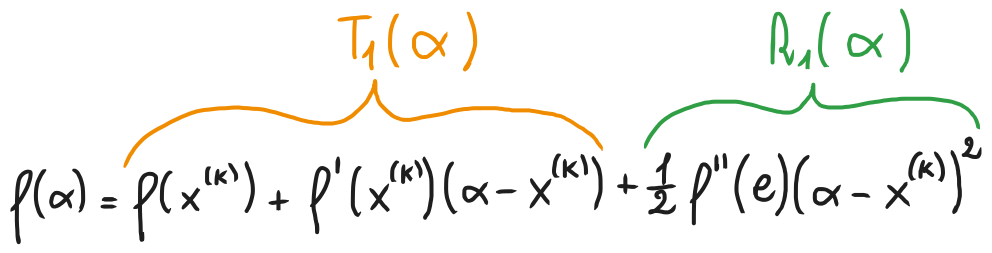
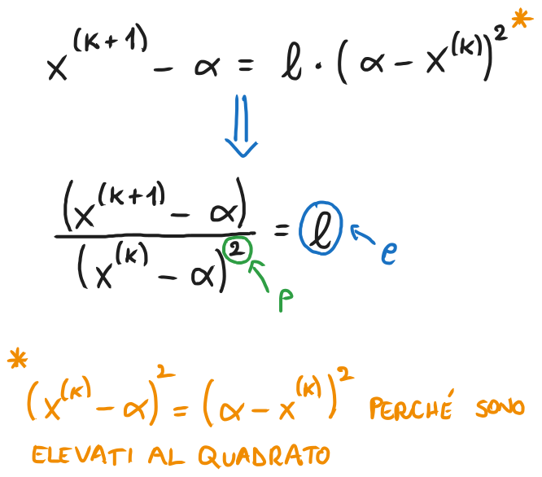

# Metodo di Newton - Convergenza, stime dell'errore, criteri di arresto e pseudocodice
### [Lezione precedente](Lezione3.md)

### Convergenza
Sia $f$ una funzione sufficientemente regolare (ovvero può essere derivata diverse volte, ottenendo derivate continue) e consideriamone il polinomio di Taylor di grado $1$ centrato in una generica iterata $x^{(k)}$ e valutato in uno zero $α$ di $f$:

Sfruttando il fatto che $α$ è uno zero della funzione (e di conseguenza $f(α) = 0$) e dividendo per $f'(x^{(k)})$ (che assumiamo essere diverso da 0), otteniamo

Continuiamo con il nostro ragionamento assumendo che l'espressione $\frac{ f''(c)}{2f'(x^{k})}$ si mantenga limitata e sia uguale a un certo numero generico $l$. Non ci importa quale sia questo valore, è solo per praticità nella scrittura delle formule.

Non ci resta che porre $x^{(k)} \rightarrow α$ e possiamo notare come l'espressione finale non sia altro che la formula della definizione di ordine di convergenza. Abbiamo utilizzato il metodo di Newton per ottenere $x^{(k+1)}$ da un'espressione in termini di $x^{(k)}$, di conseguenza quella formula si riferisce la successione generata da quel metodo e, di conseguenza, ci dice l'ordine di convergenza del metodo di Newton. 

Siccome il denominatore è elevato al quadrato, abbiamo che l'ordine di convergenza ($p$) sarà 2 e, di conseguenza, il metodo di Newton ha convergenza quadratica. Il fattore asintotico di convergenza ($c$), invece, corrisponde all'espressione $\frac{ f''(c)}{2f'(x^{k})}$, alla quale abbiamo assegnato il valore $l$. Il metodo di Newton ha quindi convergenza quadratica solo nel caso in cui il valore di $l$ si mantenga limitata e non diverga verso valori infiniti.

Questa è l'idea base dietro alla convergenza quadratica del teorema di Newton. Vediamo ora l'approccio formale per dimostrarlo.
### Teorema di convergenza del metodo di Newton
Sia $f$ una funzione avente almeno due derivate continue in un intorno di $α$, ovvero uno zero semplice di $f$. Allora, per $x^{(0)}$ sufficientemente vicino a $α$, la successione

converge a $α$ con ordine di convergenza non inferiore a 2.
### Dimostrazione
Essendo $f'$ continua in un intorno di $α$, per il teorema della permanenza del segno esiste un certo $ε > 0$ tale che $f'(x) \neq 0$, per ogni $x ∈ I = [α - ε, α + ε]$. Essendo $|f'|$ e $|f''|$ continue e $I$ chiuso e limitato, possiamo definire

