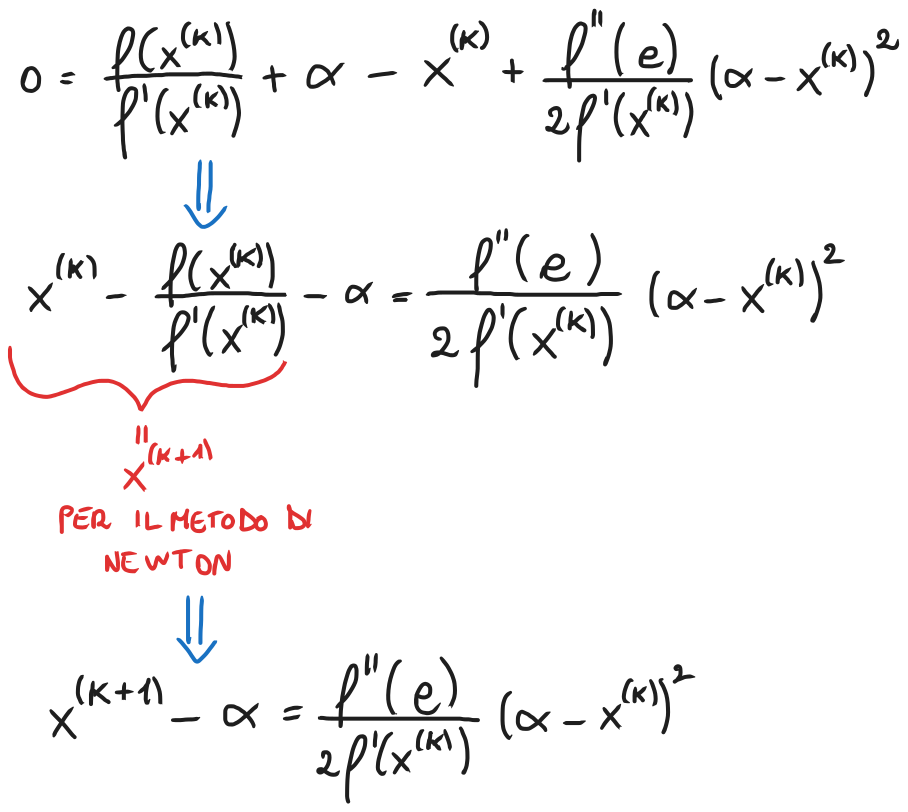
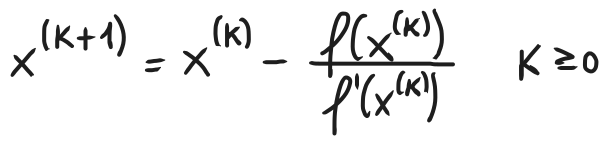
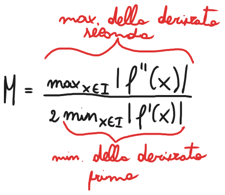
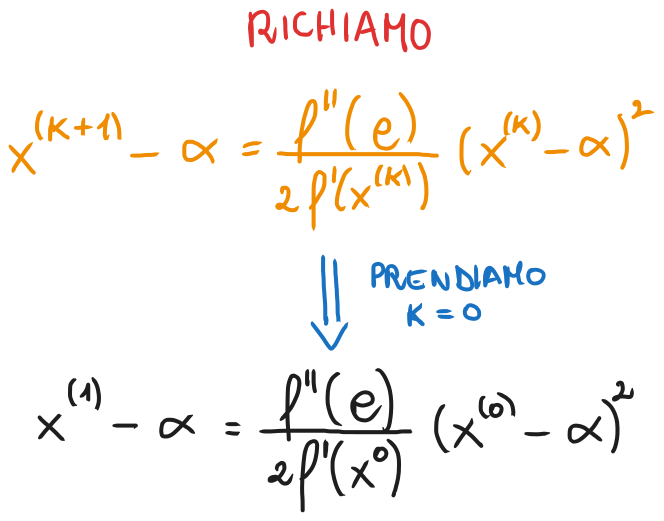
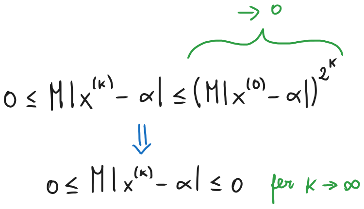

# Metodo di Newton - Convergenza, stime dell'errore, criteri di arresto e pseudocodice
### [Lezione precedente](Lezione3.md)

### Convergenza
Sia $f$ una funzione sufficientemente regolare (ovvero può essere derivata diverse volte, ottenendo derivate continue) e consideriamone il polinomio di Taylor di grado $1$ centrato in una generica iterata $x^{(k)}$ e valutato in uno zero $α$ di $f$:

Sfruttando il fatto che $α$ è uno zero della funzione (e di conseguenza $f(α) = 0$) e dividendo per $f'(x^{(k)})$ (che assumiamo essere diverso da 0), otteniamo

Continuiamo con il nostro ragionamento assumendo che l'espressione $\frac{ f''(c)}{2f'(x^{k})}$ si mantenga limitata e sia uguale a un certo numero generico $l$. Non ci importa quale sia questo valore, è solo per praticità nella scrittura delle formule.

Non ci resta che porre $x^{(k)} \rightarrow α$ e possiamo notare come l'espressione finale non sia altro che la formula della definizione di ordine di convergenza. Abbiamo utilizzato il metodo di Newton per ottenere $x^{(k+1)}$ da un'espressione in termini di $x^{(k)}$, di conseguenza quella formula si riferisce la successione generata da quel metodo e, di conseguenza, ci dice l'ordine di convergenza del metodo di Newton. 

Siccome il denominatore è elevato al quadrato, abbiamo che l'ordine di convergenza ($p$) sarà 2 e, di conseguenza, il metodo di Newton ha convergenza quadratica. Il fattore asintotico di convergenza ($c$), invece, corrisponde all'espressione $\frac{ f''(c)}{2f'(x^{k})}$, alla quale abbiamo assegnato il valore $l$. Il metodo di Newton ha quindi convergenza quadratica solo nel caso in cui il valore di $l$ si mantenga limitato e non diverga verso valori infiniti.

Questa è l'idea base dietro alla convergenza quadratica del teorema di Newton. Vediamo ora l'approccio formale per dimostrarlo.
### Teorema di convergenza del metodo di Newton
Sia $f$ una funzione avente almeno due derivate continue in un intorno di $α$, ovvero uno zero semplice di $f$. Allora, per $x^{(0)}$ sufficientemente vicino a $α$, la successione

converge a $α$ con ordine di convergenza non inferiore a 2.
### Dimostrazione
Essendo $f'$ continua in un intorno di $α$, per il teorema della permanenza del segno esiste un certo $ε > 0$ tale che $f'(x) \neq 0$, per ogni $x ∈ I = [α - ε, α + ε]$. Essendo $|f'|$ e $|f''|$ continue e $I$ chiuso e limitato, possiamo definire

Consideriamo adesso un certo $x^{(0)} ∈ I$, ovvero il punto di partenza del metodo di Newton, scegliendolo il modo tale che sia già abbastanza vicino allo zero della funzione, nello specifico lo scegliamo in modo tale che $M | x^{(0)} - α | < 1$. Riprendiamo adesso l'equazione che abbiamo visto all'inizio della lezione (la riporterò di nuovo qui per chiarezza), prendendo $k = 0$.

Abbiamo definito $M$ come il rapporto tra il valore massimo della derivata seconda di $f$ nell'intorno $I$ e il valore minimo della derivata prima di $f$. Per definizione, $c$ è un valore contenuto nell'intorno $I$, di conseguenza $f''(c)$ è coperto dall'operazione $max$. Essenzialmente abbiamo ottenuto $M$ prendendo l'espressione $\frac{f''(c)}{2f'(x_0)}$, massimizzando il numeratore e minimizzando il denominatore. In questo modo, con le ipotesi che ci siamo fatti, abbiamo la certezza che $\frac{f''(c)}{2f'(x_0)} \leq M$. Aggiungiamo quest'informazione nell'espressione, ottenendo quindi

Avendo ipotizzato precedentemente che $M | x^{(0)} - α | < 1$, utilizzando quest'espressione è facile dimostrare che anche $M|x^{(1)} - α| < 1$. Meglio ancora, è possibile dimostrare per induzione che questo è valido per ciascun valore di $x^{(k)}$, ovvero per tutti i valori della successione.

Adesso, sfruttando l'espressione che abbiamo appena trovato e la definizione di $M$, possiamo scrivere

Siccome, per ipotesi, $M | x^{(0)} - α | < 1$, si ha che $(M | x^{(0)} - α |)^{2^k} \rightarrow 0$ per valori di $k$ sempre più grandi (questo perché stiamo elevando un numero minore di $1$ a una potenza sempre più elevata). Di conseguenza, abbiamo che

Per il teorema dei carabinieri (o teorema del confronto tra tre successioni), abbiamo quindi che anche $|x^{(k)} - α| \rightarrow 0$, ovvero $x^{(k)} \rightarrow α$. Questo dimostra quindi che, se scegliamo un valore $x^{(0)}$ sufficientemente vicino a $α$ (all'inizio della dimostrazione abbiamo detto che $M | x^{(0)} - α | < 1$), la successione generata dal metodo di Newton convergerà a $α$.

Per quanto riguarda l'ordine di convergenza, richiamiamo di nuovo l'espressione che abbiamo visto all'inizio della lezione (anche qui la riscriverò per chiarezza) e la manipoliamo per ottenere questo:

Passando al limite per $k \rightarrow \infty$ e sfruttando le ipotesi di regolarità di $f$ ed il fatto che $c \rightarrow α$ (è una proprietà di $c$, conseguenza del teorema di Taylor che è facilmente dimostrabile) e $x^{(k)} \rightarrow α$, possiamo dedurre che

Anche qui, torniamo di nuovo alla formula della definizione di ordine di convergenza e possiamo osservare che $p = 2$. Dunque, se $f''(α) \neq 0$, il metodo di Newton esibisce ordine di convergenza quadratico. Se, invece, $f''(α) = 0$, l'ordine di convergenza sarà superiore a $2$. Questo conclude la dimostrazione.

Il teorema appena dimostrato afferma che il metodo di Newton risulta quadraticamente convergente a patto di partire da una stima iniziale $x^{(0)}$ sufficientemente vicina allo zero semplice che stiamo cercando.

### Criteri di arresto

