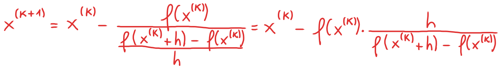

# Metodo di Newton - Convergenza, stime dell'errore, criteri di arresto e pseudocodice, metodi alternativi a Newton
### [Lezione precedente](Lezione3.md)

### Convergenza
Sia $f$ una funzione sufficientemente regolare (ovvero può essere derivata diverse volte, ottenendo derivate continue) e consideriamone il polinomio di Taylor di grado $1$ centrato in una generica iterata $x^{(k)}$ e valutato in uno zero $α$ di $f$:

Sfruttando il fatto che $α$ è uno zero della funzione (e di conseguenza $f(α) = 0$) e dividendo per $f'(x^{(k)})$ (che assumiamo essere diverso da 0), otteniamo

Continuiamo con il nostro ragionamento assumendo che l'espressione $\frac{ f''(c)}{2f'(x^{k})}$ si mantenga limitata e sia uguale a un certo numero generico $l$. Non ci importa quale sia questo valore, è solo per praticità nella scrittura delle formule.

Non ci resta che porre $x^{(k)} \rightarrow α$ e possiamo notare come l'espressione finale non sia altro che la formula della definizione di ordine di convergenza. Abbiamo utilizzato il metodo di Newton per ottenere $x^{(k+1)}$ da un'espressione in termini di $x^{(k)}$, di conseguenza quella formula si riferisce la successione generata da quel metodo e, di conseguenza, ci dice l'ordine di convergenza del metodo di Newton. 

Siccome il denominatore è elevato al quadrato, abbiamo che l'ordine di convergenza ($p$) sarà 2 e, di conseguenza, il metodo di Newton ha convergenza quadratica. Il fattore asintotico di convergenza ($c$), invece, corrisponde all'espressione $\frac{ f''(c)}{2f'(x^{k})}$, alla quale abbiamo assegnato il valore $l$. Il metodo di Newton ha quindi convergenza quadratica solo nel caso in cui il valore di $l$ si mantenga limitato e non diverga verso valori infiniti.

Questa è l'idea base dietro alla convergenza quadratica del teorema di Newton. Vediamo ora l'approccio formale per dimostrarlo.
### Teorema di convergenza del metodo di Newton
Sia $f$ una funzione avente almeno due derivate continue in un intorno di $α$, ovvero uno zero semplice di $f$. Allora, per $x^{(0)}$ sufficientemente vicino a $α$, la successione

converge a $α$ con ordine di convergenza non inferiore a 2.
### Dimostrazione
Essendo $f'$ continua in un intorno di $α$, per il teorema della permanenza del segno esiste un certo $ε > 0$ tale che $f'(x) \neq 0$, per ogni $x ∈ I = [α - ε, α + ε]$. Essendo $|f'|$ e $|f''|$ continue e $I$ chiuso e limitato, possiamo definire

Consideriamo adesso un certo $x^{(0)} ∈ I$, ovvero il punto di partenza del metodo di Newton, scegliendolo il modo tale che sia già abbastanza vicino allo zero della funzione, nello specifico lo scegliamo in modo tale che $M | x^{(0)} - α | < 1$. Riprendiamo adesso l'equazione che abbiamo visto all'inizio della lezione (la riporterò di nuovo qui per chiarezza), prendendo $k = 0$.

Abbiamo definito $M$ come il rapporto tra il valore massimo della derivata seconda di $f$ nell'intorno $I$ e il valore minimo della derivata prima di $f$. Per definizione, $c$ è un valore contenuto nell'intorno $I$, di conseguenza $f''(c)$ è coperto dall'operazione $max$. Essenzialmente abbiamo ottenuto $M$ prendendo l'espressione $\frac{f''(c)}{2f'(x_0)}$, massimizzando il numeratore e minimizzando il denominatore. In questo modo, con le ipotesi che ci siamo fatti, abbiamo la certezza che $\frac{f''(c)}{2f'(x_0)} \leq M$. Aggiungiamo quest'informazione nell'espressione, ottenendo quindi

Avendo ipotizzato precedentemente che $M | x^{(0)} - α | < 1$, utilizzando quest'espressione è facile dimostrare che anche $M|x^{(1)} - α| < 1$. Meglio ancora, è possibile dimostrare per induzione che questo è valido per ciascun valore di $x^{(k)}$, ovvero per tutti i valori della successione.

Adesso, sfruttando l'espressione che abbiamo appena trovato e la definizione di $M$, possiamo scrivere

Siccome, per ipotesi, $M | x^{(0)} - α | < 1$, si ha che $(M | x^{(0)} - α |)^{2^k} \rightarrow 0$ per valori di $k$ sempre più grandi (questo perché stiamo elevando un numero minore di $1$ a una potenza sempre più elevata). Di conseguenza, abbiamo che

Per il teorema dei carabinieri (o teorema del confronto tra tre successioni), abbiamo quindi che anche $|x^{(k)} - α| \rightarrow 0$, ovvero $x^{(k)} \rightarrow α$. Questo dimostra quindi che, se scegliamo un valore $x^{(0)}$ sufficientemente vicino a $α$ (all'inizio della dimostrazione abbiamo detto che $M | x^{(0)} - α | < 1$), la successione generata dal metodo di Newton convergerà a $α$.

Per quanto riguarda l'ordine di convergenza, richiamiamo di nuovo l'espressione che abbiamo visto all'inizio della lezione (anche qui la riscriverò per chiarezza) e la manipoliamo per ottenere questo:

Passando al limite per $k \rightarrow \infty$ e sfruttando le ipotesi di regolarità di $f$ ed il fatto che $c \rightarrow α$ (è una proprietà di $c$, conseguenza del teorema di Taylor che è facilmente dimostrabile) e $x^{(k)} \rightarrow α$, possiamo dedurre che

Anche qui, torniamo di nuovo alla formula della definizione di ordine di convergenza e possiamo osservare che $p = 2$. Dunque, se $f''(α) \neq 0$, il metodo di Newton esibisce ordine di convergenza quadratico. Se, invece, $f''(α) = 0$, l'ordine di convergenza sarà superiore a $2$. Questo conclude la dimostrazione.

Il teorema appena dimostrato afferma che il metodo di Newton risulta quadraticamente convergente a patto di partire da una stima iniziale $x^{(0)}$ sufficientemente vicina allo zero semplice che stiamo cercando.

### Criteri di arresto
I criteri di arresto per il metodo di Newton sono essenzialmente gli stessi del metodo delle successive bisezioni, ovvero le varie stime su errore assoluto, relativo, errore misto (per lo stesso discorso dell'errore assoluto/relativo malcondizionato che abbiamo menzionato nella [lezione 2](Lezione2.md)) e residuo. Ma vediamo adesso come arrivarci formalmente.

Nella dimostrazione precedente abbiamo visto che, scegliendo $x^{(0)}$ opportunamente vicino a $α$ e definendo opportunamente $M > 0$, si ha che $x^{(k)} \rightarrow α$ e 

Consideriamo ora $|x^{(k)} - α$|. Con qualche manipolazione algebrica e utilizzando questa proprietà, possiamo scrivere

Siccome $x^{(k)} \rightarrow α$, questo implica che $|x^{(k)} - α| \rightarrow 0$ e, di conseguenza, il termine $(1 - M|x^{(k)} - α|) \rightarrow 1$. Di conseguenza, prendendo il limite per $k \rightarrow \infty$, la disuguaglianza diventa

Siccome $|x^{(k)} - α|$ rappresenta l'errore assoluto ($E_a$), questa disuguaglianza giustifica il fatto che si possa stimare l'errore assoluto mediante la distanza tra le ultime due iterazioni del metodo di Newton. Ha senso anche logicamente, perché $x^{(k)}$ e $x^{(k + 1)}$ sono approssimazioni di $α$, di conseguenza nel sottrarre $x^{(k + 1)}$ da $x^{(k)}$ si ottiene in un valore "meno preciso" rispetto al valore che si otterrebbe sottraendo $α$ da $x^{(k)}$. In compenso, si può usare questa disuguaglianza per fare una stima leggermente gonfiata dell'errore assoluto. Detto questo, considerata una tolleranza $ε > 0$, per il metodo di Newton si possono utilizzare i seguenti criteri di arresto.

L'unico problema di questo approccio è che l'errore assoluto viene stimato "con un passo di ritardo". La disuguaglianza è $|x^{(k)} - α| \leq |x^{(k)} - x^{(k + 1)}|$ ci permette sì di stimare l'errore assoluto relativo a $x^{(k)}$, ma per farlo è comunque necessario calcolare la successiva iterazione del metodo di Newton $x^{(k + 1)}$, quindi per calcolare l'errore assoluto dell'approssimazione corrente ci serve già sapere il valore dell'approssimazione successiva. Per risolvere questo problema, si può utilizzare la disuguaglianza di partenza e la nostra stima dell'errore assoluto per ottenere una nuova stima:

Questa nuova stima è sì aggiornata al passo corrente (in quanto usa l'approssimazione precedente anziché l'approssimazione successiva), però coinvolge il valore di $M$ che generalmente non è noto, di conseguenza si preferisce comunque la stima che abbiamo descritto precedentemente, anche perché c'è un altro modo per calcolarla senza utilizzare l'approssimazione successiva che vedremo tra poco.

### Osservazioni
Ad ogni passo è opportuno controllare che $|f'(x^{(k)})|$ non si avvicini troppo a zero, così da assicurarsi che il problema non sia malcondizionato (e quindi che non ci siano divisioni per zero o variazioni eccessivamente grandi tra iterate consecutive).

A livello di codice, generalmente è preferibile separare il calcolo di $x^{(k + 1)}$ in due fasi.

Questo perché, come mostrato nel N. B., $dx^{(k)}$ rappresenta la stima dell'errore assoluto che utilizzeremo come criterio di arresto. Rappresenta l'incremento tra $x^{(k)}$ e $x^{(k + 1)}$ e si può calcolare senza sapere già a priori il valore di $x^{(k + 1)}$, quindi risolve anche il problema del "ritardo di un passo" che abbiamo visto precedentemente. È quindi conveniente calcolare in due step l'approssimazione, così da avere la variabile $dx^{(k)}$ sulla quale si possono fare tutti i controlli del caso.

### Pseudo codice
**Input:** $f$, $f'$, $x^{(0)}$, $ε$, $nitmax$.

1. $nit = 1$
2. $dfx = f'(x^{(0)})$
3. Se $|dfx|$ è troppo piccolo, esci con errore
4. $dx = \frac {-f(x^{(0)})}{dfx}$
5. $x^{(1)} = x^{(0)} + dx$
6. Se $|dx| < ε$, poni $α = x^{(1)}$ ed esci
7. Se $nit = nitmax$, esci con errore
8. $nit = nit + 1$
9. $x^{(0)} = x^{(1)}$
10. Torna al punto 2

**Output:** $α$, $nit$.

$nit$ è una variabile che rappresenta il numero di iterazioni effettuate fino a quel punto dall'algoritmo, mentre $nitmax$ rappresenta un valore in input che rappresenta il numero di iterazioni massime che concediamo all'algoritmo di compiere. Serve come un ulteriore controllo sull'algoritmo e, se $nit$ supera $nitmax$, vuol dire che il numero di iterazioni effettuate ha superato il numero di iterazioni che siamo disposti ad accettare, di conseguenza c'è stato un errore nell'algoritmo e quindi esce restituendo un segnale d'errore.

## Metodi alternativi al metodo di Newton
Il metodo di Newton ha ottime proprietà di convergenza ma ha alcuni svantaggi. Ad esempio, ad ogni passo è richiesto il calcolo della derivata prima di $f$. Questa potrebbe non essere nota (ad esempio nel caso in cui la mappatura $x \rightarrow f(x)$ sia nota ma provenga da una "black box", ovvero la funzione in sé è sconosciuta), oppure è nota ma è molto onerosa da calcolare. Quando il calcolo della derivata prima di $f$ causa problemi, ci si rivolge a varianti del metodo di Newton dette *derivative-free*, ovvero esenti dall'uso della derivata.

### Metodo delle corde
L'idea alla base di questo metodo è simile a quella del metodo di Newton, la differenza è che anziché utilizzare la retta tangente alla funzione calcolata nel punto considerato, si utilizza una retta che ha una certa pendenza fissa per ogni iterazione. Questa pendenza corrisponderà a un certo valore $m \neq 0$ prefissato.

Il valore di $m$ deve essere scelto intelligentemente, chiaramente. Ad esempio, se la nostra stima iniziale $x^{(0)}$ si trova alla destra di $α$, non possiamo scegliere un valore di $m$ negativo perché altrimenti le rette si allontanerebbero da $α$ anziché avvicinarsi. Generalmente, le prestazioni di questo metodo sono tanto migliori quanto più $m$ è vicino a $f'(α)$. Per questo, una scelta comune tende ad essere $m = f'(x^{(0)})$, avendo cura di scegliere un valore di $x^{(0)}$ che sia sufficientemente vicino ad $α$. Generalmente ha convergenza lineare, ma ne studieremo le proprietà più avanti.

### Metodo delle secanti
Anche qui l'idea di base è simile a quella del metodo di Newton, la differenza è che si utilizzano i due punti precedenti generati dal metodo per tracciare una retta secante che sostituirà la tangente del metodo di Newton. È quindi un metodo "a due passi", ovvero sono necessarie due iterazioni precedenti della funzione per calcolare la successiva.

Ovviamente questo vale a patto che il denominatore sia diverso da zero. Geometricamente, quindi, la retta tangente è sostituita dalla retta secante passante per i punti del grafico $(x^{(k - 1)}, f(x^{(k - 1)}))$ e $(x^{(k)}, f(x^{(k)}))$ e si trova l'intersezione tra questa secante e l'asse delle ascisse per trovare il punto $x^{(k + 1)}$. A ogni iterazione sono quindi necessarie le due iterazioni precedenti, non solo una. Anche per far partire il metodo serviranno due punti di partenza, ovvero $x^{(0)}$ e $x^{(1)}$. 

Si può dimostrare che, se $α$ è zero semplice di $f$, $f$ è sufficientemente regolare e $x^{(0)}$ e $x^{(1)}$ sono sufficientemente vicini a $α$, allora il metodo produce una successione che converge a $α$ con ordine di convergenza non inferiore a $φ = \frac {sqrt(5) + 1}{2} \approx 1.6$. È dunque un metodo superlineare.

### Metodo quasi-Newton
In questo metodo si mantiene l'idea generale del metodo di Newton, la differenza è che si utilizza *un'approssimazione* del valore della derivata prima anziché utilizzarne il valore preciso.

L'espressione $\frac{f(x^{(k)} + h) - f(x^{(k)})}{h}$ è la formula del rapporto incrementale e, prendendo il limite per $h \rightarrow 0$, si ottiene la definizione teorica di derivata di $f$ calcolata in $x^{(k)}$, ovvero $f'(x^{(k)})$, permettendo così di calcolarne direttamente il valore. Non sempre è possibile calcolare direttamente questo limite, per cui generalmente si preferisce assegnare un valore piuttosto piccolo ad $h$ (ad esempio $0.1$, $0.01$, valori piccoli ma comunque diversi da $0$) e questo permette di ottenere un'approssimazione abbastanza accurata di $f'(x^{(k)})$.

Per quanto riguarda l'ordine di convergenza, sebbene in teoria il metodo converga linearmente, scegliendo $h$ in modo ottimale ne risulta un comportamento pressoché indistinguibile dal metodo di Newton.
### [Lezione successiva](Lezione6.md)
### [Torna all'indice](../README.md)