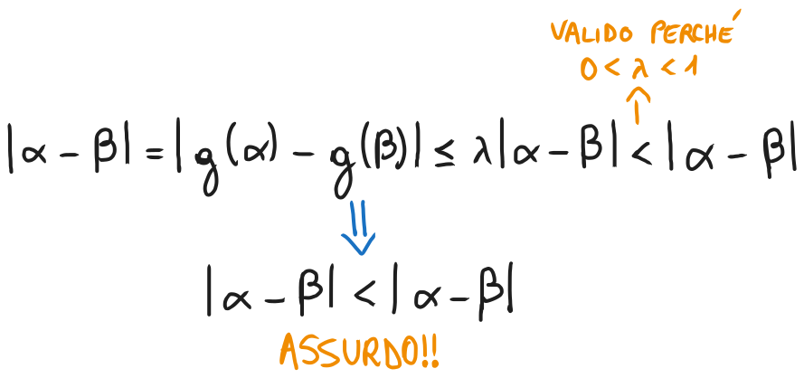
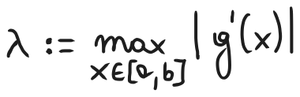

# Confronti tra metodi iterativi, teoria generale dei metodi iterativi ad 1 passo

### [Lezione precedente](Lezione3.md)

### Confronto tra metodi iterativi
Nel confrontare due metodi iterativi, bisogna tener conto sia dell'ordine di convergenza atteso che del costo di ogni iterata (misurato in unità di tempo). Questo costo lo misureremo in numero di volte in cui andrà valutata la funzione (valutazioni uniche, valutare una funzione nello stesso punto due volte o più verrà considerata come un'unica valutazione) . Compiliamo adesso una tabella in cui inseriremo i vari metodi iterativi e le loro informazioni rilevanti per il confronto, ovvero il costo e l'ordine di convergenza. Utilizzeremo la notazione "$nf$" per indicare che la funzione $f$ deve essere valutata $n$ volte per ogni iterazione di quel metodo. Per l'ordine di convergenza, indicheremo il valore che ci attendiamo di osservare sperimentalmente nelle condizioni tipiche.

|        `Metodo`        | `Num. valutazioni di funzione` | `Ordine di convergenza` |
| :--------------------: | :----------------------------: | :---------------------: |
| *Successive bisezioni* |              $1f$              |           $1$           |
|     *Regula Falsi*     |              $1f$              |           $1$           |
|        *Newton*        |           $1f + 1f'$           |           $2$           |
|        *Corde*         |              $1f$              |           $1$           |
|       *Secanti*        |              $1f$              |      $\approx 1.6$      |
|     *Quasi-Newton*     |              $2f$              |       $\approx 2$       |

Facciamo un esempio e vediamo come sia possibile fare un confronto tra il metodo di Newton e il metodo delle secanti.

Assumiamo che una valutazione di $f'$ costi tanto quanto una valutazione di $f$. Questo significa che un passo del metodo di Newton costerà tanto quanto due passi del metodo delle secanti (perché nel metodo di Newton facciamo due valutazioni, mentre nel metodo delle secanti solo una). Dunque, per fare un confronto a parità di costo passo per passo, dobbiamo considerare il metodo delle secanti *come se stessimo facendo due passi del metodo alla volta*. In pratica, andremo a calcolare l'ordine di convergenza della successione $\{x^{(0)}, x^{(2)}, x^{(4)}, ...\}$, dove $\{x^{(k)}\}$ è generata dal metodo delle secanti (insomma, andremo a prendere gli elementi pari della successione generata dal metodo delle secanti). È facile verificare che, se $x^{(k)} \rightarrow α$ con ordine di convergenza $p$, allora $x^{(2k)} \rightarrow α$ con ordine di convergenza $p^2$. Siccome nel il metodo delle secanti $p \approx 1.6$, questo significa che, con le nostre ipotesi di lavoro, il metodo delle secanti risulterà più efficiente del metodo di Newton.

### Metodi iterativi ad un passo
Il metodo di Newton appartiene ad una famiglia più generale di metodi, detti *metodi iterativi ad un passo*. Dati una funzione $g: R \rightarrow R$ ed un valore $x^{(0)} ∈ R$, un metodo iterativo ad un passo genera la successione $x^{(k + 1)} = g(x^{(k)})$, per ogni $k \geq 0$. 

Questo significa che generano una successione di approssimazioni basandosi sull'approssimazione immediatamente precedente (per questo sono detti metodi iterativi ad un passo) mediante una certa funzione $g$, che rappresenta la formula iterativa del metodo. In questo caso, la successione $\{x^{(k)}\}$ è detta *successione definita per ricorrenza iterando* $g$, mentre $g$ è detta *funzione iteratrice*. 

Affinché una successione definita per ricorrenza sia ben definita, è necessario che $x^{(k)}$ sia nel dominio di $g$ per ogni $k \geq 0$. Per questo motivo, se $g: [a, b] \rightarrow R$, faremo generalmente l'assunzione che $g([a, b]) ⊂ [a, b]$, che esprimeremo con "$g$ manda $[a, b]$ in se stesso".

Supponiamo che una successione definita per ricorrenza $x^{(k+1)} = g(x^{(k)})$ converga a $α$ e che $g$ sia continua in $α$. Allora, passando al limite per $k \rightarrow \infty$, si ottiene $g(α) = α$.

#### Definizione
Un numero $α ∈ R$ è detto *punto fisso per* $g$ se $g(α) = α$.

A livello geometrico, $α$ è punto fisso per $g$ se e soltanto se ($α$, $α$) è punto di intersezione del grafico di $g$ con la retta di equazione $y = x$ (ovvero la retta bisettrice del $I$ e del $III$ quadrante).

L'importanza dei punti fissi risiede nel fatto che è sempre possibile trasformare il problema $f(x) = 0$ in un problema equivalente $g(x) = x$, ovvero si trasforma un problema di zeri in un problema di punti fissi.

### Teorema di esistenza del punto fisso
Sia $g: [a, b] \rightarrow R$ continua e tale che $g([a, b]) ⊂ [a, b]$. Allora esiste $α ∈ [a, b]$ tale che $g(α) = α$.

La dimostrazione è un'immediata conseguenza del teorema degli zeri applicato alla funzione $f(x) = g(x) - x$.

Sotto ipotesi più forti, possiamo ottenere ancora più informazioni sul comportamento di $\{x^{(k)}\}$, adesso vedremo come.

### Teorema delle contrazioni
Sia $g: [a, b] \rightarrow R$ continua e tale che $g([a, b]) ⊂ [a, b]$. Sia $0 < λ < 1$ tale che

Si ha quindi che

#### Definizione
Una funzione che verifichi le condizioni di questo teorema per un certo $0 < λ < 1$ è detta *contrattiva* e $λ$ è detta costante di contrazione. Da queste definizioni deriva il nome del teorema.

### Dimostrazione
`Punto 1.` L'esistenza di quel valore è garantita perché le ipotesi del teorema del punto fisso sono verificate, di conseguenza il teorema è valido e la funzione ha un punto fisso. Per l'unicità, procediamo per assurdo e supponiamo che esistano due punti fissi distinti per $g$, $α$ e $β$. Sapendo che sono punti fissi che appartengono all'intervallo, sappiamo che $g(α) = α$ e $g(β) = β$. Sapendo questo e utilizzando la disuguaglianza dell'ipotesi $|g(x) - g(y)| \leq λ|x - y|$, possiamo quindi scrivere

`Punto 2.` Utilizzando le definizioni di successione definita per ricorrenza e di punto fisso, oltre di nuovo alla disequazione $|g(x) - g(y)| \leq λ|x - y|$ dell'ipotesi, possiamo scrivere

da cui segue che $x^{(k)} \rightarrow α$.

`Punto 3.` Utilizzando la disuguaglianza triangolare, possiamo scrivere

Riorganizzando opportunamente i termini e utilizzando il punto 2 della tesi, otteniamo

Questo conclude la dimostrazione.

### Osservazioni
Dal punto 3 della tesi del teorema precedente, scegliendo $k = 1$, si ottiene

Sostituendo $x^{(0)}$ con $x^{(k)}$, e dunque $x^{(1)}$ con $x^{(k + 1)}$, otteniamo

Questa disequazione ci permette di stimare l'errore assoluto al passo corrente mediante la distanza tra le ultime due iterazioni. L'utilità di questa stima, però, è limitata perché, generalmente, il valore di $λ$ non è noto. Si può verificare che, se $0 < λ \leq \frac{1}{2}$, si ha che $\frac{λ}{1 - λ} \leq 1$, e di conseguenza possiamo dire che

Questo vuol dire che, a patto che la costante di contrazione non sia più grande di $\frac{1}{2}$, la distanza tra due iterazioni consecutive è una *sovrastima* dell'errore assoluto al passo corrente e quindi si può utilizzare come criterio di arresto. Nel caso in cui $\frac{1}{2} < λ < 1$, invece, la distanza tra due iterazioni consecutive potrebbe *sottostimare* l'errore assoluto al passo corrente, quindi è sconsigliato usarlo come criterio di arresto (a meno che il metodo analizzato non abbia altre giustificazioni che permettono di utilizzare la distanza tra due iterazioni, come il metodo di Newton o il metodo delle successive bisezioni).

Il teorema delle contrazioni garantisce la convergenza delle iterazioni $x^{(k + 1)} = g(x^{(k)})$ sotto determinate ipotesi, che però non sono sempre facili da verificare. Ci sono altri modi che permettono di ottenere risultati di convergenza sotto ipotesi più forti ma più facilmente verificabili.

### Teorema di Lagrange
Sia $g: [a, b] \rightarrow R$ continua in $[a, b]$ e derivabile in $(a, b)$. Allora, per ogni coppia di punti distinti $x, y$ in $[a, b]$ esiste $c$ compreso tra $x$ e $y$ tale che

Sfruttando il teorema di Lagrange, possiamo riformulare le ipotesi del teorema delle contrazioni richiedendo delle proprietà particolari della derivata prima di $g$.

### Corollario del teorema delle contrazioni
Sia $g: [a, b] \rightarrow R$ continua e derivabile in $[a, b]$. Sia $g([a, b]) ⊂ [a, b]$. Definiamo adesso

Se è vero che $λ < 1$, allora valgono le stesse ipotesi del teorema delle contrazioni e, inoltre, se $x^{(0)} \neq α$, vale anche che

### Dimostrazione
Siccome $g$ è continua e derivabile in $[a, b]$, allora valgono le ipotesi del teorema di Lagrange. Effettuando qualche manipolazione algebrica, possiamo scrivere che, per ogni $x, y ∈ [a, b]$

per qualche $c$ che è compreso tra $x$ e $y$ per il teorema di Lagrange. Siccome, per ipotesi, abbiamo che $λ < 0$, ne segue che $g$ è contrattiva in $[a, b]$ e dunque sono verificate le tesi del teorema delle contrazioni. Inoltre, considerando che $x^{(x + 1)} = g(x^{(k)})$, per ogni $k \geq 0$, se $x^{(0)} \neq α$, sempre dal teorema di Lagrange segue che

E questo conclude la dimostrazione.

### Osservazioni
Nelle ipotesi del corollario precedente, si ha quindi che se $g'(α) \neq 0$, allora $x^{(k)} \rightarrow α$ con ordine di convergenza lineare. In altri termini, con questo corollario non si può garantire convergenza superlineare per $x^{(k)}$ a meno che $g'(α) = 0$.

Nemmeno le ipotesi di questo corollario sono facili da verificare, in quanto richiedono una buona conoscenza delle proprietà di $g'$ in tutto $[a, b]$. Vediamo adesso un teorema che indebolisce questa richiesta, spostando l'attenzione solo sul valore della derivata localmente.

### Teorema di convergenza locale per i metodi iterativi ad un passo
Sia $g: [a, b] \rightarrow R$ continua e derivabile in $[a, b]$ e sia $α ∈ [a, b]$ un punto fisso per $g$. Se  $|g'(α)| < 1$, allora $x^{(k)} \rightarrow α$ per $x^{(0)}$ sufficientemente vicino a $α$. Inoltre, se $g'(α) \neq 0$, la convergenza è lineare. La dimostrazione di questo teorema è nella prossima lezione.

### [Lezione successiva](Lezione7.md)
### [Torna all'indice](../README.md)

