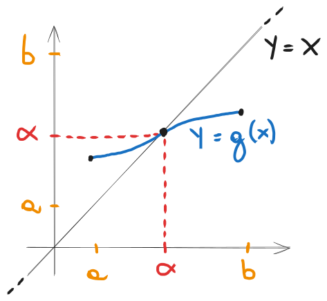
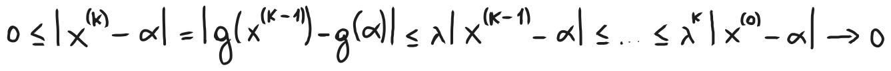
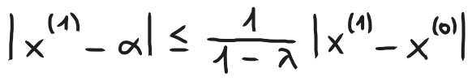
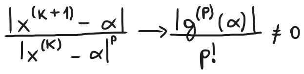

# Confronti tra metodi iterativi, teoria generale dei metodi iterativi ad 1 passo

### [Lezione precedente](Lezione3.md)

### Confronto tra metodi iterativi
Nel confrontare due metodi iterativi, bisogna tener conto sia dell'ordine di convergenza atteso che del costo di ogni iterata (misurato in unità di tempo). Questo costo lo misureremo in numero di volte in cui andrà valutata la funzione (valutazioni uniche, valutare una funzione nello stesso punto due volte o più verrà considerata come un'unica valutazione) . Compiliamo adesso una tabella in cui inseriremo i vari metodi iterativi e le loro informazioni rilevanti per il confronto, ovvero il costo e l'ordine di convergenza. Utilizzeremo la notazione "$nf$" per indicare che la funzione $f$ deve essere valutata $n$ volte per ogni iterazione di quel metodo. Per l'ordine di convergenza, indicheremo il valore che ci attendiamo di osservare sperimentalmente nelle condizioni tipiche.

|        `Metodo`        | `Num. valutazioni di funzione` | `Ordine di convergenza` |
| :--------------------: | :----------------------------: | :---------------------: |
| *Successive bisezioni* |              $1f$              |           $1$           |
|     *Regula Falsi*     |              $1f$              |           $1$           |
|        *Newton*        |           $1f + 1f'$           |           $2$           |
|        *Corde*         |              $1f$              |           $1$           |
|       *Secanti*        |              $1f$              |      $\approx 1.6$      |
|     *Quasi-Newton*     |              $2f$              |           $2$           |

Facciamo un esempio e vediamo come sia possibile fare un confronto tra il metodo di Newton e il metodo delle secanti.

Assumiamo che una valutazione di $f'$ costi tanto quanto una valutazione di $f$. Questo significa che un passo del metodo di Newton costerà tanto quanto due passi del metodo delle secanti (perché nel metodo di Newton facciamo due valutazioni, mentre nel metodo delle secanti solo una). Dunque, per fare un confronto a parità di costo passo per passo, dobbiamo considerare il metodo delle secanti *come se stessimo facendo due passi del metodo alla volta*. In pratica, andremo a calcolare l'ordine di convergenza della successione $\{x^{(0)}, x^{(2)}, x^{(4)}, ...\}$, dove $\{x^{(k)}\}$ è generata dal metodo delle secanti (insomma, andremo a prendere gli elementi pari della successione generata dal metodo delle secanti). È facile verificare che, se $x^{(k)} \rightarrow α$ con ordine di convergenza $p$, allora $x^{(2k)} \rightarrow α$ con ordine di convergenza $p^2$. Siccome nel il metodo delle secanti $p \approx 1.6$, questo significa che, con le nostre ipotesi di lavoro, il metodo delle secanti risulterà più efficiente del metodo di Newton.

### Metodi iterativi ad un passo
Il metodo di Newton appartiene ad una famiglia più generale di metodi, detti *metodi iterativi ad un passo*. Dati una funzione $g: R \rightarrow R$ ed un valore $x^{(0)} ∈ R$, un metodo iterativo ad un passo genera la successione $x^{(k + 1)} = g(x^{(k)})$, per ogni $k \geq 0$. 

Questo significa che generano una successione di approssimazioni basandosi sull'approssimazione immediatamente precedente (per questo sono detti metodi iterativi ad un passo) mediante una certa funzione $g$, che rappresenta la formula iterativa del metodo. In questo caso, la successione $\{x^{(k)}\}$ è detta *successione definita per ricorrenza iterando* $g$, mentre $g$ è detta *funzione iteratrice*. 

Affinché una successione definita per ricorrenza sia ben definita, è necessario che $x^{(k)}$ sia nel dominio di $g$ per ogni $k \geq 0$. Per questo motivo, se $g: [a, b] \rightarrow R$, faremo generalmente l'assunzione che $g([a, b]) ⊂ [a, b]$, che esprimeremo con "$g$ manda $[a, b]$ in se stesso".

Supponiamo che una successione definita per ricorrenza $x^{(k+1)} = g(x^{(k)})$ converga a $α$ e che $g$ sia continua in $α$. Allora, passando al limite per $k \rightarrow \infty$, si ottiene $g(α) = α$.

#### Definizione
Un numero $α ∈ R$ è detto *punto fisso per* $g$ se $g(α) = α$.

A livello geometrico, $α$ è punto fisso per $g$ se e soltanto se ($α$, $α$) è punto di intersezione del grafico di $g$ con la retta di equazione $y = x$ (ovvero la retta bisettrice del $I$ e del $III$ quadrante).

L'importanza dei punti fissi risiede nel fatto che è sempre possibile trasformare il problema $f(x) = 0$ in un problema equivalente $g(x) = x$, ovvero si trasforma un problema di zeri in un problema di punti fissi.

### Teorema di esistenza del punto fisso
Sia $g: [a, b] \rightarrow R$ continua e tale che $g([a, b]) ⊂ [a, b]$. Allora esiste $α ∈ [a, b]$ tale che $g(α) = α$.

La dimostrazione è un'immediata conseguenza del teorema degli zeri applicato alla funzione $f(x) = g(x) - x$.

Sotto ipotesi più forti, possiamo ottenere ancora più informazioni sul comportamento di $\{x^{(k)}\}$, adesso vedremo come.

### Teorema delle contrazioni
Sia $g: [a, b] \rightarrow R$ continua e tale che $g([a, b]) ⊂ [a, b]$. Sia $0 < λ < 1$ tale che

Si ha quindi che

#### Definizione
Una funzione che verifichi le condizioni di questo teorema per un certo $0 < λ < 1$ è detta *contrattiva* e $λ$ è detta costante di contrazione. Da queste definizioni deriva il nome del teorema.

Si dice contrattiva perché applicare la funzione "diminuisce" la distanza tra i punti $x$ e $y$, siccome la differenza delle immagini della funzione è minore della differenza dei punti considerati moltiplicati per un certo fattore che è minore di $1$, in questo caso $λ$. A livello geometrico, sul grafico questo significa che la distanza tra i punti $x$ e $y$ sull'asse delle ascisse è maggiore della distanza tra i punti $f(x)$ e $f(y)$ sull'asse delle ordinate.

Si può notare che il concetto di contrazione dipende molto dalla pendenza della curva della funzione. Più è bassa la pendenza e più la funzione tenderà a contrarre i valori. Questo fattore di contrazione deve chiaramente essere minore di $1$ per l'appunto, altrimenti non sarà una contrazione ma, invece, la distanza aumenterà. La pendenza di una funzione si può quantificare mediante la sua derivata prima, infatti successivamente vedremo come $f'$ incida su questa cosa.

#### Dimostrazione
`Punto 1.` L'esistenza di quel valore è garantita perché le ipotesi del teorema del punto fisso sono verificate, di conseguenza il teorema è valido e la funzione ha un punto fisso. Per l'unicità, procediamo per assurdo e supponiamo che esistano due punti fissi distinti per $g$, $α$ e $β$. Sapendo che sono punti fissi che appartengono all'intervallo, sappiamo che $g(α) = α$ e $g(β) = β$. Sapendo questo e utilizzando la disuguaglianza dell'ipotesi $|g(x) - g(y)| \leq λ|x - y|$, possiamo quindi scrivere

`Punto 2.` Utilizzando le definizioni di successione definita per ricorrenza e di punto fisso, oltre di nuovo alla disequazione $|g(x) - g(y)| \leq λ|x - y|$ dell'ipotesi, possiamo scrivere

da cui segue che $x^{(k)} \rightarrow α$.

`Punto 3.` Utilizzando la disuguaglianza triangolare, possiamo scrivere

Riorganizzando opportunamente i termini e utilizzando il punto 2 della tesi, otteniamo

Questo conclude la dimostrazione.

#### Osservazioni
Dal punto 3 della tesi del teorema precedente, scegliendo $k = 1$, si ottiene

Sostituendo $x^{(0)}$ con $x^{(k)}$, e dunque $x^{(1)}$ con $x^{(k + 1)}$, otteniamo

Questa disequazione ci permette di stimare l'errore assoluto al passo corrente mediante la distanza tra le ultime due iterazioni. L'utilità di questa stima, però, è limitata perché, generalmente, il valore di $λ$ non è noto. Si può verificare che, se $0 < λ \leq \frac{1}{2}$, si ha che $\frac{λ}{1 - λ} \leq 1$, e di conseguenza possiamo dire che

Questo vuol dire che, a patto che la costante di contrazione non sia più grande di $\frac{1}{2}$, la distanza tra due iterazioni consecutive è una *sovrastima* dell'errore assoluto al passo corrente e quindi si può utilizzare come criterio di arresto. Nel caso in cui $\frac{1}{2} < λ < 1$, invece, la distanza tra due iterazioni consecutive potrebbe *sottostimare* l'errore assoluto al passo corrente, quindi è sconsigliato usarlo come criterio di arresto (a meno che il metodo analizzato non abbia altre giustificazioni che permettono di utilizzare la distanza tra due iterazioni come stima dell'errore assoluto, come il metodo di Newton o il metodo delle successive bisezioni).

Il teorema delle contrazioni garantisce la convergenza delle iterazioni $x^{(k + 1)} = g(x^{(k)})$ sotto determinate ipotesi, che però non sono sempre facili da verificare. Non è semplice dimostrare che una funzione sia contrattiva, dovremmo verificare che la disuguaglianza è valida per ciascuna coppia di punti nell'intervallo per un certo valore di $λ$. Ci sono altri modi che permettono di ottenere risultati di convergenza sotto ipotesi più forti ma più facilmente verificabili. Torniamo quindi sulla derivata prima, riprendendo il concetto della pendenza che stavamo formulando prima.

### Teorema di Lagrange
Sia $g: [a, b] \rightarrow R$ continua in $[a, b]$ e derivabile in $(a, b)$. Allora, per ogni coppia di punti distinti $x, y$ in $[a, b]$ esiste $c$ compreso tra $x$ e $y$ tale che

Sfruttando il teorema di Lagrange, possiamo riformulare le ipotesi del teorema delle contrazioni richiedendo delle proprietà particolari della derivata prima di $g$.

### Corollario del teorema delle contrazioni
Sia $g: [a, b] \rightarrow R$ continua e derivabile in $[a, b]$. Sia $g([a, b]) ⊂ [a, b]$. Definiamo adesso

Se è vero che $λ < 1$, allora valgono le stesse ipotesi del teorema delle contrazioni e, inoltre, se $x^{(0)} \neq α$, vale anche che

E questo implica che $g$ abbia convergenza lineare.

#### Dimostrazione
Siccome $g$ è continua e derivabile in $[a, b]$, allora valgono le ipotesi del teorema di Lagrange. Effettuando qualche manipolazione algebrica, possiamo scrivere che, per ogni $x, y ∈ [a, b]$

per qualche $c$ che è compreso tra $x$ e $y$ per il teorema di Lagrange. Siccome, per ipotesi, abbiamo che $λ < 1$, ne segue che $g$ è contrattiva in $[a, b]$ e dunque sono verificate le tesi del teorema delle contrazioni. Inoltre, considerando che $x^{(x + 1)} = g(x^{(k)})$, per ogni $k \geq 0$, se $x^{(0)} \neq α$, sempre dal teorema di Lagrange segue che

E questo conclude la dimostrazione.

#### Osservazioni
Nelle ipotesi del corollario precedente, si ha quindi che se $g'(α) \neq 0$, allora $x^{(k)} \rightarrow α$ con ordine di convergenza lineare. In altri termini, con questo corollario non si può garantire convergenza superlineare per $x^{(k)}$ a meno che $g'(α) = 0$.

Nemmeno le ipotesi di questo corollario sono facili da verificare, in quanto richiedono una buona conoscenza delle proprietà di $g'$ in tutto $[a, b]$. Vediamo adesso un teorema che indebolisce questa richiesta, spostando l'attenzione solo sul valore della derivata "localmente", cioè per un unico punto.

### Teorema di convergenza locale per i metodi iterativi ad un passo
Sia $g: [a, b] \rightarrow R$ continua e derivabile in $[a, b]$ e sia $α ∈ [a, b]$ un punto fisso per $g$. Se  $|g'(α)| < 1$, allora $x^{(k)} \rightarrow α$ per $x^{(0)}$ sufficientemente vicino a $α$. Inoltre, se $g'(α) \neq 0$, la convergenza è lineare. 
#### Dimostrazione
Per questa dimostrazione si cerca di utilizzare le ipotesi di partenza per dimostrare che la funzione rispetta le ipotesi del corollario del teorema di contrazione, dimostrando, quindi, che possiamo arrivare alle stesse conclusioni di quel teorema (dimostrando quindi la tesi).

Sappiamo già che $g: [a, b] \rightarrow R$ è continua e derivabile in $[a, b]$, quindi essenzialmente dobbiamo dimostrare le altre due ipotesi del corollario del teorema di contrazione, ovvero che esiste un certo intorno $I$ nel quale la derivata prima è minore di $1$ (e quindi possiamo definire $λ$) e che $g(I) ⊂ I$ (ovvero $g$ si manda in se stessa).

`Punto 1.` Per ipotesi, sappiamo che $|g'(α)| < 1$. Da questo ne deriva che, per il teorema della permanenza del segno, esiste $ε$ tale che

In parole povere, per il teorema della permanenza del segno, se $|g'(α)| < 1$, questo significa che $g'$ sarà minore di uno anche in prossimità del punto $α$ (non sappiamo quanto sia grande questa prossimità, infatti $ε$ è un valore arbitrario generalmente sconosciuto, ma non ci interessa). Formalmente, questo vuol dire che esiste già un intorno $I = [α - ε, α + ε]$ di $α$ per il quale $|g'(x)| < 1$, dove $x ∈ I$. Questo dimostra quindi la prima ipotesi e, per di più, ipoteticamente ci dice che il valore iniziale $x^{(0)}$ deve essere contenuto in $I$ affinché il metodo converga ad $α$, ovvero $x^{(0)}$ deve essere sufficientemente vicino ad $α$.

`Punto 2.` Ora dobbiamo dimostrare che $g(I) ⊂ I$. L'idea consiste nel dimostrare che $g$ sia una funzione contrattiva intorno ad $α$, perché così facendo dimostreremmo che l'intervallo generato da $g(I)$ è più piccolo dell'intervallo $I$ e, di conseguenza, dovrà essere contenuto in esso.

Sia, allora, $y ∈ g(I)$. Per definizione, questo significa che esiste un certo $x ∈ I$ tale che $y = g(x)$. Siccome $g$ è continua e derivabile in $I$, possiamo applicare il teorema di Lagrange a $x$ e $α$.

Siccome $α$ è punto fisso di $g$, allora $g(α) = α$. Procediamo quindi definendo $λ$ allo stesso modo del corollario del teorema di contrazione, ovvero come il valore massimo del valore assoluto della derivata prima nell'intervallo $I$. Come dimostrato nel `punto 1`, $|g'|$ sarà minore di $1$ per tutti i valori dell'intervallo $I$, di conseguenza abbiamo che $λ < 1$. Per di più, siccome $c ∈ I$, abbiamo che $|g'(c)| \leq λ < 1$. Di conseguenza, passando in valori assoluti, possiamo scrivere

Abbiamo quindi dimostrato che la funzione è contrattiva, di conseguenza l'intervallo $g(I)$ è più piccolo, e quindi sottoinsieme (siccome sono entrambi centrati in $α$), dell'intervallo $I$, ovvero $g(I) ⊂ I$.

Sono quindi verificate le ipotesi del corollario del teorema delle contrazioni e, di conseguenza, vale anche la tesi di quel teorema, concludendo così la dimostrazione.

#### Osservazione
Una conseguenza del teorema precedente è che un punto fisso $α$ per $g$ tale che $g'(α) < 1$ "attrae" i punti sufficientemente vicini ad esso mediante l'iterazione della funzione $g$. Al contrario, se $|g'(α)| > 1$, iterando la funzione $g$ si tende ad "allontanarsi" dal punto $α$. Infatti, si può dimostrare mediante il teorema di Lagrange che, per $x^{(k)}$ sufficientemente vicino a $α$, si ha che $|x^{(k + 1)} - α| > |x^{(k)} - α|$ (ovvero l'errore assoluto aumenta a ogni iterazione, quindi ci stiamo allontanando da $α$ anziché avvicinarsi) e questo fatto impedisce la convergenza di $x^{(k)}$ a $α$.

Geometricamente, possiamo visualizzare questo concetto mediante questo grafico, immaginando che ogni iterazione della funzione $g'$ equivalga a partire dal punto $x^{(k)}$ considerato, intersecarlo con la funzione e spostandosi orizzontalmente verso la retta bisettrice del primo e terzo quadrante.

Questi esempi mostrano come un punto fisso con $|g'(α)| < 1$ tende appunto ad attrarre i punti $x^{(k)}$ sufficientemente vicini ad esso, mentre un punto fisso con $|g'(α)| > 1$ tende a farli allontanare. Questo ha anche senso logicamente, perché noi stiamo cercando di avvicinarsi al punto fisso, che per definizione si trova sulla retta $y = x$, cioè la bisettrice del primo e terzo quadrante. Se la nostra funzione avesse una pendenza maggiore rispetto alla pendenza della retta bisettrice (che ha pendenza $1$), la nostra funzione si starebbe allontanando da quel punto più velocemente di quanto il metodo iterativo sia in grado di avvicinarsi ad esso.

#### Definizione
Sia $g$ derivabile in un intorno di un suo punto fisso $α$. Se $|g'(α)| < 1$, allora $α$ è detto *attrattivo*. Se, invece, $|g'(α)| > 1$, allora $α$ è detto *repulsivo*.

Nel caso in cui $|g'(α)| = 1$, invece, non possiamo trarre conclusioni concrete sul comportamento del punto fisso senza fare uno studio più approfondito del comportamento della funzione $g$ in un intorno di $α$.

### Teorema (ordine di convergenza dei metodi iterativi ad 1 passo)
Sia $g$ derivabile $p \geq 2$ volte in un intorno di un suo punto fisso $α$ tale che

Allora, per $x^{(0)}$ sufficientemente vicino ad $α$, $x^{(k + 1)} = g(x^{(k)}) \rightarrow α$ con ordine di convergenza $p$.

In sostanza, questo teorema afferma che, per un metodo ad un passo, l'ordine di convergenza è il più piccolo intero $p ∈ N$ per il quale la derivata $p$-esima di $g$ è diversa da zero in $α$. Per di più, una conseguenza di questo teorema è che i metodi ad un passo possono avere come ordine di convergenza solo un numero intero. Possiamo rendercene conto ritornando alla tabella all'inizio della lezione. Notiamo anche come l'unico metodo a non avere un numero intero come ordine di convergenza è il metodo delle secanti, l'unico metodo ad essere non a uno ma a due passi.
#### Dimostrazione
Scriviamo $g(x^{(k)})$ utilizzando il suo relativo polinomio di Taylor, centrato in $α$ e valutato in $x^{(k)}$.

Con $c^{(k)}$ compreso tra $x^{(k)}$ e $α$. Sfruttando le ipotesi (ovvero il fatto che tutte le derivate eccetto la derivata $p$-esima sono nulle e quindi si annullano quasi tutti i termini, lasciando solo $g(α) + R_n(x^{(k)})$), sfruttando il fatto che $g(x^{(k)}) = x^{(k + 1)}$ (perché funzione iteratrice) e che $g(α) = α$ (perché è punto fisso di $g$) e ridistribuendo opportunamente i termini dell'equazione, possiamo scrivere

Essendo $|g'(α)| = 0 < 1$, per i teoremi precedenti abbiamo che sia $x^{(k)}$ che $c^{(k)}$ convergono a $α$. Passando ai valori assoluti, al limite per $k \rightarrow \infty$ e riorganizzando opportunamente l'ultima equazione, otteniamo

Che è ancora una volta la formula della definizione di ordine di convergenza. Sappiamo per ipotesi che $g^{(p)}(α) \neq 0$ per ipotesi, di conseguenza questa formula tenderà a un valore diverso da $0$. Questo dimostra quindi che $x^{(k + 1)} = g(x^{(k)}) \rightarrow α$ con ordine di convergenza $p$, e quindi la tesi è dimostrata.
### Esempio - Esercizio con gli ultimi due teoremi
![[Excalidraw/EsercizioEsempioLezione7.png]]

(Poi lo riscrivo io a mano ma per ora metto questo placeholder)

Con questo si conclude la parte di programma dedicata ai metodi numerici per la risoluzione delle equazioni non lineari. Nella prossima lezione passeremo allo studio dei numeri di macchina.
### [Lezione successiva](Lezione7.md)
### [Torna all'indice](../README.md)

