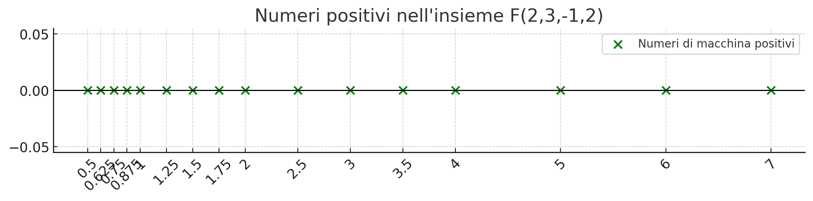

# Introduzione ai numeri di macchina

### [Lezione precedente](Lezione6_7.md)

Un computer ha quantità finita di memoria. Questo implica che può memorizzare solo una quantità finita di numeri, ognuno dei quali dovrà necessariamente essere rappresentato attraverso un numero finito di cifre. Banalmente, questo significa che un numero decimale infinito come $\frac{1}{3} = 0.\overline3$ o un numero reale come $π$ non possono essere conservati su una macchina senza essere troncati in qualche modo. L'obiettivo di questa parte di programma è capire in quali modo i numeri reali vengono approssimati su computer mediante i cosiddetti *numeri di macchina* e studiare l'errore che nasce da questa approssimazione.

### Teorema di rappresentazione in base
Dati $x ∈ R, x \neq 0$, e $β ∈ N, β \geq 2$, esiste un unico modo di rappresentare $x$ come segue:

1. $d_i ∈ N$ e $0 \leq d_i \leq β - 1$ per ogni $i ∈ N$ (le cifre del numero devono essere minori della base, ad esempio in base $10$ non possiamo avere $10$ come cifra, ma solo cifre che vanno da $0$ a $9$)
2. $d_0 \neq 0$ (la prima cifra non può essere $0$, numeri come $0012$ non sono validi, dovremmo scrivere $12$. Inoltre, identifica la corretta posizione del separatore decimale, che deve comparire immediatamente dopo la cifra più significativa $d_0$. Ad esempio, la corretta rappresentazione di $0.123$ è $1.23 * 10^{-1}$)
3. $p ∈ Z$ (indica il range degli esponenti delle cifre, positivo se è una cifra intera e negativo se è decimale)
4. $\{d_i\}_{i ∈ N}$ non definitivamente uguali a $β - 1$ (significa che non sono ammesse rappresentazioni di numeri infiniti che abbiamo solo $β - 1$ come cifra. Questo perché, ad esempio, in base $10$ abbiamo che $0.\overline9 = 1$, di conseguenza senza questa condizione avremmo due rappresentazioni differenti per lo stesso numero (una per $0.\overline9$, ovvero $9.\overline9 * 10^{-1}$, e una per $1$, ovvero $1 * 10^0$) e quindi si perderebbe l'unicità della rappresentazione)

Il teorema enunciato afferma che ogni numero reale può essere rappresentato in una base arbitraria e che questa rappresentazione è unica. L'unicità della rappresentazione, nello specifico, è garantita dai punti $2$ e $4$.

Questo teorema sembra complicato, ma in realtà è semplicemente la formalizzazione di quella che conosciamo come notazione scientifica.

Si faccia attenzione al fatto che un numero che ha una rappresentazione finita (ovvero un numero finito di cifre) in una base potrebbe avere rappresentazione infinita in un'altra, ad esempio $(0.1)_{10} = (1.\overline{1001} * 2^{-4})$. Questo può causare errori di approssimazione nel calcolo di macchina, ad esempio il famoso $0.1 + 0.2 = 0.30000000000000004$ su JavaScript. La scelta della base può quindi influire sulla possibilità di rappresentare un numero in modo esatto sul computer.

Questo vale generalmente per rappresentare i numeri in una certa base. Siccome abbiamo detto che la memoria di un computer è limitata, dobbiamo in qualche modo limitare anche questa rappresentazione. Possiamo farlo limitando opportunamente il range di variabilità dell'esponente $p$ (dandogli un limite minimo e massimo) e del numero di cifre $d_i$. Fatta questa premessa, possiamo ora definire l'insieme dei numeri di macchina.

### Definizione dell'insieme dei numeri di macchina

Dove:
1. $d_i ∈ N$ e $0 \leq d_i \leq β - 1$ per ogni $i ∈ N$
2. $d_0 \neq 0$ (condizione di normalizzazione)
3. $p, M_1, M_2 ∈ Z$ e $M_1 + 1 \leq p \leq M_2 - 1$

$F$ è quindi un quartetto detto *insieme dei numeri di macchina* di base $β$ aventi $t + 1$ cifre significative e range per l'esponente $(M_1, M_2)$. Con le condizioni che abbiamo definito significa che, ad esempio, se $M_1 = -2$ e $M_2 = 4$, allora $p$ può assumere come valori $\{-1, 0, 1, 2, 3\}$. Gli elementi di $F(β, t, M_1, M_2)$ saranno denominati semplicemente *numerica macchina* oppure, più comunemente, *numeri floating point*. Con la condizione $2$, questi numeri di macchina sono detti anche numeri di macchina *normali*. Per semplificare le notazioni, spesso scriveremo il quartetto $F$ sottintendendo l'aggettivo normali (a meno che non è specificato altrimenti).

#### Osservazioni
A causa della condizione $1$, possiamo notare che $0 \notin F$.

Informalmente, possiamo dire che i numeri di macchina $x$ in $F(β, t, M_1, M_2)$ sono i numeri che possiamo scrivere in questo modo e con le condizioni ulteriormente specificate dalla condizione $2$

#### Esempi
I fattori che determinano se $x ∈ R$ appartiene o meno a un determinato insieme di numeri di macchina $F$ sono essenzialmente il suo ordine di grandezza e il suo numero di cifre della sua rappresentazione in base $β$. Ad esempio

### Numeri macchina più piccolo e più grande
L'insieme dei numeri di macchina è un insieme discreto e finito e quindi, diversamente da $R$, ammette il più piccolo elemento e il più grande elemento (li considereremo strettamente positivi). Inoltre, ogni numero di macchina (eccetto il più grande) ha il suo successivo.

Il più piccolo numero di macchina strettamente positivo si ottiene assegnando alle cifre $d_i$ e all'esponente $p$ i valori più piccoli consentiti. Chiaramente dobbiamo cercare di minimizzare quanto più possibile i fattori determinanti per ottenere il numero più piccolo possibile. Di conseguenza, $p = M_1 + 1$, che è il valore più piccolo consentito per $p$, mentre tutte le cifre $d_i = 0$, eccezione fatta per $d_0$ che, siccome deve essere diversa da $0$ per la condizione $1$, sarà uguale a $1$. Definiremo come *realmin* il numero più piccolo strettamente positivo e, secondo questo ragionamento, si calcola in questo modo:

Facendo il ragionamento inverso per il più grande numero di macchina, invece, cercheremo di massimizzare il numero assegnando alle cifre $d_i$ e all'esponente $p$ i valori più grandi consentiti. Di conseguenza, $p = M_2 - 1$, che è il valore più grande consentito per $p$, mentre tutte le cifre $d_i = β - 1$, ovvero la cifra più grande per quella base. Definiremo come *realmax* il numero più piccolo strettamente positivo e, secondo questo ragionamento, si calcola in questo modo:

Quest'espressione è piuttosto scomoda da calcolare, però c'è un modo più conveniente per esprimerla. Aggiungendo e sottraendo a quest'espressione la quantità $β^{(M_2 - 1 - t)} = 0.00 ... 01 * β^{(M_2 - 1)}$, si ottiene l'espressione più compatta

Facciamo adesso un'osservazione limitandoci ai numeri strettamente positivi per semplicità. Per definizione, non esistono numeri di macchina normali più piccoli di *realmin* o più grandi di *realmax*. In caso volessimo rappresentare un numero $x > realmax$, incorreremo nel cosiddetto errore di *overflow*, mentre nel caso in cui volessimo rappresentare un numero $x < realmin$, incorreremo nel cosiddetto errore di *underflow*.

Per di più, per la natura di $a^x$ come funzione esponenziale (nel caso dei numeri di macchina ci riferiamo a $β^p$), i numeri di macchina non sono distribuiti in modo equidistante sulla retta dei numeri reali. Siccome $β^p$ cresce esponenzialmente e stiamo moltiplicando le nostre cifre per questo numero, l'effetto che si ottiene è che quanto più $p$ è grande, tanto più due numeri di macchina successivi saranno distanti tra di loro. Questo implica che c'è un addensamento di numeri di macchina quanto più vicini siamo a *realmin*, mentre diventano più sparsi quanto più ci avviciniamo a *realmax*. 

Questo discorso e il concetto di *underflow* tendono a causare una perdita di precisione quando abbiamo un numero $x < realmin$ oppure quando $x$ è un numero che si avvicina a $realmax$. Gli effetti di questa perdita di precisione saranno visti meglio nelle prossime lezioni.

### Numeri di macchina denormali
Per alleviare la perdita di precisione causata dall'underflow, sono stati introdotti i cosiddetti numeri *denormali* o *subnormali*. L'insieme dei numeri denormali associato a $F(β, t, M_1, M_2)$ è costituito dai seguenti numeri

Informalmente, si tratta dei numeri $x$ non nulli che possono essere rappresentati nella forma

Che essenzialmente sono tutti i numeri che si aggiungono ponendo $p$ al valore più piccolo possibile $M_1 + 1$ e togliendo la condizione di normalizzazione, ovvero permettendo a $d_0$ di essere uguale a $0$.

Il più piccolo numero positivo denormale si ottiene con lo stesso ragionamento di *realmin*, però senza avere la condizione $d_0 \neq 0$ e ricordando comunque che $x \neq 0$ per definizione, quindi stavolta sarà la cifra meno significativa $d_t$ ad essere uguale a $1$. Di conseguenza, il *realmin denormale* può essere calcolato in questo modo:

#### Esempio
Consideriamo $F(2, 2, -2, 3)$. Informalmente, questo insieme conterrà tutti i numeri rappresentabili come $\pm 1.d_1d_2 * 2^p, p ∈ \{-1, 0, 1, 2\}$, dove $d_1$ e $d_2$ sono cifre binarie. Di conseguenza, vediamo che:

L'insieme è costituito da 32 elementi, di cui ne listeremo qualcuno per esempio qui:

Scrivendo tutti i termini e piazzandoli sulla retta dei numeri si può anche osservare il fenomeno dell'addensamento dei numeri di macchina intorno a *realmin* e la loro dispersione man mano che ci si avvicina a *realmax* menzionata precedentemente nella lezione, come nell'immagine di sotto.

### [Lezione successiva](Lezione8.md)
### [Torna all'indice](../README.md)

