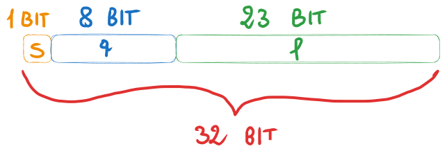

# Proprietà dei numeri di macchina, arrotondamento e il suo effetto sull'aritmetica di macchina
### [Lezione precedente](Lezione7.md)

### Standard IEEE 754
Abbiamo visto come definire un generico insieme di numeri di macchina. Per avere una guida che tutte le macchine possano seguire, è stato adottato lo standard IEEE 754. Questo standard ha alcune versioni in base all'insieme dei numeri di macchina considerato, però le due versioni più rilevanti per lo scopo di questa materia sono due, ovvero *single precision* e *double precision*.

In entrambi i casi si utilizza la rappresentazione in base binaria. Nello standard *single*, un numero macchina viene rappresentato mediante una stringa di 32 bit, nella quale il primo bit (ovvero il più significativo) è utilizzato per il segno (0 se positivo, 1 se negativo). I successivi 8 bit, invece, vengono utilizzati per l'esponente $p$ e gli ultimi 23 vengono utilizzati per la *mantissa* (ovvero le cifre del numero) $f = d_1d_2...d_{22}d_{23}$. In pratica, la stringa è suddivisa in 3 parti:

Con questa premessa, un numero di macchina $x$ con questo standard è rappresentato informalmente come $x = (-1)^s 1.f * 2^p$, con $f = d_1d_2...d_{22}d_{23}$. Il pezzo $(-1)^s$ serve per determinare il segno, infatti se $s = 0$ allora $x$ è positivo, altrimenti se $s = 1$ allora $x$ è negativo.

Nella rappresentazione proposta dallo standard notiamo che non compare in nessun modo $p$, ma l'esponente è rappresentato invece da $q$. Per ottenere $p$ bisogna sottrarre a $q$ il cosiddetto *bias*.

Questo serve perché $q$ è una stringa a 8 bit, di conseguenza può assumere valori da $0$ a $255$. Vedremo che i valori agli estremi ($0$ e $255$) hanno un significato specifico, per cui ci restano i numeri da $1$ a $254$. Questo range ci permette di esprimere esclusivamente esponenti positivi, di conseguenza possiamo rappresentare molti più numeri grandi ma siamo limitati nella rappresentazione di numeri decimali piccoli. Per ovviare a questo problema, si sottrae un certo numero da $q$ per traslare in qualche modo l'esponente. Con questo standard, nello specifico, il numero ottimale da sottrarre è $127$, quindi avremo $p = q - 127$. Questo implica che $p$ può assumere valori compresi tra $-126$ e $127$, cosa che permette una distribuzione più o meno equa di rappresentazioni di numeri grandi e numeri piccoli.

La quantità che abbiamo sottratto e della quale trasliamo $q$ è detta *bias* e, per l'appunto, il *bias* di questo standard è $127$. Sapendo questo, l'insieme dei numeri di macchina dello standard IEEE 754 è $F(2, 23, -127, 128)$. Come accennato sopra, i valori agli estremi del range di $q$ hanno un significato particolare che documenteremo in questa tabella.

|    `p`     |      `f`      |   `Significato`    |
| :--------: | :-----------: | :----------------: |
| $00000000$ |  $= 00...0$   | *Zero di macchina* |
| $00000000$ | $\neq 00...0$ | *Numeri denormali* |
| $11111111$ |  $= 00...0$   |     $\pm Inf$      |
| $11111111$ | $\neq 00...0$ |       $NaN$        |

Lo zero di macchina indica un numero che rappresenta $0$ per quel calcolatore. Secondo la definizione di insieme di numeri di macchina che abbiamo dato nella [lezione precedente](Lezione7.md), abbiamo detto che $0 \notin F$, di conseguenza è necessario avere qualche modo per rappresentarlo.

Il simbolo $Inf$ significa essenzialmente *infinito* ed indica un numero più grande del *realmax* di questa rappresentazione. Viene infatti utilizzato nella gestione dell'overflow e permette anche di estendere l'aritmetica di macchina in modo compatibile con le regole dettate dai limiti sulle funzioni. Ad esempio, in MATLAB, sono valide operazioni come $\frac{1}{0} = Inf$, $\frac{1}{Inf} = 0$, $x + Inf = Inf$ (con $x \in F$) e $Inf + Inf = Inf$.

Il simbolo $NaN$ (*Not a Number*) viene utilizzato quando non si riesce a dare un senso a operazioni aritmetiche che coinvolgono $Inf$. Può essere il caso di sottrazioni e divisioni tra infiniti, in quanto sono forme indeterminate anche secondo le regole dei limiti di funzione. Ad esempio, $Inf - Inf = NaN$ e $\frac{Inf}{Inf} = NaN$.

### Arrotondamento