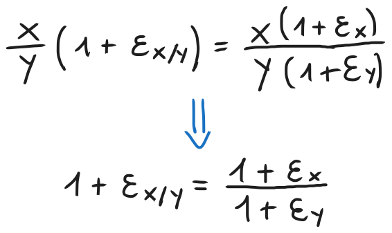

# Proprietà dei numeri di macchina, arrotondamento e il suo effetto sull'aritmetica di macchina
### [Lezione precedente](Lezione7.md)

### Standard IEEE 754
Abbiamo visto come definire un generico insieme di numeri di macchina. Per avere una guida che tutte le macchine possano seguire, è stato adottato lo standard IEEE 754. Questo standard ha alcune versioni in base all'insieme dei numeri di macchina considerato, però le due versioni più rilevanti per lo scopo di questa materia sono due, ovvero *single precision* e *double precision*.

In entrambi i casi si utilizza la rappresentazione in base binaria. Nello standard *single*, un numero macchina viene rappresentato mediante una stringa di 32 bit, nella quale il primo bit (ovvero il più significativo) è utilizzato per il segno (0 se positivo, 1 se negativo). I successivi 8 bit, invece, vengono utilizzati per l'esponente $p$ e gli ultimi 23 vengono utilizzati per la *mantissa* (ovvero le cifre del numero) $f = d_1d_2...d_{22}d_{23}$. In pratica, la stringa è suddivisa in 3 parti:

Con questa premessa, un numero di macchina $x$ con questo standard è rappresentato informalmente come $x = (-1)^s 1.f * 2^p$, con $f = d_1d_2...d_{22}d_{23}$. Il pezzo $(-1)^s$ serve per determinare il segno, infatti se $s = 0$ allora $x$ è positivo, altrimenti se $s = 1$ allora $x$ è negativo.

Nella rappresentazione proposta dallo standard notiamo che non compare in nessun modo $p$, ma l'esponente è rappresentato invece da $q$. Per ottenere $p$ bisogna sottrarre a $q$ il cosiddetto *bias*.

Questo serve perché $q$ è una stringa a 8 bit, di conseguenza può assumere valori da $0$ a $255$. Vedremo che i valori agli estremi ($0$ e $255$) hanno un significato specifico, per cui ci restano i numeri da $1$ a $254$. Questo range ci permette di esprimere esclusivamente esponenti positivi, di conseguenza possiamo rappresentare molti più numeri grandi ma siamo limitati nella rappresentazione di numeri decimali piccoli. Per ovviare a questo problema, si sottrae un certo numero da $q$ per traslare in qualche modo l'esponente. Con questo standard, nello specifico, il numero ottimale da sottrarre è $127$, quindi avremo $p = q - 127$. Questo implica che $p$ può assumere valori compresi tra $-126$ e $127$, cosa che permette una distribuzione più o meno equa di rappresentazioni di numeri grandi e numeri piccoli.

La quantità che abbiamo sottratto e della quale trasliamo $q$ è detta *bias* e, per l'appunto, il *bias* di questo standard è $127$. Sapendo questo, l'insieme dei numeri di macchina dello standard IEEE 754 è $F(2, 23, -127, 128)$. Come accennato sopra, i valori agli estremi del range di $q$ hanno un significato particolare che documenteremo in questa tabella.

|    `p`     |      `f`      |   `Significato`    |
| :--------: | :-----------: | :----------------: |
| $00000000$ |  $= 00...0$   | *Zero di macchina* |
| $00000000$ | $\neq 00...0$ | *Numeri denormali* |
| $11111111$ |  $= 00...0$   |     $\pm Inf$      |
| $11111111$ | $\neq 00...0$ |       $NaN$        |

Lo zero di macchina indica un numero che rappresenta $0$ per quel calcolatore. Secondo la definizione di insieme di numeri di macchina che abbiamo dato nella [lezione precedente](Lezione7.md), abbiamo detto che $0 \notin F$, di conseguenza è necessario avere qualche modo per rappresentarlo.

Il simbolo $Inf$ significa essenzialmente *infinito* ed indica un numero più grande del *realmax* di questa rappresentazione. Viene infatti utilizzato nella gestione dell'overflow e permette anche di estendere l'aritmetica di macchina in modo compatibile con le regole dettate dai limiti sulle funzioni. Ad esempio, in MATLAB, sono valide operazioni come $\frac{1}{0} = Inf$, $\frac{1}{Inf} = 0$, $x + Inf = Inf$ (con $x \in F$) e $Inf + Inf = Inf$.

Il simbolo $NaN$ (*Not a Number*) viene utilizzato quando non si riesce a dare un senso a operazioni aritmetiche che coinvolgono $Inf$. Può essere il caso di sottrazioni e divisioni tra infiniti, in quanto sono forme indeterminate anche secondo le regole dei limiti di funzione. Ad esempio, $Inf - Inf = NaN$ e $\frac{Inf}{Inf} = NaN$.

### Arrotondamento
Come abbiamo detto nell'introduzione di questo argomento, una macchina può memorizzare solo uno specifico insieme di numeri, denotato con $F$ e detto insieme dei numeri di macchina. Ogni altro numero $x \in R$, prima di essere memorizzato, dovrà essere approssimato opportunamente con un numero di macchina.

L'operazione che a un numero reale $x$ associa un numero (o anche, come vedremo successivamente, un simbolo) di macchina è detta *arrotondamento*, in inglese "round" o "float". Denomineremo questa funzione con $F$ e possiamo definirla come $x \rightarrow fl(x)$, con $x \in R$ e $fl(x) \in F ∪$ {$0$, $\pm Inf$, numeri denormali} (ovvero $fl(x)$ è una funzione che prende un numero reale $x$ e restituisce un numero di macchina appartenente a $F$, $0$, $\pm Inf$ oppure un numero denormale).

L'arrotondamento avviene secondo la regola *"Round to Nearest, Ties to Even"* (RNTE). Consideriamo l'insieme dei numeri di macchina $F(β, t, M_1, M_2)$, prendiamo un numero $x \in R$ e, per semplicità, assumiamo che *realmin* $\leq x \leq$ *realmax*. Inoltre, scegliamo una base $β$ pari per motivi che spiegheremo a breve (limitarci a basi pari non è un problema visto che le macchine operano generalmente in binario, ovvero in base $2$). 

L'idea è che si prendono i due numeri di macchina successivi tra cui $x$ è compreso e lo si arrotonda al numero di macchina più vicino a $x$ tra quei due. Quindi, dato un certo $x \in R$ tale che esistono due numeri di macchina successivi $a$ e $b$ tali che $a \leq x \leq b$, $fl(x)$ sarà uguale ad $a$ se $x$ è più vicino ad $a$, altrimenti sarà uguale a $b$. Per valutare questa vicinanza vedremo se $x$ è più piccolo o più grande della media dei due numeri di macchina (se è più piccolo è più vicino ad $a$, se è più grande è più vicino a $b$).

Sorge un problema nel caso in cui $x$ si trovi perfettamente a metà tra i due numeri di macchina $a$ e $b$. In quel caso, è necessario utilizzare un ulteriore criterio per scegliere come approssimare $x$. Siccome abbiamo detto che $β$ è pari, allora abbiamo la certezza che, presi due numeri di macchina consecutivi $a$ e $b$, uno di questi due abbia mantissa pari mentre l'altro abbia mantissa dispari. Quindi, quando ci troviamo in una situazione in cui $x$ sia equidistante tra $a$ e $b$, si dà la priorità al numero di macchina che ha mantissa pari. 

Essendo numeri consecutivi, se $a$ ha mantissa $f$ allora $b$ avrà mantissa $f + 1$. Di conseguenza, se $f$ è pari allora $f + 1$ sarà dispari e viceversa. Questo vale soltanto per i numeri di macchina espressi in base pari, però (ad esempio, in base $3$ un numero di mantissa $2$ avrebbe come successivo un numero di mantissa $0$, ovvero due numeri pari consecutivi), per questo è stato necessario imporre questa limitazione precedentemente, altrimenti potrebbero crearsi ambiguità in certe situazioni (ad esempio, se entrambi i numeri di macchina avessero mantissa pari).

Formalmente, sia $F(β, t, M_1, M_2)$ un insieme di numeri di macchina e sia $β$ pari. Sia $x \in R$, $|x| \in [$*realmin*, *realmax*$]$ e siano $a, b \in F$ consecutivi e tali che $a \leq x \leq b$. Allora:

### Il massimo errore relativo commesso nell'arrotondamento
Per semplicità, supponiamo che l'arrotondamento di $x \in R$ non causi underflow o overflow, ovvero supponiamo che $|x| \in [$*realmin*, *realmax*$]$. Siano $a, b \in F$ consecutivi e tali che $a \leq x \leq b$. Allora l'errore relativo che si commette nell'approssimare $x$ con $fl(x)$ è

Siccome vogliamo ottenere la stima massima dell'errore relativo che possiamo commettere, ovvero vogliamo una stima per eccesso di $E_R$, procediamo a massimizzare il numeratore e a minimizzare il denominatore.

Possiamo definire un limite superiore per il numeratore $|x - fl(x)|$, nello specifico si ha che $|x - fl(x)| < \frac{1}{2}|a - b|$. Questo può essere giustificato visualmente in questo modo:

Essendo $a$ e $b$ numeri di macchina consecutivi, come abbiamo visto alla fine della [lezione precedente](Lezione7.md), è $β^{p - t}$, se $|a|, |b| \in [β^p, β^{p + 1}]$, di conseguenza $|a - b| = β^{p - t}$. 

Visto che $a \leq x \leq b$, questo vuol dire che $x$ sarà maggiore o uguale al più piccolo valore che $a$ può assumere, ovvero $β^p$. Di conseguenza, possiamo definire un limite inferiore per il denominatore $|x|$, ovvero $|x| > β^p$. Con queste due conclusioni, possiamo scrivere

Abbiamo dunque che il massimo errore relativo commesso nell'arrotondamento *RNTE* è pari a $\frac{1}{2}β^{-t}$. La quantità $β^{-t}$ è significativa, infatti, ed è detta *precisione di macchina*, indicata anche con *eps*. Questa dipenderà dal numero di cifre $t + 1$ della rappresentazione.

#### Esempi
Nello standard IEEE 754 single precision, il massimo errore relativo commesso nell'arrotondamento è $2^{-24} \approx 10^{-8}$, mentre in quello double precision è $2^{-53} \approx 10^{-16}$. Questo significa che, in questi standard, l'arrotondamento di un numero reale ad un numero di macchina conserva, rispettivamente, 8 e 16 cifre corrette del numero.

### Condizionamento dell'aritmetica di macchina
L'aritmetica tra numeri di macchina viene detta *aritmetica di macchina* oppure *aritmetica finita*. Il nostro obiettivo, adesso, è valutare quanto l'errore associato all'arrotondamento influenzi la precisione del risultato delle operazioni elementari eseguite in aritmetica finita.

Prima di tutto, introduciamo un modo diverso di esprimere l'errore relativo associato ad un'approssimazione, una modalità in cui teniamo conto anche del segno dell'errore. Siano $x, \overline x \in R$, con $\overline x$ approssimazione di $x$. Definiamo l'errore relativo *con segno* come segue:

Questo ci permette di esprimere il dato approssimato $\overline x$ come il dato esatto $x$ moltiplicato per un certo fattore che è dipendente dall'errore. Questa sarà un'espressione che ci tornerà utile a breve.

#### Disuguaglianza triangolare
Prima di procedere con il calcolo del condizionamento nelle operazioni di base nell'aritmetica finita, facciamo un'appunto sulla *disuguaglianza triangolare*, siccome la utilizzeremo frequentemente nei prossimi paragrafi. Dati due numeri $a, b \in R$, la disuguaglianza triangolare afferma che $|a + b| \leq |a| + |b|$. Per di più, se $a$ e $b$ hanno segno concorde, la disuguaglianza diventa un'uguaglianza, ovvero $|a + b| = |a| + |b|$.

#### Somma e differenza
Siamo $x, y \in R$. In aritmetica esatta, il risultato della loro somma è semplicemente il numero $x + y \in R$. Se effettuiamo l'operazione in aritmetica finita, però, dovremmo prima arrotondare $x$ e $y$ a un numero di macchina e poi arrotondare la somma dei due arrotondamenti. In pratica, è come se stessimo calcolando $fl(fl(x) + fl(y))$, che darà un certo numero di macchina. Utilizzando la relazione tra dato esatto e dato approssimato che abbiamo ricavato sopra, possiamo scrivere

Il nostro obiettivo è trovare la stima massima dell'errore relativo sulla somma $|ε_{x + y}|$ mediante gli errori relativi dovuti agli arrotondamenti $|ε_x|, |ε_y|$. Dobbiamo quindi isolare $ε_{x + y}$, questo possiamo farlo dividendo per $x + y$ e passando poi ai valori assoluti. Infine, possiamo utilizzare la disuguaglianza triangolare per scindere il numeratore in una somma di valori assoluti e possiamo massimizzarlo raggruppando gli errori $|ε_x|$ e $|ε_y|$ e sostituendoli con il massimo dei due, ottenendo quindi

Questa disuguaglianza esprime il fatto che, in aritmetica finita, l'errore relativo sulla somma non può superare $\frac{|x| + |y|}{|x + y|}$ l'errore relativo commesso nell'arrotondamento. Il numero di condizionamento della somma in aritmetica finita è dunque

Questo significa che, in aritmetica finita, la somma è malcondizionata quando $x + y$ è molto piccolo, ovvero quando "$x$ è quasi l'opposto di $y$", ovvero sono valori molto vicini ma di segno opposto.

Dalla disuguaglianza triangolare deriva direttamente che $K \geq 1$. Inoltre, sempre per le proprietà dell'uguaglianza triangolare, se i segni di $x$ e $y$ sono concordi allora da disuguaglianza diventa un'uguaglianza, di conseguenza $K = 1$ e quindi l'operazione sarà a prescindere ben condizionata.

La somma in aritmetica finita è quindi malcondizionata se gli addendi $x$ e $y$ hanno segno discorde e $|x| \approx |y|$, altrimenti è ben condizionata. L'errore che consegue dal sommare in aritmetica finita due numeri che sono quasi opposti tra di loro è detto *errore di cancellazione* e si riferisce alla perdita di cifre significative corrette.

#### Moltiplicazione
Per la moltiplicazione seguiremo un ragionamento pressoché identico a quello della somma, per cui lo tratteremo più rapidamente. Siano quindi $x, y \in R$. Gli errori relativi con segno derivanti dall'arrotondamento $ε_x, ε_y$ e quello associato alla moltiplicazione $ε_{xy}$ possono essere messi in relazione nel seguente modo

Gli errori sono generalmente dei numeri molto piccoli, ovvero $<<1$, di conseguenza $ε_xε_y$ è trascurabile rispetto ai valori di $ε_x$ e $ε_y$. Quindi, trascurando $ε_xε_y$, passando ai valori assoluti e utilizzando la disuguaglianza triangolare, possiamo scrivere

Da questo ne deriva che la moltiplicazione in aritmetica finita è sempre ben condizionata e ha fattore di condizionamento $K = 2$.

#### Divisione
Il ragionamento da seguire e le conclusioni ottenute per la divisione sono molto simili a quelle per la moltiplicazione. Siano $x, y \in R$, $y \neq 0$. Seguendo lo stesso ragionamento delle operazioni precedenti, possiamo scrivere

Richiamiamo un teorema di Analisi Matematica, ovvero

Per di più, se il valore $|x|$ è molto piccolo, allora tutti i termini $x^2, x^3, ...$ sono trascurabili rispetto a $x$. Siccome $ε_y << 1$, allora possiamo approssimare $\frac{1}{1 + ε_y}$ con $1 - ε_y$. Da questo ne consegue che $ε_{x/y} \approx ε_x - ε_y$. Procedendo come abbiamo fatto per lo studio del condizionamento della moltiplicazione, ovvero utilizzando la disuguaglianza triangolare, otteniamo

Quindi anche la divisione in aritmetica finita è sempre ben condizionata e ha fattore di condizionamento $K = 2$.
### [Lezione successiva](Lezione9.md)
### [Torna all'indice](../README.md)